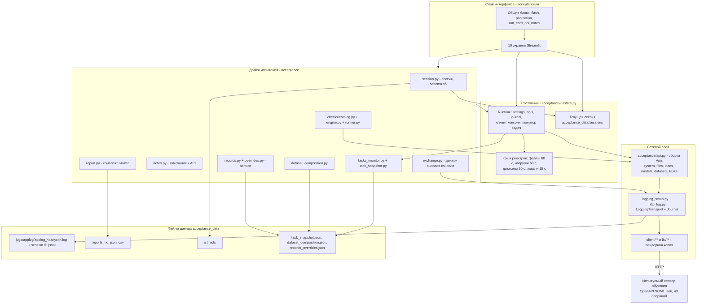
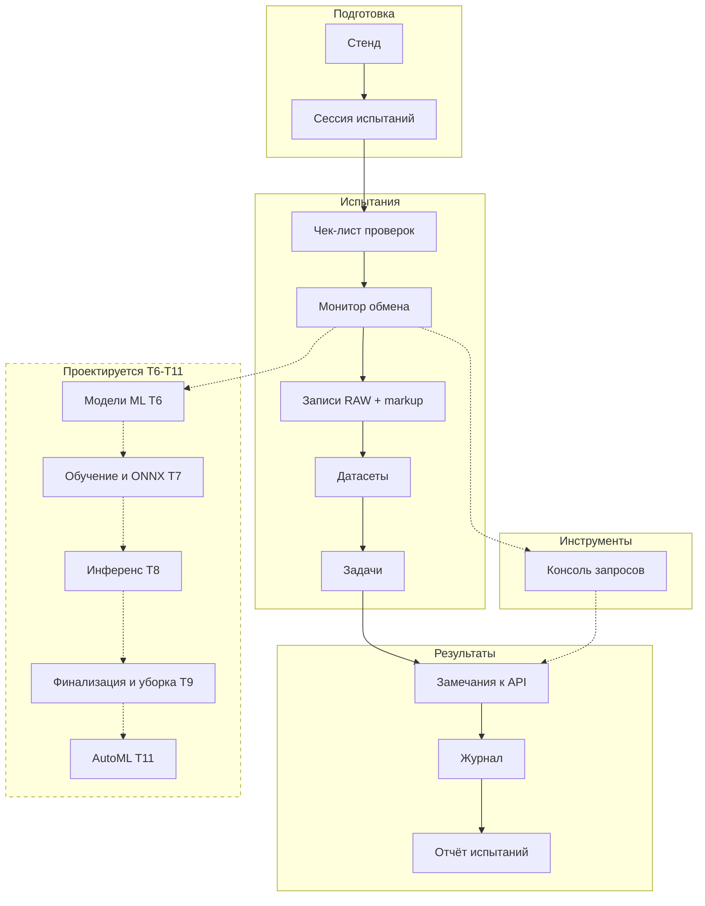
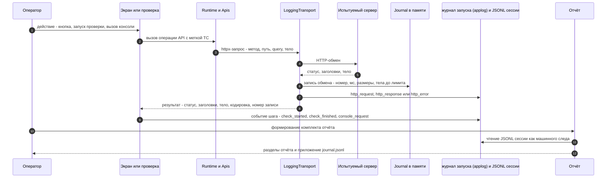
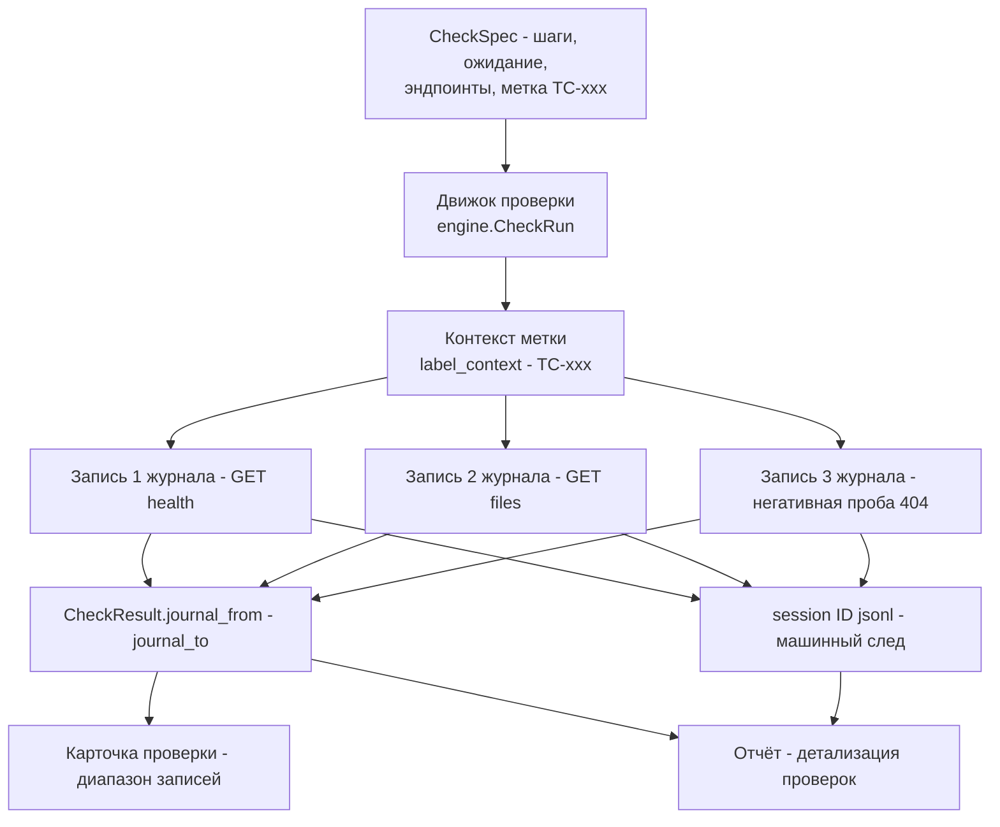
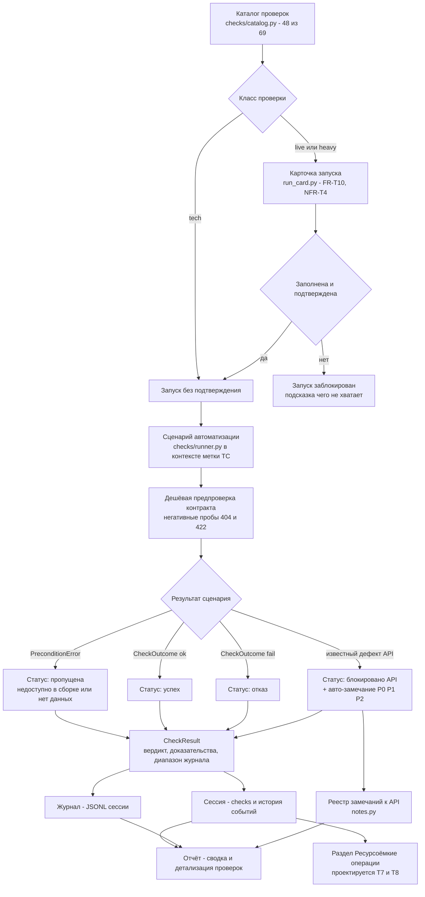
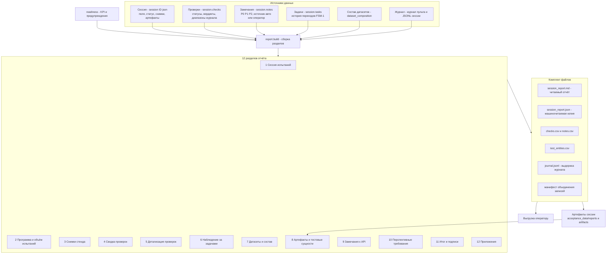
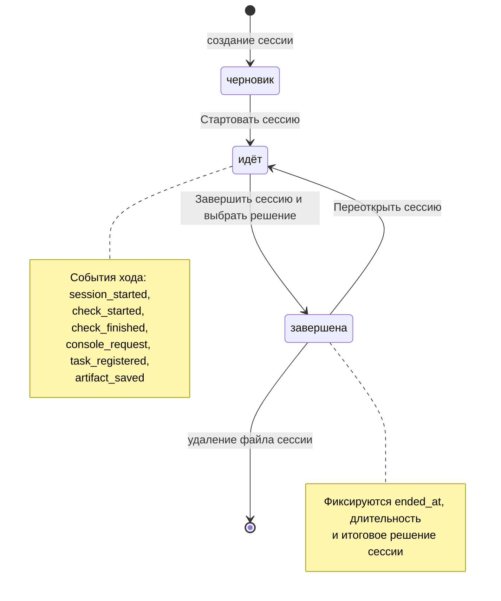
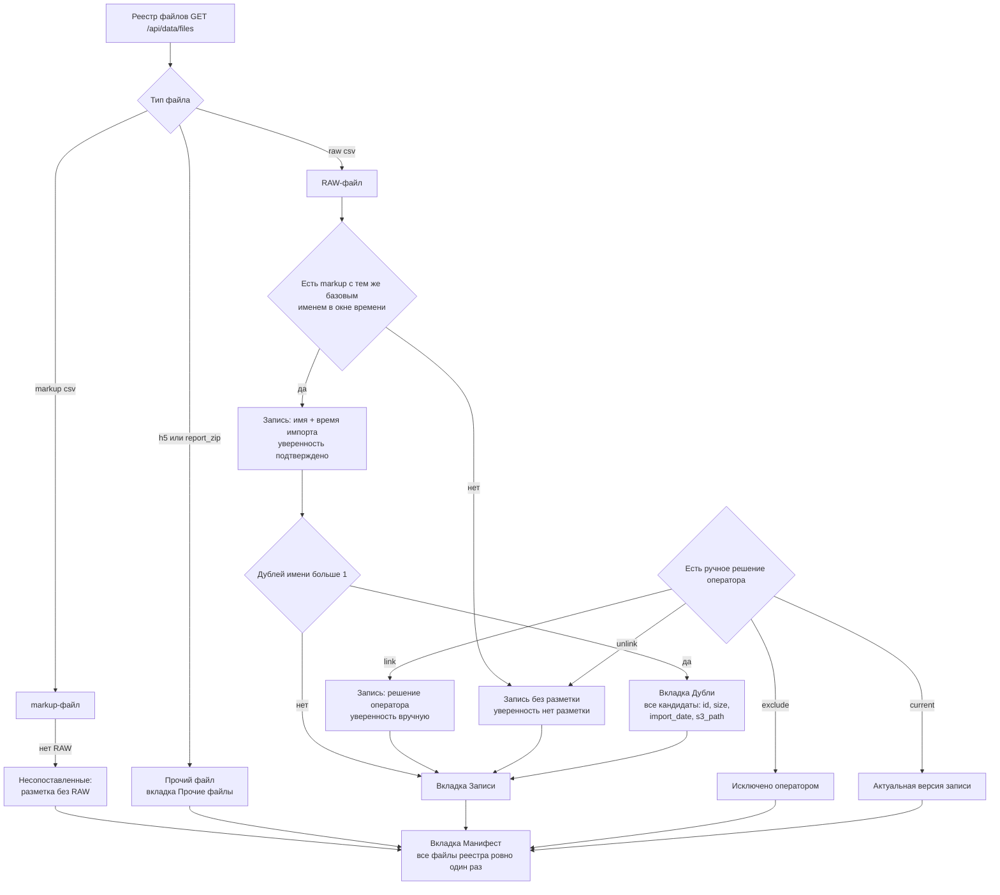
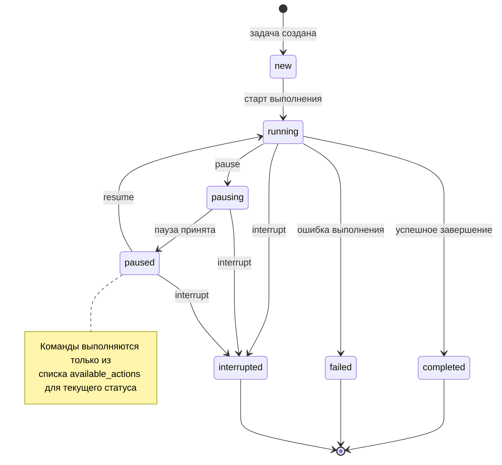
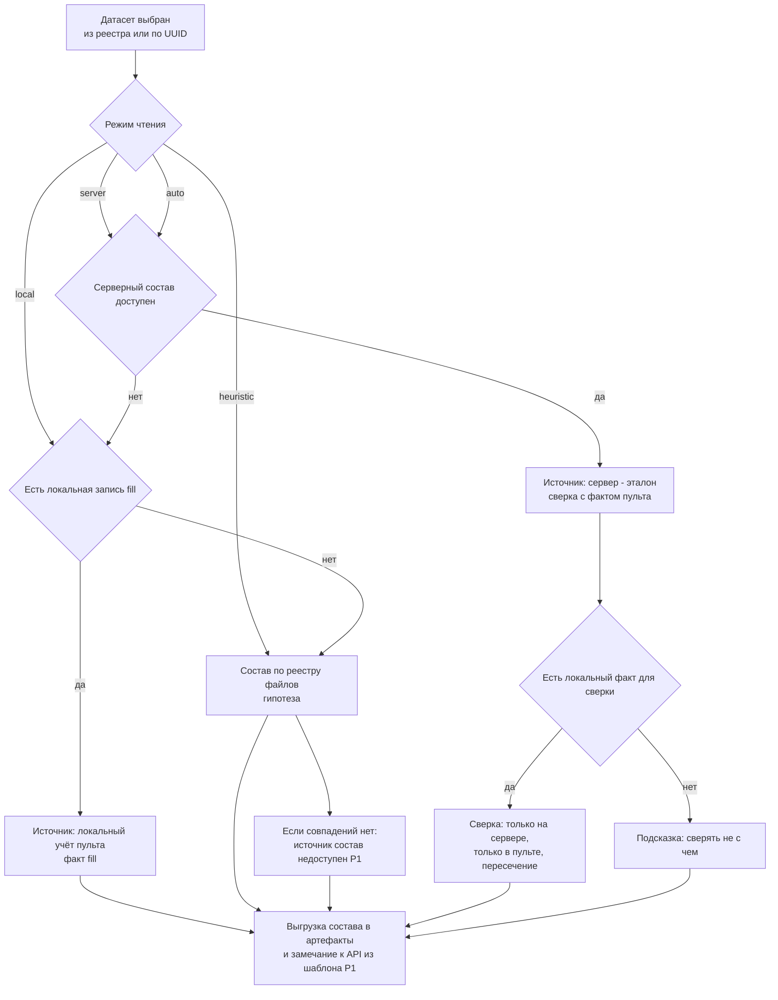

# Руководство пользователя пульта испытаний: функционал и правила использования

> **Назначение документа.** Описание функционала «Пульта испытаний сервера обучения»
> (`TrainingServerAcceptance`) и правил его использования: что делает каждый раздел
> программы, как им пользоваться, какие данные он читает и создаёт, что попадает в отчёт.
>
> **Статусы разделов.** По уже работающим разделам (этапы **T0–T5**) документ описывает то,
> что реализовано в коде. По проектируемым разделам (**T6–T11**) описана ожидаемая на
> текущий момент функциональность — каждая такая глава помечена блоком
> «⚠️ Проектируемая часть».
>
> **Источники:** `README.md`, `docs/01. ТЗ на пульт испытаний (временный UI).md`,
> `docs/02. Чек-лист испытаний.md`, `docs/03…docs/11`, код `acceptance/**`, `client/**`,
> `lib/**`.
>
> **Дата:** 21.09.2026. **Контракт испытуемого API:** `docs/SOM1.json` — **действующий** контракт
> 17.09.2026 (34 пути / 40 операций / 49 схем / 10 тегов), он же источник реестра операций
> консоли. Имя файла историческое: в `docs/` действующий контракт всегда называется
> `SOM1.json`, а полученная поставка сохраняется отдельно как `docs/api_17_09_26.json`
> (107 765 Б, SHA-256 `50f8ed29…6b11`) — это доказательство «как получено»; предыдущая
> версия — архив `docs/SOM1.2026-08-31.json` (по ней построены этапы T0–T3). Поэтому
> ссылки на `docs/SOM1.json` в этом руководстве означают именно контракт 17.09.2026;
> таблица версий — `docs/README.md` §«Версии контракта API».

---

## Содержание

**Часть I. Введение, архитектура и прозрачность**

1. [О документе, статусах разделов и терминах](#1-о-документе-статусах-разделов-и-терминах)
2. [Назначение, цель и границы приложения](#2-назначение-цель-и-границы-приложения)
3. [Архитектура приложения](#3-архитектура-приложения)
4. [Прозрачность вызовов API](#4-прозрачность-вызовов-api)
5. [Оценка результатов работы сервера](#5-оценка-результатов-работы-сервера)
6. [Механизм составления отчётов](#6-механизм-составления-отчётов)
7. [Установка, запуск и общие правила работы](#7-установка-запуск-и-общие-правила-работы)

**Часть II. Реализованные разделы (работает)**

8. [Раздел «🧪 Сессия испытаний»](#8-раздел--сессия-испытаний)
9. [Раздел «🖥️ Стенд»](#9-раздел--стенд)
10. [Раздел «🧩 Записи (RAW + markup)»](#10-раздел--записи-raw--markup)
11. [Раздел «⏱️ Задачи»](#11-раздел--задачи)
12. [Раздел «🗂️ Датасеты»](#12-раздел--датасеты)
13. [Раздел «✅ Чек-лист проверок»](#13-раздел--чек-лист-проверок)
14. [Раздел «📡 Консоль запросов»](#14-раздел--консоль-запросов)
15. [Раздел «✍️ Замечания к API»](#15-раздел--замечания-к-api)
16. [Раздел «🧾 Журнал»](#16-раздел--журнал)
17. [Раздел «📄 Отчёт испытаний»](#17-раздел--отчёт-испытаний)
27. [Раздел «🔄 Монитор обмена» и программа испытаний](#27-раздел--монитор-обмена-и-программа-испытаний)

**Часть III. Проектируемые разделы (T6–T11)**

18. [⚠️ Модели машинного обучения (TC-MOD, T6)](#18-️-модели-машинного-обучения-tc-mod-t6)
19. [⚠️ Обучение, проверка, экспорт ONNX (TC-TR, T7)](#19-️-обучение-проверка-экспорт-onnx-tc-tr-t7)
20. [⚠️ Инференс (TC-INF, T8)](#20-️-инференс-tc-inf-t8)
21. [⚠️ Финализация, сравнение сессий и уборка ресурсов (T9)](#21-️-финализация-сравнение-сессий-и-уборка-ресурсов-t9)
22. [⚠️ AutoML — подбор параметров (TC-AUTO, T11)](#22-️-automl--подбор-параметров-tc-auto-t11)
23. [⚠️ Передача комплекта испытаний и документация (T10)](#23-️-передача-комплекта-испытаний-и-документация-t10)

**Часть IV. Общие правила, ограничения и приложения**

24. [Правила безопасной работы на общем стенде](#24-правила-безопасной-работы-на-общем-стенде)
25. [Известные дефекты и ограничения API](#25-известные-дефекты-и-ограничения-api)
26. [Приложения](#26-приложения)

---

# Часть I. Введение, архитектура и прозрачность

## 1. О документе, статусах разделов и терминах

### 1.1. Адресат и способ чтения

Документ адресован:

* **испытателю (оператору пульта)** — главы 7–17 описывают последовательность действий;
* **руководителю испытаний и комиссии** — главы 24–26 описывают правила, ограничения и
  приложения, которые входят в комплект отчётности;
* **разработчику** — главы 3–6 описывают архитектуру, прозрачность вызовов API и механику
  оценки результатов и формирования отчёта.

### 1.2. Статусы разделов программы

| Раздел программы | Глава | Статус | Этап |
|---|---|---|---|
| 🖥️ Стенд | 9 | **работает** | T0 |
| 🧪 Сессия испытаний | 8 | **работает** | T0 + T1…T5 + «Монитор» (schema v6) |
| 🧩 Записи (RAW + markup) | 10 | **работает** | T1 |
| ⏱️ $Задачи | 11 | **работает** | T4 |
| 🗂️ $Датасеты | 12 | **работает** | T5 |
| ✅ Чек-лист проверок | 13 | **работает** (48 из 69 проверок) | T3, T4, T5 |
| 🔄 Монитор обмена и программа испытаний | 27 | **работает** | «Монитор обмена» (M1) |
| 📡 Консоль запросов | 14 | **работает** | T2 |
| ✍️ Замечания к API | 15 | **работает** | T2 |
| 🧾 Журнал | 16 | **работает** | T0 |
| 📄 Отчёт испытаний | 17 | **работает** (сравнение сессий и финализация — проектируются) | T3 (T9) |
| 🧠 Модели ML | 18 | **проектируется** | T6 |
| 🎓 Обучение / проверка / ONNX | 19 | **проектируется** | T7 |
| 🔮 Инференс | 20 | **проектируется** | T8 |
| 🔁 Финализация и уборка | 21 | **проектируется** | T9 |
| 🤖 AutoML (`find_params`) | 22 | **проектируется** (операции доступны из консоли) | T11 |
| 📦 Передача комплекта | 23 | **проектируется** | T10 |

### 1.3. Термины

| Термин | Значение |
|---|---|
| **Пульт** | Настоящее приложение — временный (альтернативный) UI для испытаний и приёмки текущей версии сервера обучения, без доработки его API |
| **Стенд** | Испытуемый сервер обучения (адрес задаётся в `.env`, параметр `TRAINING_SERVER_BASE_URL`) |
| **Запись (record)** | Пара файлов `<имя>.raw.csv` (сигналы) + `<имя>.markup.csv` (разметка). В API сущности «запись» нет — её собирает пульт по явному правилу |
| **Дубль** | Файл с тем же `file_name`, что уже есть в хранилище: другой `id`, `size`, `import_date`, `s3_path`. Одноимённые файлы — разные версии записи |
| **Субдатасет** | Группа записей по признаку. В пульте **не используется** (решение заказчика 15.09.2026), остаётся перспективным требованием к API |
| **Сессия испытаний** | Зафиксированный период испытаний: кто, когда, на какой сборке, что проверялось и с каким результатом. Хранится в `acceptance_data/sessions/<session_id>.json` |
| **Проверка** | Сценарий программы испытаний с идентификатором `TC-<модуль>-<NN>`, трассировкой на требования, классом, шагами и ожидаемым результатом |
| **Класс проверки** | `tech` — безопасная, `live` — боевая на реальных данных, `heavy` — ресурсоёмкая, `manual` — только вручную |
| **Класс безопасности операции** | Для операций API: `read` (🟢 только чтение), `write` (🟠 изменяет данные), `heavy` (🟣 ресурсоёмкая), `destructive` (🔴 удаление) |
| **FSM-1** | Конечный автомат статусов асинхронной задачи: `new → running → pausing → paused → completed / failed / interrupted` |
| **`__TEST__`** | Обязательный префикс имён сущностей, создаваемых пультом на общем стенде; такие сущности удаляются самим пультом (самоочистка) |
| **Блокировано API** | Статус проверки: сценарий нельзя выполнить из-за подтверждённого дефекта/пробела API. Это **результат испытаний**, а не ошибка пульта; к нему автоматически создаётся замечание |
| **Замечание к API** | Зафиксированный дефект или пробел API с приоритетом `P0` (блокирует), `P1` (мешает, есть обходной путь), `P2` (улучшение) |
| **Артефакт** | Выгруженный оператором файл (манифест, файл записи, пара-zip, ответ консоли, комплект отчёта), зарегистрированный в сессии как доказательство |

---

### 1.4. Соглашение о терминах: сущности стенда и сущности пульта

Пожелание заказчика (21.09.2026, п. 4): термины испытываемого сервера и внутренние термины
пульта должны быть различимы. Правило — механическое:

1. Сущности **испытываемого сервера** выделяются префиксом `$` (`$Задача`, `$Датасет`,
   `$Модель`) — они приходят и уходят по API.
2. Внутренние сущности **пульта** префикса не имеют: проверка, карточка проверки, карточка
   запуска, запись, замечание к API, артефакт.
3. «Карточка» всегда уточняется: карточка проверки (пульт), карточка запуска (пульт),
   карточка $задачи ($Задача сервера).
4. «Программа» всегда уточняется: программа испытаний (план вызовов пульта), программа
   проверок (`docs/02`), программа-методика (документ заказчика).
5. «Монитор» всегда уточняется: монитор обмена (запросы и ответы) и монитор $задач
   (наблюдение за $Задачами сервера).

Таблица ниже — **единственный источник канонических подписей** (`acceptance/glossary.py`);
её соответствие коду проверяет тест `tests/unit/test_glossary.py`, а подписи экранов
(боковая панель и заголовки страниц) берутся из того же модуля.

| Термин | Принадлежность | Значение |
|---|---|---|
| `$Задача` | стенд (сервер) | асинхронная задача сервера (`celery-test`, `dataset-fill`, `training`, `model-testing`, `inference`) со статусами FSM-1 |
| `$Файл` | стенд (сервер) | файл реестра сервера (`RAW`, `LOADS`, `ONNX`; вне перечисления — `H5`, `REPORT_ZIP`) |
| `$Датасет` | стенд (сервер) | датасет сервера (модуль Datasets) |
| `$Модель` | стенд (сервер) | модель машинного обучения сервера |
| `$Нагрузка` | стенд (сервер) | нагрузка сервера (модуль Loads) |
| Сессия испытаний | пульт | зафиксированный период испытаний |
| Проверка (`TC-…`) | пульт | сценарий программы проверок |
| Карточка проверки | пульт | панель проверки на экране «Чек-лист» |
| Карточка запуска | пульт | подтверждение ресурсоёмкой или изменяющей операции (FR-T10, NFR-T4) |
| Карточка $задачи | пульт | панель наблюдения за $Задачей сервера (прогоны, FSM-1, команды) |
| Программа испытаний | пульт | план вызовов: что и в каком порядке исполняет пульт (галочки, «Выполнить», пауза) |
| Программа проверок | пульт | документ `docs/02` и каталог проверок `TC-*` |
| Программа-методика | пульт | документ заказчика; его реквизиты вносятся в сессию (`program_doc`) |
| Запись (RAW + markup) | пульт | пара файлов, объединённая пультом: в API сущности «запись» нет |
| Монитор обмена | пульт | лента вызовов API и ответов |
| Монитор $задач | пульт | наблюдение за $Задачами сервера (FR-T11) |
| Замечание к API | пульт | реестр претензий к API (FR-T7) |
| Артефакт | пульт | выгруженное доказательство испытаний |
| Журнал обмена | пульт | таблица обменов и JSONL сессии |
| Журнал запуска | пульт | текстовый журнал одного запуска пульта (`logs/applog/applog_<запуск>.log`) |
| Отчёт испытаний | пульт | комплект отчётности сессии (FR-T8) |
| Снимок стенда | пульт | счётчики реестров на начало/конец |
| `__TEST__`-сущность | пульт | сущность, созданная пультом и убираемая им |

Как это видно в интерфейсе: боковая панель показывает подпись «`$` отмечает сущности
испытываемого сервера…», экраны «$Задачи» и «$Датасеты» названы с префиксом, а «Чек-лист
проверок», «Записи (RAW + markup)» и «Монитор обмена» — без него (это сущности пульта).

---

## 2. Назначение, цель и границы приложения

### 2.1. Цель

Обеспечить проведение испытаний и приёмки **текущей** версии сервера обучения Energomera
(живой сервис `https://energomera.ai-center.online`, API по спецификации `SOM1.json`):

* проверить все модули API на реальных данных и в «боевом» режиме;
* зафиксировать результаты и замечания;
* оформить отчёт об испытаниях;
* **не ожидая** готовности продуктивного UI и **без изменений** со стороны сервера.

### 2.2. Ключевой принцип

> Всё, что не удалось проверить из-за дефектов/пробелов API, является **результатом
> испытаний**: проверка получает статус «блокировано API», а в отчёт автоматически
> попадает замечание с приоритетом и обходным путём. Ни одна проверка не требует
> доработки испытуемого API.

### 2.3. Что входит в объём

* все 40 операций API контракта 17.09.2026 (10 тегов: `Система`, `File Import`,
  `Datasets`, `Loads`, `ML models: initialization`, `ML models: training`,
  `ML models: testing`, `ML models: inference`, `ML models: AutoML`, `Task service`);
* скриптованный чек-лист проверок с трассировкой на требования (UC/FR/BR/FSM);
* свободная консоль запросов к API (диагностика, произвольные пробы);
* прозрачное объединение RAW- и markup-файлов в записи (включая дубли имён);
* сессии испытаний и отчёт об испытаниях (`md`/`json` + приложения);
* журналирование трёх уровней: журнал приложения, структурный журнал сессии, журнал
  HTTP-обмена.

### 2.4. Что вне объёма

* доработка испытуемого API;
* авторизация/РБАК (в ТЗ — задел на будущее, `NFR-7`);
* продуктивный UI (`TrainingServerUI`, FR-1…FR-8) — развивается отдельно;
* интеграция с Фабрикой Данных;
* обучение рабочих моделей вне программы испытаний.

---

## 3. Архитектура приложения

### 3.1. Решение об изоляции

Пульт — **отдельный проект** с собственной копией сетевого и доменного слоя основного UI.
Это гарантирует, что правки в основном UI не повлияют на ход испытаний, а испытания — на
основной UI.

| Аспект | Решение |
|---|---|
| Расположение | `D:\VSC Python projects\TrainingServerAcceptance` — отдельный git-репозиторий |
| Изоляция | своё `.venv`, свой `.env`, свой каталог `acceptance_data/` (gitignored) |
| Копия кода | `client/*`, `lib/*` — замороженная копия коммита `c71afef` **без локальных правок** (`VENDOR.md`) |
| Аддитивные модули | `client/tasks.py` (модуль «Task service»), `client/datasets.py` (модуль «Datasets») — кандидаты на обратный порт в основной UI (`BACKPORT.md`) |
| Синхронизация копии | `tools/sync_vendor.ps1` (сверка и обновление из источника) |
| Документы постановки | копия в `docs/` (`python -m tools.sync_docs`) |

### 3.2. Слои приложения

| Слой | Каталог | Что делает |
|---|---|---|
| Веб-интерфейс | `acceptance/ui/**` | 10 экранов Streamlit, общие блоки (`flash`, `pagination`, `run_card`, `api_notes`, `labels`), runtime-состояние (`state.py`) |
| Домен испытаний | `acceptance/*.py` | сессия, записи, замечания, отчёт, реестр эндпоинтов, движок вызовов, монитор задач, снимок задач, учёт состава датасетов, журналирование |
| Чек-лист | `acceptance/checks/**` | каталог проверок, движок проверки, автоматические сценарии |
| Сетевой слой (вендор) | `client/**` | httpx-клиент, Pydantic-схемы из `SOM1.json`, ошибки, настройки подключения |
| Доменные хелперы (вендор) | `lib/**` | пары RAW+markup, разбор разметки, пагинация, FSM-1, поллинг, валидаторы |
| Данные испытаний | `acceptance_data/**` | `sessions/`, `logs/`, `reports/`, `artifacts/` + `task_snapshot.json`, `dataset_composition.json`, `records_overrides.json` |

### 3.3. Диаграмма компонентов



### 3.4. Карта разделов программы и маршрут оператора

Навигация пульта — боковая панель с четырьмя группами: «Подготовка» (стенд и сессия),
«Испытания» (прогон и наблюдение → данные стенда → монитор `$задач`), «Инструменты»
(консоль запросов) и «Результаты». Порядок групп — часть бизнес-процесса испытаний, он
зафиксирован в `acceptance/ui/nav.py`, проверяется `tests/unit/test_nav.py` и описан в
`docs/14. Концепт пульта — целевой бизнес-процесс испытаний.md` §4. Проектируемые экраны
показаны пунктиром: они ещё не реализованы, но их место в маршруте уже определено планом
этапов T6–T11.



### 3.5. Точки расширения

| Что расширяется | Где | Как |
|---|---|---|
| Реестр операций консоли | `acceptance/endpoints.py` (генерируется) | `python -m tools.gen_endpoints` после обновления `docs/SOM1.json` |
| Каталог проверок | `acceptance/checks/catalog.py` + модуль сценариев в `acceptance/checks/` | добавить `CheckSpec` и зарегистрировать автоматизацию в `CHECKS_BY_GROUP` / `AUTOMATION_DOMAINS` |
| Шаблоны замечаний | `acceptance/notes.py` (`KNOWN_DEFECTS`, `PROSPECTIVE_REQUIREMENTS`) | дополнить кортеж и (при необходимости) карту `DEFECT_BY_CHECK` |
| Разделы отчёта | `acceptance/report.py` (`SECTION_TITLES` + функция раздела) | добавить раздел и включить его в `build()` |
| Схема сессии | `acceptance/session.py` (`SCHEMA_VERSION`) | новое поле с значением по умолчанию: старые файлы сессий читаются без правок |

---

## 4. Прозрачность вызовов API

Требование прозрачности (`FR-T3`, `FR-T6`, `NFR-1`, `NFR-2`) реализовано технически:

* **единая точка выхода в сеть** — все экраны, проверки и консоль используют httpx-клиент,
  обёрнутый в `LoggingTransport`. Оператор не может выполнить запрос «мимо журнала»;
* **каждый обмен фиксируется** в `Journal` (в памяти, до `PULT_JOURNAL_MAX` = 5000 записей)
  и в структурном JSONL сессии: номер, время, метод, путь, `query`, метка проверки, статус,
  длительность (мс), размеры запроса и ответа, `Content-Type`, текст ошибки соединения;
* **тела сохраняются** для текстовых типов до лимита `PULT_BODY_LIMIT` = 4096 символов
  (с пометкой об усечении); бинарные ответы и multipart фиксируются только размером и именем
  файла из `Content-Disposition`;
* **метка проверки** (`TC-…`) связывает обмен с проверкой чек-листа. Каждый экран ставит
  свои метки: записи — `TC-REC-01…TC-REC-05`, монитор задач — `TC-TASK-01…TC-TASK-08`,
  проверки — метку собственного id, консоль — введённую оператором (по умолчанию
  `TC-CONSOLE`);
* **консоль не является исключением**: она работает «сырым» `httpx.Client` с **тем же**
  транспортом, потому что ей нужны статус, заголовки, длительность, размер и сырое тело
  (включая бинарное);
* **ошибки — часть результата**: `execute_request` никогда не бросает исключений, а
  возвращает класс ошибки (`network` — сервер недоступен, `not_found` — 404,
  `validation` — 422, `api` — прочие 4xx/5xx, `request` — запрос не отправлен);
* **подбор кодировки** тела (`utf-8` → `cp1251` → `latin-1`) сделан намеренно: дефект
  сервера с `latin-1` виден как текст, а не как «кракозябры» интерпретатора.

### 4.1. Путь одного запроса



### 4.2. Воспроизводимость: от проверки к записям журнала

Проверка хранит **диапазон номеров** журнала (`journal_from` … `journal_to`), поэтому любой
её шаг можно найти в JSONL и повторить (в том числе через `curl`, который показывает сама
консоль).



### 4.3. Классы безопасности операций

Каждая операция реестра консоли (40 операций, 10 модулей) имеет класс безопасности, который
определяет правила подтверждения (`NFR-T4`):

| Класс | Иконка | Что требует пульт перед вызовом |
|---|---|---|
| `read` | 🟢 | ничего; скачивание файла крупнее 50 МБ — чекбокс подтверждения |
| `write` | 🟠 | подтверждение изменяющей операции + контроль префикса `__TEST__` у имён создаваемых сущностей |
| `heavy` | 🟣 | карточка запуска (цель, данные, параметры, ответственный, ожидаемая длительность, судьба артефактов) + подтверждение расхода ресурсов |
| `destructive` | 🔴 | чекбокс, слово `DELETE` и (для сущностей без `__TEST__`) повторный ввод полного `id` |

---

## 5. Оценка результатов работы сервера

Оценка результатов — это не «ручное заключение», а воспроизводимый конвейер: описание
проверки → подтверждения → автоматический сценарий → вердикт → запись результата в сессию.

### 5.1. Что описывает проверка

`CheckSpec` содержит: `check_id` (`TC-<модуль>-<NN>`), название, модуль API, трассировку на
требования постановки (`UC-xx`, `FR-x`, `BR-Fx`, `BR-Rx`, `FSM-1`), класс
(`tech`/`live`/`heavy`/`manual`), шаги, ожидаемый результат, эндпоинты, пути негативных проб
(операции, которых **нет** в реестре именно потому, что проверка подтверждает их отсутствие)
и признак зависимости от известного дефекта API.

### 5.2. Статусы и вердикты

| Статус | Значение |
|---|---|
| ⚪ не выполнена | проверка ещё не запускалась |
| ✅ успех | факт совпал с ожиданием |
| ❌ отказ | факт не совпал с ожиданием (разбирается: дефект пульта или сервера) |
| 🚫 блокировано API | сценарий невозможен из-за подтверждённого дефекта API; автоматически создаётся замечание |
| ⏭️ пропущена | сценарий неприменим (нет данных, блок отсутствует в сборке, проверка исключена из группового прогона) |
| 🖐️ выполнена вручную | оператор подтвердил результат вручную (класс `manual`) |
| ⛔ прервана | выполнение остановлено оператором |

«Выполненными» считаются все терминальные статусы, кроме «не выполнена» и «пропущена».
Результат (`CheckResult`) хранит: факт (сырые данные), ожидание, автоматический вердикт,
заключение оператора, доказательства, параметры запуска, время, длительность и диапазон
номеров журнала.

### 5.3. Конвейер оценки



### 5.4. Роль оператора в оценке

Автоматический вердикт — это ещё не итог испытаний. Оператор:

1. задаёт цель проверки и параметры (в карточке запуска или в пикерах `task_id` / `file_id` /
   `load_id` / `dataset_id`);
2. подтверждает боевые и ресурсоёмкие сценарии;
3. дополняет результат заключением и ручной отметкой там, где автоматизация невозможна
   (класс `manual`);
4. фиксирует итоговое решение сессии (`годен` / `годен с замечаниями` / `не годен` /
   `не определён`) и подписи.

---

## 6. Механизм составления отчётов

### 6.1. Инвариант отчёта

> Отчёт строится **только по данным сессии и журнала**. При формировании отчёта сервер не
> опрашивается — ни одного запроса. Это обеспечивает воспроизводимость: любой шаг проверки
> повторяется по записи `http_request` / `http_response` из JSONL сессии.

### 6.2. Что проверяется перед формированием

Функция `report.readiness()` считает KPI готовности и выдаёт предупреждения «чего не хватает»:

| Предупреждение | Что означает |
|---|---|
| не заполнено ядро сессии | нет наименования и объекта испытаний — шапка отчёта неполна |
| нет снимка стенда «начало» | сравнение реестров не построить |
| нет снимка стенда «окончание» | изменение реестров за сессию не подтверждено |
| не выполнено проверок: N из M | итог может быть «не определён» |
| проверок с отказом: N | требуется разбор причин |
| статус «блокировано API» без замечания | нарушено правило «дефект = замечание» |
| не удалены созданные `__TEST__`-сущности | не выполнена самоочистка (NFR-T4) |
| не зафиксировано итоговое решение сессии | сессию нельзя закрыть с итогом |

### 6.3. Сборка комплекта



### 6.4. Правила работы с отчётом

1. Отчёт формируется **одной кнопкой** на экране «📄 Отчёт испытаний»; предпросмотр markdown
   доступен до сохранения.
2. Комплект может быть выгружен файлами либо сохранён в артефакты сессии (тогда файлы
   попадают в раздел 8 отчёта как доказательства).
3. Отчёт **перегенерируется** после дозаполнения полей сессии или новых проверок — как
   отдельная версия файла в `acceptance_data/reports/`.
4. Критерии полноты — предупреждения `readiness()`; «готовым» считается отчёт без
   предупреждений.
5. Сравнение двух сессий и финализация с подписями — проектируемая часть (глава 21).

---

## 7. Установка, запуск и общие правила работы

### 7.1. Запуск

| Способ | Команда | Что происходит |
|---|---|---|
| Windows | `run_pult.bat` | создаёт `.venv` (если нет), ставит зависимости из `requirements.txt` (однократно), создаёт `.env` из `.env.example`, запускает Streamlit на порту **8502** |
| Linux/macOS | `./run_pult.sh` | то же |
| Вручную | `python -m streamlit run acceptance/app.py --server.port 8502` | запуск из корня репозитория |

После запуска пульт доступен по адресу `http://localhost:8502`. Скрипт Streamlit выполняется
при подключении браузера, поэтому файлы журнала за текущий запуск появляются после открытия
UI.

### 7.2. Настройки (`.env`)

| Переменная | Назначение | По умолчанию |
|---|---|---|
| `TRAINING_SERVER_BASE_URL` | адрес испытуемого сервера (**обязательно**) | `https://energomera.ai-center.online` |
| `TRAINING_SERVER_TIMEOUT` | таймаут обычных запросов, с | 15 |
| `TRAINING_SERVER_DOWNLOAD_TIMEOUT` | таймаут скачивания файлов, с | 600 |
| `TRAINING_SERVER_DOWNLOAD_LIMIT_MB` | порог размера файла (МБ), выше которого скачивание требует подтверждения | 200 |
| `PULT_LOG_LEVEL` | уровень журналирования: `DEBUG` / `INFO` / `WARNING` / `ERROR` | `INFO` |
| `PULT_LOG_BODIES` | сохранять тела HTTP-запросов/ответов | `true` |
| `PULT_BODY_LIMIT` | лимит сохраняемого тела, символов | 4096 |
| `PULT_JOURNAL_MAX` | максимум записей журнала HTTP в памяти | 5000 |
| `PULT_POLL_INTERVAL` | интервал поллинга задач, с | 2.0 |
| `PULT_LOG_ENQUEUE` | асинхронная запись журналов | `false` (журнал испытаний не должен теряться при аварии) |

Уровень журнала можно менять прямо в боковой панели пульта; выбранное значение действует до
перезапуска и фиксируется в сессии.

### 7.3. Порядок работы оператора (сквозной сценарий)

1. **Подготовка.** Проверить `.env` (адрес стенда), при необходимости выставить
   `PULT_LOG_LEVEL` (для разбора дефектов — `DEBUG`).
2. **Стенд.** Нажать «🔄 Проверить сервер» — получить `/health` и `/version` со всеми полями
   сборки.
3. **Снимок стенда «Начало сессии».** Кнопка «📸 Снять снимок» — счётчики реестров попадут в
   отчёт и будут сравниваться с окончанием.
4. **Сессия испытаний.** Создать сессию (обязательно: наименование и объект испытаний), при
   необходимости заполнить остальные поля, дозаполнять их по ходу.
5. **Чек-лист проверок (маршрут прогона).** Прогнать безопасные (`tech`) проверки групповым
   прогоном, затем боевые (`live`) и ресурсоёмкие (`heavy`) — по одной, с карточкой запуска и
   подтверждением.
6. **Монитор обмена.** Исполнение по одной команде («▶ Выполнить следующую») или «⏯ Авто с
   паузой»: рядом с каждым вызовом видны отправленный запрос и полученный ответ (подробность
   выбирается по отдельности), вердикт «соответствует ожиданию» и повтор с правками.
7. **Обзорные экраны данных.** «🧩 Записи» (объединение RAW+markup, дубли, несопоставленные)
   и «🗂️ Датасеты» (реестр и состав) — по мере необходимости.
8. **`$Задачи`.** Монитор инфраструктуры: состояние очереди, наблюдение за асинхронными
   `$Задачами` (`dataset-fill`, `training`, `inference`), команды FSM-1. В меню раздел стоит
   последним из «Испытаний»: он обслуживает прогон, а не заменяет его
   (`docs/14`, §4).
9. **Консоль запросов** — для диагностики и произвольных проб; каждый вызов помечается
   меткой `TC-…`.
10. **Замечания к API.** Проверить автоматически созданные замечания (по статусам
    «блокировано API»), при необходимости дополнить вручную; при необходимости заполнить
    перспективные требования.
11. **Снимок стенда «Окончание сессии».**
12. **Отчёт испытаний.** Убедиться, что предупреждений готовности нет, сохранить комплект в
    артефакты сессии.
13. **Завершение сессии** с итоговым решением (`годен` / `годен с замечаниями` / `не годен` /
    `не определён`); при необходимости — переоткрытие для уточнений.

### 7.4. Где лежат данные испытаний

```
acceptance_data/
  sessions/    <session_id>.json            сессия (переживает перезапуск пульта)
  logs/        applog/applog_<ГГГГММДД-ЧЧММСС>.log   текстовый журнал (ротация 10 МБ × 10)
               session_<id>.jsonl           структурный журнал сессии (машинный след)
               session_unassigned.jsonl     журнал, когда сессия не выбрана
  reports/     <session_id>_report.md/.json + приложения csv и jsonl
  artifacts/   выгрузки: манифесты, файлы записей, пары-zip, ответы консоли, комплекты
  task_snapshot.json                        архив задач и последние известные статусы
  dataset_composition.json                  учёт состава датасетов (sidecar)
  records_overrides.json                    ручные решения оператора по записям
```

### 7.5. Проверка работоспособности пульта (для разработчика)

```powershell
python -m pytest                        # unit + smoke (без сети)
$env:TRAINING_SERVER_BASE_URL = "https://energomera.ai-center.online"
python -m pytest -m integration         # живые проверки (только чтение)
python -m pytest -m integration -k write # изменяющие сценарии (нужен PULT_LIVE_WRITE=1)
python -m ruff check . ; python -m mypy client lib acceptance tests
python -m tools.gen_endpoints --check   # реестр 40 операций актуален спецификации
```

Изменяющие сценарии автотестов включаются отдельно (`$env:PULT_LIVE_WRITE = "1"`) — по
умолчанию выполняются только читающие операции и `POST /api/tasks/test` с малой
длительностью.

### 7.6. Правила гигиены работы

* **Одна сессия — один прогон.** Для повторной приёмки создаётся новая сессия: так работают
  сравнение сессий и дельта снимков.
* **Снимки не забывать.** Без снимков «начало» и «окончание» отчёт теряет раздел сравнения
  реестров.
* **Замечание — на каждый дефект.** Для «блокировано API» замечание создаётся
  автоматически; для отказов и аномалий — вручную из консоли, карточки проверки или экрана
  замечаний.
* **Не удалять артефакты сессии** до подписания отчёта: они перечислены в разделе 8 отчёта.
* **Крупные файлы (RAW до 2.1 ГБ)** скачивать только осознанно: сервер не поддерживает
  `Range`, файл отдаётся целиком.

---

# Часть II. Реализованные разделы (работает)

Главы 8–17 описывают разделы программы, реализованные на этапах T0–T5: что есть на экране,
в каком порядке им пользоваться и что попадает в отчёт.

---

## 8. Раздел «🧪 Сессия испытаний»

**Требование:** FR-T5. **Статус:** работает (схема сессии v5).

Сессия — «дело испытаний»: она фиксирует, кто, когда, на какой сборке, что проверял и с каким
результатом. Все прочие экраны пишут свои данные **в текущую сессию**, а отчёт строится
**по сессии**. Если сессия не выбрана, пульт работает, но результаты в отчёт не попадут — об
этом он предупреждает на каждом экране.

### 8.1. Создание сессии

Форма «Новая сессия»: «Наименование испытаний\*», «Объект испытаний (сборка, ревизия)\*»
(подставляется текущая сборка), «Оператор (ФИО)», «Испытательная организация /
подразделение», «Цель испытаний». Кнопка **«▶ Начать сессию»** — сессия сразу переходит в
статус `идёт`.

Автоматически фиксируются: `session_id` (вида `20260918-140006-b6ed`), адрес стенда, сборка
сервера (`branch`/`revision`/`commit`/`build_date`), версия пульта (git-коммит, версия Python,
ОС), пути журналов, время создания. Файл сессии сохраняется в
`acceptance_data/sessions/<session_id>.json` и переживает перезапуск пульта.

### 8.2. Панель текущей сессии

Метрики: «Сборка сервера», «Начало», «Окончание», «Длительность, с». Строка сведений: адрес
стенда, число проверок, число замечаний к API, число событий истории, путь структурного
журнала. Если не заполнено обязательное ядро (наименование и объект испытаний) — выводится
предупреждение о неполноте будущего отчёта.

### 8.3. Поля сессии (входят в шапку отчёта)

| Короткие поля (в две колонки) | Длинные поля (текстовые блоки) |
|---|---|
| Наименование испытаний\* | Состав комиссии (ФИО, должности) |
| Программа/методика испытаний (реквизиты) | Цель испытаний |
| Объект испытаний (сборка, ревизия)\* | Объём испытаний (перечень проверок) |
| Заказчик | Условия испытаний (стенд, сеть, окружение) |
| Испытательная организация / подразделение | Ограничения и допущения |
| Оператор (ФИО) | Дополнительные сведения |
| Должность оператора | Подписи (ФИО, дата) |
| Критерии оценки | |

Кнопка **«💾 Сохранить поля сессии»** пишет значения в файл сессии и событие
`session_info_saved` в журнал.

### 8.4. Действия сессии

| Действие | Когда доступно | Что делает |
|---|---|---|
| **▶ Стартовать сессию** | статус `черновик` | переводит в `идёт`, фиксирует время начала |
| **⏹ Завершить сессию** | статус `идёт` | окно с выбором итогового решения (`годен` / `годен с замечаниями` / `не годен` / `не определён`) и комментария; фиксирует время окончания и длительность |
| **↩ Переоткрыть сессию** | статус `завершена` | возвращает в `идёт` для уточнений |
| **⬇ Файл сессии (JSON)** | всегда | выгрузка для передачи между пультами |
| **🗑 Удалить сессию** | после чекбокса подтверждения | удаляет файл сессии из пульта (уровень события — `WARNING`) |

### 8.5. Жизненный цикл сессии



### 8.6. Что накапливает сессия (schema v5)

| Поле сессии | Наполняется разделом | Куда попадает в отчёте |
|---|---|---|
| `info` | Сессия испытаний | раздел 1 «Сессия испытаний» |
| `snapshots` (start/end) | Стенд | раздел 3 «Снимки стенда» |
| `checks` | Чек-лист проверок | разделы 4–5 |
| `notes` | Замечания к API | раздел 9 |
| `tasks` + история FSM-1 | Задачи | раздел 6 |
| `dataset_composition` | Датасеты | раздел 7 |
| `artifacts` | Записи, консоль, отчёт | раздел 8 |
| `markup_stats` | Записи | раздел 7 (косвенно), карточка записи |
| `console_calls` | Консоль запросов | разделы 5 и 8 (привязка вызовов к проверкам) |
| `test_entities` (`__TEST__`) | Чек-лист, консоль, датасеты | раздел 8 (создано/удалено) |
| `history` | все разделы | протокол хода испытаний |
| `counters` | пульт | раздел 1 |

### 8.7. Список сессий и перенос между пультами

Раздел «Сохранённые сессии» показывает до 10 последних сессий с колонками: сессия, статус,
наименование, объект испытаний, сборка, начало, окончание, число проверок, число замечаний,
решение. Доступны: **«📂 Открыть»**, **«⏏ Снять с просмотра»**, импорт внешнего файла сессии
(**«📥 Загрузить»**, `JSON`). Импорт позволяет продолжить работу с сессией, начатой на другом
пульте.

### 8.8. Правила использования

1. Сессию создавать **после** снимка стенда «начало» — тогда сравнение реестров будет
   корректным.
2. Заполнять поля сессии до формирования отчёта: без наименования и объекта испытаний отчёт
   неполон (предупреждение в `readiness`).
3. Итоговое решение фиксировать **при завершении** сессии: если его нет, `readiness` выдаёт
   предупреждение.
4. Файлы схем v1…v4 читаются без правок (отсутствующие поля заполняются значениями по
   умолчанию) — переносить сессии между версиями пульта безопасно.

---

## 9. Раздел «🖥️ Стенд»

**Требование:** FR-T1. **Статус:** работает.

Экран даёт «паспорт стенда», который входит в отчёт об испытаниях.

### 9.1. Блок «Сервер»

* Кнопка **«🔄 Проверить сервер»** выполняет `GET /health` и `GET /version`. Запрос
  выполняется **только по действию оператора** (или при первом входе в сессию): каждый вызов
  должен быть осознанным и видимым в журнале.
* Показываются **все фактические поля сборки**: `branch`, `revision`, `commit`, `message`,
  `author`, `email`, `build_date`.
* Рядом — параметры подключения (адрес, таймауты, порог скачивания) и уровень журналирования.

### 9.2. Блок «Журналирование»

Пути журналов текущего запуска (`app_log` и `session_log`), их назначение и признак того, что
журнал испытаний пишется синхронно.

### 9.3. Блок «Снимок стенда»

Снимок — счётчики реестров и сборка сервера на выбранную фазу:

| Фаза | Когда снимать |
|---|---|
| Начало сессии | сразу после проверки сервера, до первых изменяющих операций |
| Окончание сессии | после завершения всех проверок и уборки |

Кнопка **«📸 Снять снимок»** сохраняет снимок в сессию (`snapshots.start` / `snapshots.end`).
Если сессия не выбрана, снимок формируется, но в сессию не сохраняется — и пульт об этом
предупреждает.

Что входит в снимок:

* счётчики: файлов, нагрузок, моделей, датасетов, задач;
* по файлам: суммарный объём, число уникальных имён, число имён с дублями, разрез по типам
  файлов;
* сборка сервера (`build_label`);
* **раздел «ошибки»** — ошибки отдельных запросов снимка не прерывают снимок целиком, а
  попадают в этот раздел (оператор видит, что именно не удалось прочитать).

### 9.4. Сравнение снимков

Если есть оба снимка, выводится таблица «Изменение реестров за сессию»: реестр, значение на
начало, значение на окончание, изменение. Эта таблица попадает в раздел 3 отчёта.

### 9.5. Правила использования

1. Проверять сервер **перед** созданием сессии — так в сессию попадёт корректная сборка.
2. Снимок «начало» — до любых изменяющих операций (наполнение датасетов, загрузка файлов,
   создание моделей).
3. Снимок «окончание» — после уборки тестовых сущностей: тогда дельта реестров подтвердит
   самоочистку.
4. Если в снимке есть раздел «ошибки», снимок всё равно сохраняется — но в отчёте видно, что
   часть реестров недоступна.

---

## 10. Раздел «🧩 Записи (RAW + markup)»

**Требования:** FR-T2, замечание №1 к макету (пары RAW+markup, дубли). **Статус:** работает
(этап T1).

В API сущности «запись» нет: реестр файлов плоский. Пульт объединяет RAW и markup
**по явному правилу** и **показывает правило** объединения рядом со значением.

### 10.1. Правила объединения

| Правило | Метка (`rule`) | Уверенность | Когда применяется |
|---|---|---|---|
| имя + время импорта | `имя + время импорта` | `подтверждено` | markup с тем же базовым именем импортирован в пределах окна сопоставления |
| имя (разметка не найдена) | `имя (разметка не найдена)` | `нет разметки` | markup для RAW не найден |
| решение оператора | `решение оператора` | `вручную` | оператор привязал markup вручную |

Объединение без подтверждения по времени (разметка импортирована позже RAW более чем на окно
сопоставления) помечается `не подтверждено` и подсвечивается предупреждением.

### 10.2. Схема объединения



### 10.3. Элементы экрана

* Кнопка **«🔄 Обновить реестр»** — сбрасывает кэш реестра файлов (TTL 60 с,
  `GET /api/data/files`).
* KPI: «Записей», «С разметкой» (и покрытие %), «Дублей», «Без разметки», «Разметка без RAW»,
  «Прочих файлов»; в подписи — число файлов, объём RAW и markup, окно сопоставления по времени,
  число объединённых вручную и исключённых.
* Вкладки: **«📦 Записи (N)»**, **«🔁 Дубли (N)»**, **«❓ Несопоставленные (N)»**,
  **«🗃️ Прочие файлы (N)»**, **«📄 Манифест»**.
* Фильтры списка: поиск по имени (база, RAW или markup), признаки («требуют внимания»,
  «только дубли», «только без разметки», «только с ручными решениями», «только исключённые»),
  режим просмотра, клиентские страницы по 25 записей (таблица-превью — до 500 строк).

### 10.4. Карточка записи

* Обе части записи: RAW и markup с `id`, `size`, `import_date`, `s3_path`; кандидаты разметки
  — по близости времени импорта (при дублях показываются **все** кандидаты).
* **Выгрузка:** «⬇ RAW», «⬇ markup», «⬇ пара (zip)»; выгрузка крупнее 50 МБ требует
  подтверждения. Содержимое крупных файлов не удерживается в памяти — фиксируются размер и имя.
* **«🧮 Записи и чанки»** — разбор markup: число записей и чанков; результат помечается как
  **клиентская оценка** («рассчитано (клиентская оценка)») либо «заблокировано API», если файл
  не скачивается (например, не-ASCII имя с дефектом `latin-1`).
* **Ручные решения оператора:** выбор markup из пула файлов, комментарий к решению и кнопки
  «🔗 Привязать», снятие привязки, исключение записи, возврат к эвристике. Решение оператора
  приоритетнее эвристики; последнее решение выигрывает; разметка принадлежит ровно одной
  записи; каждое действие фиксируется в журнале и истории сессии (`records_overrides.json`).
* Кнопка создания замечания к API «нет связи «запись ↔ пара RAW+markup»» — прямо из карточки
  дубля.

### 10.5. Вкладки «Дубли», «Несопоставленные», «Прочие файлы»

* **Дубли** — все версии одного имени с указанием размеров и дат импорта; можно отметить
  актуальную версию (`current`). В API нет `checksum`/`updated_at`, поэтому версии различаются
  только по `id`/`size`/`import_date`/`s3_path`.
* **Несопоставленные** — разметка без RAW и RAW без разметки с указанием причины; разметку
  можно привязать к записи прямо здесь.
* **Прочие файлы** — `H5`, `REPORT_ZIP` и другие типы, которые не являются ни RAW, ни
  разметкой (в отчёте они видны отдельной группой).

### 10.6. Манифест объединения

Манифест содержит **все файлы реестра ровно один раз** и выгружается в CSV (кодировка
`utf-8-sig` для Excel) и JSON. Кнопка **«💾 Сохранить в артефакты сессии»** кладёт манифест в
`acceptance_data/artifacts/` и регистрирует его в сессии; файл попадает в приложения отчёта.
Тут же выводится **контроль полноты**: «каждый файл реестра попал в манифест ровно один раз»
(иначе — ошибка с числами).

### 10.7. Живые показатели (ориентир)

По отчёту этапа T1 на живом реестре: **265 файлов / 129 записей**, 128 из 129 записей входят в
дубли (61 база, у одной — 3 версии), 108 записей имеют не-ASCII имена и не скачиваются до
исправления дефекта `latin-1`. Эти числа — не «ошибка пульта», а результат испытаний
(проверки `TC-FILE-10`, `TC-REC-05/06`).

### 10.8. Правила использования

1. Перед разбором записей нажать «🔄 Обновить реестр», если данные менялись (кэш 60 с).
2. При дублях **не** удалять версии вручную: отметить актуальную и зафиксировать решение в
   комментарии — оно попадёт в манифест.
3. Крупные RAW (> 50 МБ, а тем более 2.1 ГБ) скачивать только при необходимости: сервер отдаёт
   файл целиком, `Range` не поддерживается.
4. Манифест сохранять в артефакты **в конце** работы с записями — тогда он отражает итоговые
   решения оператора.

---

## 11. Раздел «⏱️ Задачи»

**Требования:** FR-T11, FR-8, UC-26…UC-28, FSM-1. **Статус:** работает (этап T4).

Экран — монитор асинхронных задач: список задач сервера, наблюдение за ними, карточка с
прогонами и история переходов FSM-1. Он же — инфраструктура всех асинхронных проверок
(наполнение датасетов, обучение, инференс) и наблюдения за задачами, запущенными **вне**
пульта.

### 11.1. Вкладки экрана

| Вкладка | Назначение |
|---|---|
| **📋 Список задач** | `GET /api/tasks/` с фильтрами, видами, архивом и постановкой на наблюдение |
| **⏱️ Наблюдение** | таблица наблюдаемых задач, опрос, управление поллингом, команды FSM-1 |
| **🔎 Карточка задачи** | `GET /api/tasks/{task_id}` — `TaskWithRuntimes` с прогонами и историей переходов |
| **🩺 Диагностика** | запуск `POST /api/tasks/test?duration=N` (задача `celery-test`) с подтверждением |
| **🔗 Внешняя задача** | наблюдение за задачей, запущенной вне пульта, по `task_id` |

### 11.2. Список задач

* Фильтры: «Тип задачи» (`task_type`), «Статус» (`status`), «Фильтр по периоду» (включается
  чекбоксом; границы задаются датами и передаются как **дата-время** — сервер отклоняет
  «чистую» дату с ошибкой 422 `datetime_parsing`; конец периода — исключающая граница).
* Виды списка: **«🗂 Активные»** (задачи, которых нет в архиве), **«📦 Архив»** (завершённые
  более суток назад), **«Все»**.
* Кнопки «⟳ Обновить список» (сброс кэша) и «⟳ Обновить статусы» (сброс кэша карточек и
  повторный запрос статусов видимых строк), выбор числа записей на странице (10/25/50/100).
* Сортировка — «создана ↓» на стороне пульта: **порядок выдачи сервера не хронологический**
  (подтверждённый дефект API). Список читается целиком (`LOAD_TASK_CAP` = 500 задач).
* Колонки компактные: «хвост» `id` (8 символов) и первые символы названия/описания; чекбокс
  «Полные значения» показывает всё, полные значения всегда доступны в панели строки.
* **Статус строки** — пиктограмма с цветом (`▶` / `✔` / `✖` / `⏸` / `?`) и **источником
  данных**: «карточка» (свежий ответ сервера), «снимок» (из `task_snapshot.json`),
  «опрос» (последний опрос монитора) или «нет данных». Статуса в ответе списка нет
  (подтверждённый дефект API), поэтому карточки видимых строк догружаются батчами
  (`STATUS_BATCH` = 25, до 5 параллельных запросов, кэш 30 с) с меткой `TC-TASK-02`.

### 11.3. Архив задач

* Правило архива: задача с терминальным статусом (`Завершена`, `Ошибка`, `Прервана`,
  `Не найдена`) уходит в архив, **когда завершена более суток назад** (автоматически).
* Задача, вернувшаяся в работу, **возвращается из архива** автоматически.
* Кнопка «📦 Перенести завершённые в архив (N)» — перенос **по требованию оператора**
  (после чекбокса подтверждения); задачи с неизвестным статусом сначала опрашиваются
  карточками, и пульт заранее сообщает число запросов.
* Архив и последние известные статусы хранятся в `acceptance_data/task_snapshot.json` (в файл
  сессии не пишутся) и переживают перезапуск пульта — поэтому статусы видны сразу после
  запуска.

### 11.4. FSM-1: статусы и доступные команды

| Статус | Иконка | Пиктограмма | Терминальный | Доступные команды |
|---|---|---|---|---|
| `new` | ⚪ | ○ | нет | — |
| `running` | 🟢 | ▶ | нет | `pause`, `interrupt` |
| `pausing` | 🟡 | ⏳ | нет | — |
| `paused` | 🟡 | ⏸ | нет | `resume`, `interrupt` |
| `completed` | ✅ | ✔ | да | — |
| `failed` | ❌ | ✖ | да | — |
| `interrupted` | ⛔ | ⏹ | да | — |
| `not_found` | ❓ | ? | да | — |



### 11.5. Наблюдение

* Таблица наблюдаемых задач: задача, тип, происхождение (`пульт` / `внешняя`), привязанная
  проверка, статус, сколько прошло с первого наблюдения, число опросов, интервал поллинга,
  признак «активен / пауза», **промежуточный результат**, последняя ошибка опроса.
* **Автоопрос**: при каждой перерисовке опрашиваются задачи с истёкшим интервалом (интервал по
  умолчанию — `PULT_POLL_INTERVAL` = 2.0 с; его можно задать индивидуально).
* Кнопка «⟳ Опросить все сейчас» — внеочередной опрос всех наблюдаемых задач.
* Для выбранной задачи: «⏸ Пауза поллинга» / «▶ Возобновить поллинг», «⟳ Опросить», изменение
  интервала, снятие с наблюдения, команды `pause` / `resume` / `interrupt` —
  **только из `available_actions`**, с возможностью принудительного подтверждения.
* Каждое изменение статуса — событие журнала (`task_status_changed`) и запись в **историю
  переходов FSM-1** в сессии. При обрыве связи или перезапуске пульта наблюдение
  возобновляется по сохранённому `task_id` (BR-R5) без потери истории.

### 11.6. Карточка задачи

* Выбор задачи из наблюдаемых или ввод `task_id` вручную (например, для внешней задачи).
* Метрики: тип, число прогонов, время создания, текущий статус.
* Таблица прогонов `runtimes[]`: статус, начало, окончание, `celery_task_id`, параметры,
  промежуточный результат, результат.
* Раздел **«История переходов FSM-1»**: время, «было» → «стало», номер записи журнала,
  примечание.
* Действия: «⏱️ Поставить на наблюдение» (если задача ещё не наблюдается), команды FSM-1,
  а также **прогон сценариев проверок** группы `TC-TASK` прямо из карточки.
* Переходы «открыть в консоли» и «открыть в журнале» с подставленным `task_id` — для
  детального разбора запроса.

### 11.7. Диагностика `celery-test`

* `POST /api/tasks/test?duration=N` — тестовая задача `celery-test`: дешёвый способ проверить
  очередь, FSM-1 и команды управления **без расхода ресурсов обучения** (UC-26).
* Операция изменяет состояние стенда (создаёт задачу), поэтому выполняется **только после
  чекбокса подтверждения** (NFR-T4). Длительность — от 1 до 300 с, по умолчанию 2 с
  (для проверки `pause`/`resume` рекомендуются 60 с).
* После запуска выводится итог: `POST /api/tasks/test?duration=N` → HTTP-статус, `task_id`,
  номер записи журнала, тело ответа. Задача сразу регистрируется в сессии как задача пульта и
  доступна в наблюдении.

### 11.8. Внешняя задача

* Задача, запущенная вне пульта (основной UI, `curl`, планировщик), наблюдается по `task_id`:
  кнопка «⏱️ Поставить на наблюдение» (`register_external`) сразу выполняет один опрос, задача
  помечается происхождением **«внешняя»** и привязывается к проверке `TC-TASK-08`.
* Кнопка «🔎 Открыть карточку» переключает на вкладку карточки задачи.
* Кнопка «✅ Подтвердить наблюдение внешней задачи (TC-TASK-08)» прогоняет соответствующий
  сценарий проверки и фиксирует результат в чек-листе.

### 11.9. Правила использования

1. Команды над задачей выполнять **только** из предложенного пультом списка: он берёт его из
   `available_actions`, а не из представлений оператора.
2. Не снимать задачу с наблюдения, пока она в работе: пропадёт часть истории FSM-1 — а именно
   она попадает в раздел 6 отчёта.
3. `celery-test` — предпочтительный способ проверки команд на живом стенде; ресурсоёмкие
   задачи (обучение, инференс) запускать только по программе испытаний с карточкой запуска.
4. Статусы в архиве — «снимок» (`task_snapshot.json`), а не живой ответ сервера. Перед
   отчётом полезно нажать «⟳ Обновить статусы», чтобы архив содержал актуальные значения.

---

## 12. Раздел «🗂️ Датасеты»

**Требования:** FR-T4 (модуль `Datasets`), UC-09…UC-14, группа `TC-DS`. **Статус:** работает
(этап T5).

Ключевая особенность: **серверный состав датасета и агрегаты в контракте отсутствуют**
(замечание `P1`), поэтому пульт ведёт учёт состава сам и **всегда подписывает источник данных**.

### 12.1. Вкладки экрана

| Вкладка | Что делает |
|---|---|
| **📋 Реестр** | список датасетов с клиентскими фильтрами (`name`, `description`, `type`, `creation_date`) и выгрузкой перечня в артефакты (CSV, `utf-8-sig`) |
| **🆕 Создание** | создание датасета только с префиксом `__TEST__`, тип `direct_fill`, запись в учёт сессии как `__TEST__`-сущности |
| **🔎 Состав** | чтение состава выбранного датасета с ярлыком источника, сверка серверного состава с фактом пульта, выгрузка состава, замечание к API из шаблона `P1` |
| **⬆️ Наполнение** | `fill` парами RAW+markup → задача `dataset-fill` → наблюдение до терминального статуса |
| **🧹 Уборка** | поштучное и массовое удаление `__TEST__`-датасетов, закрытие «хвостов» учёта сессии |

### 12.2. Источники состава датасета

| Ярлык источника | Значение | Достоверность |
|---|---|---|
| `сервер (эталон)` | состав пришёл от сервера | доверенный |
| `локальный учёт пульта (факт fill)` | пульт сам записал, что отправлял в `fill` | доверенный |
| `предположение по реестру файлов (гипотеза)` | сопоставление по именам и токенам имён | **требует подтверждения** у заказчика |
| `состав недоступен (P1)` | ни серверного состава, ни локальной записи | нет данных |

Режимы чтения состава: `авто (сервер → факт пульта → гипотеза)`, `только серверный состав`,
`только локальный учёт пульта`, `только предположение по реестру файлов`.



### 12.3. Наполнение датасета (обходной путь `fill`)

`POST /api/datasets/fill/{id}` отвечает **202 и не возвращает `task_id`** (подтверждённый дефект
API). Поэтому сценарий в пульте такой:

1. оператор выбирает «новый `__TEST__`-датасет» или «существующий `__TEST__`-датасет»;
2. выбирает **пары RAW+markup** из живых записей (мультивыбор);
3. задаёт окно поиска задачи `dataset-fill` (по умолчанию 30 с), окно ожидания терминального
   статуса (по умолчанию 600 с) и ответственного;
4. подтверждает чекбоксом наполнение (NFR-T4) и нажимает «⬆️ Наполнить датасет»;
5. пульт **записывает состав наполнения до вызова API**, выполняет `fill`, находит задачу
   `dataset-fill` в `GET /api/tasks/` и наблюдает её до терминального статуса;
6. факт наполнения попадает в `dataset_composition.json` и в сессию (`dataset_composition`).

Наполнять можно только `__TEST__`-датасет: файлы из датасета удалить нельзя (API не
поддерживает), поэтому наполнение боевого датасета было бы необратимым.

### 12.4. Уборка

* Поштучное удаление (`DELETE /api/datasets/{id}`) и массовое удаление всех `__TEST__`-датасетов
  (после чекбокса подтверждения).
* Раздел «Учёт сессии: создано пультом и не удалено» показывает «хвосты» самоочистки; если
  датасета уже нет в реестре, учёт закрывается кнопкой «✔️ Отметить удалённым» (иначе проверка
  `TC-CLEAN-01` увидит хвост).
* В отчёт попадает перечень созданных и удалённых `__TEST__`-сущностей (раздел 8).

### 12.5. Правила использования

1. Создавать и наполнять **только** `__TEST__`-датасеты; по завершении работы — уборка.
2. Гипотезу состава (`предположение по реестру файлов`) нельзя выдавать за факт: её нужно
   подтверждать у заказчика, а в отчёте она помечена как гипотеза.
3. Если `fill` отвечает 202, но задача `dataset-fill` не находится — это фиксируется как
   результат (проверка `TC-DS-05`), а не как ошибка пульта.

---

## 13. Раздел «✅ Чек-лист проверок»

**Требования:** FR-T4, FR-T10, `docs/02. Чек-лист испытаний.md`. **Статус:** работает;
наполнено **48 проверок в 6 группах** из 10 групп / 69 проверок программы испытаний.

Это ядро испытаний: каждая проверка — сценарий с трассировкой на требования, классом, шагами,
ожидаемым результатом, доказательствами и диапазоном журнала.

**Целевое состояние раздела:** прогон и наблюдение переезжают на единое рабочее место
(очередь + «Пуск» + лента обмена), а экран остаётся **протоколом** испытаний — KPI, ручные
отметки, выгрузки, приложение к отчёту. Разбор дублирования с «Монитором обмена» и порядок
перехода — `docs/14. Концепт пульта — целевой бизнес-процесс испытаний.md`, §2–3.

### 13.1. Состав каталога

| Группа | Модуль | Проверок | Этап | Наполнена |
|---|---|---|---|---|
| `TC-SYS` | Система | 6 | T3 | да |
| `TC-FILE` | File Import | 14 | T3 | да |
| `TC-REC` | Записи (RAW + markup) | 6 | T3 | да |
| `TC-LOAD` | Loads | 7 | T3 | да |
| `TC-TASK` | Task service | 8 | T4 | да |
| `TC-DS` | Datasets | 7 | T5 | да |
| `TC-MOD` | ML models | 7 | T6 | проектируется |
| `TC-TR` | Обучение, проверка, ONNX | 6 | T7 | проектируется |
| `TC-INF` | Инференс | 4 | T8 | проектируется |
| `TC-CLEAN` | Уборка и учёт ресурсов | 4 | T9 | проектируется |
| `TC-AUTO` | ML models: AutoML | 8 | T11 | проектируется |

Итого по программе: 69 проверок без `TC-AUTO` (77 с ним). KPI экрана показывает
«Проверок в каталоге 48 / 69».

### 13.2. Фильтры и KPI

* Фильтры: **«Группа проверок»** (все группы или конкретная), **«Статус»** (мультивыбор),
  **«Класс»** (мультивыбор), **«Поиск по id / названию / требованиям»**, чекбокс
  **«Показать только невыполненные проверки»**.
* KPI (7 метрик): «Проверок в каталоге», «В выборке», «Выполнено», «Успех», «Отказ»,
  «Блокировано API», «Не выполнено». KPI считается **по текущей выборке**, то есть всегда
  описывает то, что оператор видит на экране; ниже — прогресс готовности выборки в процентах.
* Таблица: ID, группа, проверка, требования, класс, статус (с иконкой), вердикт, диапазон
  журнала, время завершения.

### 13.3. Карточка проверки

* Заголовок: `TC-xxx-nn`, название, модуль, требования, класс и признак «подтверждение
  обязательно / без подтверждения».
* Колонка «Шаги проверки» и колонка «Ожидаемый результат»; ниже — эндпоинты, **негативные
  пробы** (маршруты, которых нет в спецификации), имя автоматического сценария и (если есть)
  запись «Ожидаемо блокировано API: <дефект>».
* Метрики результата: «Статус», «Диапазон журнала» (например `#118–#123`), «Длительность, мс»,
  «Завершена»; вердикт, заключение оператора, раскрывающийся блок «Доказательства» (JSON
  сырых данных сценария).
* Блок запуска: пикеры цели (см. ниже), при необходимости — карточка запуска, кнопка
  **«▶ Запустить проверку»**.
* Блок **«Отметка оператора»**: поля «Вердикт / факт» и «Заключение оператора», кнопки
  **«🖐️ Выполнена вручную»**, **«⏭️ Пропущена»**, **«🚫 Блокировано API»**, **«⛔ Прервана»**
  и **«↩ Сбросить результат»**. Ручная отметка **требует заключения оператора** (NFR-T4) —
  иначе пульт её не примет.
* Блок **«✍ Создать замечание к API по этой проверке»**: приоритет, модуль, заголовок, факт,
  ожидание, воспроизведение, доказательства; замечание попадает в реестр замечаний и в отчёт.
* Блок **«📤 Что будет отправлено»** (`__TEST__`-данные): **до запуска** видно, какие тела и
  имена создаст сценарий — файл `__TEST__<проверка>_<сессия>.csv`, датасет
  `__TEST__dataset-<8 hex>`, тело наполнения — и убирает ли пульт это за собой; для проверок
  только для чтения блок честно сообщает «payload не создаётся» (см. §27.7).

### 13.4. Запуск проверок

| Что | Как |
|---|---|
| Пикер задачи | для `TC-TASK-*` — выбор из наблюдаемых задач, а при их отсутствии — живой список задач сервера (до 50); выбранная задача сразу ставится на наблюдение |
| Пикер файла | для `TC-FILE-*`, `TC-REC-*` — живой список файлов («— подобрать автоматически —» тоже доступно) |
| Пикер нагрузки | для `TC-LOAD-*` — живой список нагрузок |
| Пикер датасета | для `TC-DS-*` — датасет из реестра или ввод UUID, параметры `fill` (пары, окна ожидания) и режим чтения состава |
| Команда для идемпотентности | для `TC-TASK-06` — выбор `pause` / `resume` / `interrupt` |
| Карточка запуска | обязательна для классов `live` и `heavy`: цель, данные, параметры, ответственный, ожидаемая длительность, судьба артефактов, подтверждение расхода ресурсов |
| Групповой прогон | кнопка **«▶ Выполнить дешёвые проверки (N)»** — все автоматические проверки класса `tech` из текущей выборки (без подтверждений и без расхода ресурсов) |

Особая проверка — `TC-TASK-08` (наблюдение за внешней задачей): она выполняется по задаче,
отмеченной как внешняя, и подтверждается отдельной кнопкой на экране «Задачи».

### 13.5. Автоматические замечания

Если сценарий завершается статусом **«блокировано API»**, пульт **автоматически** создаёт
замечание к API по шаблону известного дефекта (`ensure_defect_note`) и сообщает об этом
оператору. Это гарантирует правило «нет статуса «блокировано API» без замечания» —
его проверяет и `readiness()` перед формированием отчёта.

### 13.6. Выгрузка и артефакты

* **«⬇ Чек-лист (CSV)»** — выгрузка текущего чек-листа (14 колонок: `check_id`, группа,
  класс, модуль, название, требования, статус, вердикт, заключение, границы журнала,
  время, длительность).
* **«💾 Сохранить в артефакты»** — чек-лист сохраняется в `acceptance_data/artifacts/` в двух
  форматах (CSV `utf-8-sig` и Markdown) и регистрируется в артефактах сессии; файлы попадают
  в приложения отчёта.

### 13.7. Пример фактического результата (живой прогон 18.09.2026)

На сборке `dev@83319ae` из 41 запланированной к прогону проверки получено: **28 успех**,
**1 отказ** (`TC-SYS-03`: неизвестный путь отвечает 405 вместо 404 из-за корневого
`DELETE /api/{file_id}`), **1 блокировано API** (`TC-FILE-10`: не-ASCII имена), **2 пропущено**
(нужны данные/наблюдение задачи). Разбор — в `docs/10. Живой прогон контракта 17.09.2026 —
К2-минимум.md`.

### 13.8. Правила использования

1. Сначала — групповой прогон `tech`: он ничего не меняет на стенде и даёт быструю картину.
2. Затем — боевые (`live`) и ресурсоёмкие (`heavy`) проверки **по одной**, с карточкой запуска
   и подтверждением; создаваемые сущности — только `__TEST__`.
3. После боевых проверок выполнить уборку (датасеты, файлы) и убедиться, что в учёте
   `__TEST__`-сущностей нет «хвостов».
4. Ручные отметки применять только там, где автоматический сценарий невозможен или нужен
   комментарий испытателя; заключение оператора при ручной отметке обязательно.
5. Перед отчётом — сохранить чек-лист в артефакты: тогда его таблица входит в приложения.

---

## 14. Раздел «📡 Консоль запросов»

**Требования:** FR-T3, NFR-2, NFR-T4. **Статус:** работает (этап T2).

Консоль — «свободный доступ» ко всем операциям API: диагностика, произвольные пробы,
воспроизведение дефектов. Реестр операций **генерируется** из спецификации, поэтому «забыть»
операцию нельзя.

### 14.1. Вкладки экрана

| Вкладка | Назначение |
|---|---|
| **▶ Запрос** | выбор модуля и операции, параметры, подтверждения, выполнение, результат и действия с ним |
| **🕘 История вызовов** | вызовы текущей сессии (`console_calls`) и обмены журнала по текущей метке |
| **📚 Операции API** | таблица всех 40 операций реестра: модуль, метод, путь, класс безопасности, вид тела и ответа, назначение, особенность (замечание) |

### 14.2. Реестр операций

| Модуль API | Операций |
|---|---|
| Система | 2 |
| File Import | 4 |
| Datasets | 6 |
| Loads | 3 |
| ML models: initialization | 7 |
| ML models: training | 1 |
| ML models: testing | 1 |
| ML models: inference | 2 |
| ML models: AutoML | 8 |
| Task service | 6 |
| **Итого** | **40** |

Реестр собирается командой `python -m tools.gen_endpoints` из `docs/SOM1.json`; актуальность
проверяется командой `--check` и тестом `tests/unit/test_endpoints.py`.

### 14.3. Формирование запроса

1. Выбор **«Модуль API»** и **«Операция»** (подписи — метод, путь, назначение).
2. Карточка операции: метод, путь, класс безопасности (🟢/🟠/🟣/🔴), вид тела и ответа,
   назначение, известная особенность (замечание к API).
3. **Path-параметры** — поля по числу параметров маршрута; рядом показывается «Итоговый путь».
4. **Query-параметры** — чекбокс включения и значение (выбор из перечисления либо ввод);
   есть поле для дополнительных параметров строкой.
5. **Тело запроса** — по виду операции: JSON (разбирается и валидируется), multipart (файл +
   обязательный `file_type`) или сырое значение.
6. **Метка проверки (`TC-…`)** — по умолчанию `TC-CONSOLE`; метка попадает в журнал, сессию
   и отчёт, по ней видно, для какой проверки выполнялся запрос.
7. **Подтверждения** — по классу безопасности (см. главу 4.3). Пока подтверждения не пройдены
   (или не заполнены обязательные параметры), кнопка «▶ Выполнить запрос» заблокирована.

### 14.4. Результат вызова

* Метрики: «Статус» (и текстовое пояснение класса ошибки), «Длительность, мс»,
  «Размер ответа», **«Запись журнала»** (`#N` — номер записи, по которому можно найти полный
  трейс в журнале).
* Ошибка показывается явно: сервер недоступен / 404 / 422 / 4xx-5xx / запрос не отправлен.
* Кодировка тела указывается отдельно (важно для разбора дефекта `latin-1`).
* «Заголовки ответа» — только значимые (`content-type`, `content-length`,
  `content-disposition`, `etag`, `location` и др.), с возможностью раскрыть все.
* Тело: JSON — структурированно; текст — кодом; файл — только имя, размер и тип
  (содержимое в журнал не пишется).
* Внизу — **готовая команда `curl`** для воспроизведения запроса (её удобно вставлять в
  замечание к API).

### 14.5. Действия с результатом

| Кнопка | Что делает |
|---|---|
| **💾 Ответ в артефакты** | сохраняет тело ответа в `acceptance_data/artifacts/` и регистрирует артефакт в сессии |
| **📌 Приложить к проверке** | фиксирует в истории сессии, что обмен относится к проверке с указанной меткой |
| **🔁 Повторить запрос** | повтор разрешён только для читающих операций; изменяющие требуют повторного подтверждения |
| **🧹 Очистить результат** | убирает результат с экрана (записи журнала и сессии сохраняются) |
| **✍ Создать замечание к API из этого ответа** | форма замечания с автозаполнением факта и `curl` |
| **🔗 Поставить на наблюдение / ⏱️ Открыть в мониторе** | если в ответе есть `task_id`: задача регистрируется в сессии как задача пульта и попадает в монитор |

### 14.6. История вызовов

* Сводка: всего вызовов, с ошибками, число разных меток.
* Таблица вызовов сессии: №, время, метка, операция, `метод путь`, статус, мс, номер записи
  журнала, ошибка; раскрывается карточка вызова с телом запроса и примечанием.
* Ниже — **обмены журнала по текущей метке**: номер, запрос, статус, мс, байты, ошибка
  (последние 50 записей).
* В `console_calls` сессии фиксируются: метка, операция, класс безопасности, метод, путь,
  статус, длительность, номер записи журнала, тело запроса, ошибка, примечание, `task_id`.

### 14.7. Помощники консоли

* Живой список задач сервера для подстановки `task_id` (до 50 задач) — не нужно копировать
  идентификаторы вручную.
* Живой список файлов, нагрузок и датасетов для параметров пути.
* Кнопка «в артефакты» для бинарных ответов (ONNX, `.h5`, архивы) — без удержания тела в
  памяти дольше необходимого.

### 14.8. Правила использования

1. Каждый вызов — **осознанное действие**: класс безопасности виден до запуска, а в журнале
   остаётся след.
2. Изменяющие операции выполнять только для `__TEST__`-сущностей; имена проверяются до
   отправки.
3. Удаление — только после чекбокса, слова `DELETE` и (для боевых сущностей) повторного ввода
   `id`.
4. Ресурсоёмкие операции — только с карточкой запуска и подтверждением расхода ресурсов;
   `task_id` из ответа сразу ставить на наблюдение.
5. Результат, который является доказательством, сохранять в артефакты; для дефектов —
   создавать замечание (в нём будет `curl` для воспроизведения).

---

## 15. Раздел «✍️ Замечания к API»

**Требование:** FR-T7. **Статус:** работает (этап T2).

Реестр замечаний — «список претензий к API», который становится разделом отчёта. Замечания
создаются оператором из любого места пульта и **автоматически** — по статусу «блокировано API».

### 15.1. Вкладки экрана

| Вкладка | Назначение |
|---|---|
| **📋 Реестр замечаний** | KPI, фильтры, таблица, карточка замечания, правка формулировки, удаление |
| **➕ Добавить замечание** | готовые шаблоны известных дефектов и форма ручного замечания |
| **🧭 Перспективные требования** | бэклог развития API (не влияет на решение о приёмке текущей сборки) |
| **⬇ Выгрузка** | раздел отчёта в Markdown, JSON, CSV (`utf-8-sig`), сохранение в артефакты |

### 15.2. Поля замечания

Заголовок, модуль API, эндпоинт, приоритет, факт (что произошло), ожидание (как должно быть),
воспроизведение (шаги/запрос), привязка к проверке (`check_id`), доказательства, источник
(`оператор` / `авто`), дата создания.

### 15.3. Приоритеты

| Приоритет | Что означает |
|---|---|
| `P0` | блокирует корректную работу UI/проверки |
| `P1` | мешает, но есть обходной путь |
| `P2` | улучшение или эксплуатационное требование |

Замечания сортируются по приоритету и группируются `P0`/`P1`/`P2` в отчёте.

### 15.4. Фильтры и KPI

Фильтры: «Приоритет», «Модуль», «Источник» (все / авто / оператор), «Привязка»
(все / с привязкой к проверке / без привязки), поиск по тексту замечания.
KPI: всего, по приоритетам (P0/P1/P2), авто/оператор, наличие привязки к проверкам.

### 15.5. Шаблоны известных дефектов (14)

Список **посимвольно соответствует** реестру `acceptance/notes.py` (`KNOWN_DEFECTS`):
заголовок шаблона → приоритет. Соответствие проверяет тест
`tests/unit/test_user_guide_doc.py`, поэтому документ не может разойтись с кодом.

1. Скачивание файлов с не-ASCII именами не работает (latin-1) — `P0`.
2. Скачивание отдаёт файл целиком: нет Content-Length, Range, ETag — `P1`.
3. GET /api/data/files игнорирует limit/offset — `P1`.
4. Loads: в ответе не было phase_connection, фильтр ph_n не работал (закрыто контрактом 17.09.2026) — `P2`.
5. Нет сущности «субдатасет» и связи «запись ↔ пара RAW+markup» — `P0`.
6. Нет связи «датасет ↔ файлы» и агрегатов (записи/чанки) — `P1`.
7. POST /api/datasets/fill/{id} не возвращает task_id — `P1`.
8. Типы файлов вне перечисления: H5, REPORT_ZIP — `P2`.
9. DELETE /api/{file_id} расположен в корне /api/ — `P2`.
10. В GET /api/tasks/ нет статуса задачи: монитор требует N+1 запросов — `P1`.
11. Сортировка задач не поддерживается, порядок выдачи не хронологический — `P2`.
12. Семантика фильтров периода в GET /api/tasks/ не описана — `P2`.
13. Удаление нагрузки отсутствует, категория — свободный текст — `P2`.
14. У моделей не заполнено поле signals — `P2`.

**Дефект №4 закрыт контрактом 17.09.2026** и остаётся в списке как история прогона
`dev@58ac72f`: поле фазы убрано из `LoadDevice`/`UpdateLoadRequest`, параметр `ph_n` убран
из `GET /api/loads/list`, проверки `TC-LOAD-02`/`TC-LOAD-03` переформулированы
(см. `docs/09. Контракт API 17.09.2026…` §7.3 и `docs/08`). Шаблон остаётся доступным
оператору, но в отчёте не является открытым замечанием.

Часть шаблонов помечена как **ожидаемо блокирующие** конкретные проверки: при статусе
«блокировано API» пульт сам выбирает нужный шаблон и создаёт замечание
(`acceptance/notes.py`, `DEFECT_BY_CHECK`).

### 15.6. Перспективные требования (5)

Ведётся отдельный бэклог: «Субдатасет как сущность первого класса», «Агрегаты и структурные
характеристики», «Связи load ↔ субдатасет ↔ датасет», «Справочники и единый контракт»,
«Эксплуатационные улучшения» (presigned URL, batch-операции, сортировка, `ETag`,
`securitySchemes`/`X-Api-Version`, примеры в спецификации). Любое требование можно добавить в
реестр замечаний одной кнопкой.

### 15.7. Выгрузки

* Раздел отчёта в **Markdown** (с группировкой по приоритетам) — показывается прямо на экране.
* **JSON** — машинный формат (`meta` / `summary` / `notes` / `prospective_requirements`).
* **CSV** (`utf-8-sig`) — для Excel.
* Комплект сохраняется в артефакты сессии (кнопка «Сохранить комплект в артефакты»).

### 15.8. Правила использования

1. Одно замечание — один дефект; дубликаты по заголовку не создаются (пульт сообщает, что
   замечание уже есть).
2. Для статуса «блокировано API» замечание обязательно: если его нет, отчёт получит
   предупреждение готовности.
3. Перспективные требования **не** смешивать с замечаниями текущей приёмки: для отчёта это
   разные разделы (9 и 10).
4. Формулировку замечания можно уточнять (правка фиксируется событием `api_note_updated`);
   удаление требует подтверждения.

---

## 16. Раздел «🧾 Журнал»

**Требования:** FR-T6, NFR-1, NFR-2, BR-R10. **Статус:** работает (этап T0).

Экран отвечает за прозрачность: оператор видит **каждый** запрос пульта к серверу, шаги
проверок и действия оператора.

### 16.1. Сводка

Метрики: «Записей», «С ошибкой», «Максимум, мс», «Отправлено, байт», «Получено, байт»;
строка «Запросы по меткам проверок» — сколько обменов приходится на каждую метку `TC-…`.

### 16.2. Таблица обменов и фильтры

Фильтры:

* **«Только ошибки»** — записи с ошибкой соединения или статусом ≥ 400;
* **«Метка (id проверки)»** — выбор из меток журнала либо ручной ввод своей метки;
* **«Задача (`task_id`)»** — фильтр по задаче (в записи журнала остаётся `task_id` из пути);
* **поиск по подстроке** — по пути, `query`, тексту ошибки и `Content-Type`.

Таблица: номер записи, метод, путь, статус, длительность, размеры, метка, ошибка. Раскрывается
**детали обмена**: все поля записи плюс сохранённые тела (если тело усечено по лимиту
`PULT_BODY_LIMIT`, это указано явно).

Дополнительно доступны выгрузка журнала (JSON), скачивание JSONL текущей сессии, выбор и
скачивание любого сохранённого журнала сессий, а также **журналы запусков приложения**:
хвост журнала текущего запуска, выбор и скачивание журналов прошлых запусков (последние
200 строк каждого).

### 16.3. Файлы журналов

| Файл | Назначение |
|---|---|
| `acceptance_data/logs/applog/applog_<ГГГГММДД-ЧЧММСС>.log` | текстовый журнал запуска приложения (**свой файл на каждый запуск** пульта), ротация 10 МБ × 10, UTF-8 |
| `acceptance_data/logs/session_<id>.jsonl` | структурный журнал сессии — машинный след испытаний, основа отчёта |
| `acceptance_data/logs/session_unassigned.jsonl` | журнал, когда сессия не выбрана |

### 16.4. Типы событий (для разбора журнала)

| Группа | Примеры событий |
|---|---|
| Запуск и сессии | `pult_started`, `session_created`, `session_started`, `session_closed`, `session_reopened`, `session_info_saved`, `session_deleted` |
| Стенд | `stand_check`, `stand_snapshot` |
| HTTP-обмен | `http_request`, `http_response`, `http_error`, `journal_cleared` |
| Записи | `records_loaded`, `records_refreshed`, `record_download`, `record_download_failed`, `record_markup_stats`, `record_override`, `record_override_reset`, `records_manifest_saved` |
| Консоль | `console_request`, `console_response_saved`, `console_attachment`, `console_call` |
| Замечания | `api_note_created`, `api_note_auto_created`, `api_note_updated`, `api_note_removed`, `notes_export_saved` |
| Проверки | `check_started`, `check_finished`, `check_marked`, `checklist_exported`, `test_entity_created`, `test_entity_deleted`, `markup_stats` |
| Задачи | `task_registered`, `task_polled`, `task_status_changed`, `task_poll_error`, `task_command`, `task_test_started`, `tasks_archived`, `tasks_archived_auto`, `tasks_unarchived_auto` |
| Отчёт | `report_saved`, `artifact_saved` |

Каждая запись несёт контекст: `time`, `level`, `session_id`, `check_id`, `module`, `event`,
`message`, `payload`.

### 16.5. Уровни журналирования

| Уровень | Что попадает |
|---|---|
| `DEBUG` | детали и тела, перерисовки экранов, повторные события загрузки реестров |
| `INFO` | события и шаги (по умолчанию) |
| `WARNING` | аномалии: дубли, не-ASCII, эвристики, расхождения спецификации, удаление сессии |
| `ERROR` | отказы и исключения |

Уровень переключается в боковой панели и фиксируется в сессии; журнал испытаний пишется
**синхронно**, чтобы не теряться при аварии (`PULT_LOG_ENQUEUE=false`).

### 16.6. Правила использования

1. Для разбора дефекта поднять `PULT_LOG_LEVEL` до `DEBUG` и повторить операцию.
2. Найденный обмен использовать для замечания: номер записи, `curl` из консоли, тела
   запроса/ответа.
3. Очистка журнала (в памяти) **не** удаляет JSONL сессии — машинный след сохраняется.
4. Перед формированием отчёта журнал в очистке не нуждается: отчёт читает JSONL сессии.

---

## 17. Раздел «📄 Отчёт испытаний»

**Требования:** FR-T8, FR-T9 (частично). **Статус:** работает (этап T3); сравнение сессий и
финализация — проектируемая часть (глава 21).

### 17.1. KPI готовности

Шесть метрик + прогресс:

* «Проверки» — выполнено из реализованных в каталоге (с подсказкой «план программы»);
* «Успех / отказ»;
* «Блокировано API»;
* «Замечания» (с подсказкой по `P0`);
* «Задачи / артефакты»;
* «`__TEST__` не удалено» (и всего таких сущностей);
* прогресс «Готовность отчёта: N из M проверок».

Ниже выводятся предупреждения «чего не хватает» (см. главу 6.2).

### 17.2. Предпросмотр

Отчёт рендерится прямо на экране; чекбокс **«Показать исходный markdown»** переключает на
исходный текст (удобно для проверки таблиц и вставки в другие документы).

### 17.3. Комплект отчётности

| Файл | Содержание |
|---|---|
| `<session_id>_report.md` | основной читаемый отчёт (12 разделов) |
| `<session_id>_report.json` | машиночитаемая копия (для обработки и архива) |
| `<session_id>_checks.csv` | приложение «Таблица проверок» |
| `<session_id>_notes.csv` | приложение «Замечания к API» |
| `<session_id>_test_entities.csv` | приложение «`__TEST__`-сущности» (создано/удалено) |
| `<session_id>_journal.jsonl` | приложение «Выдержка журнала» (JSONL сессии) |
| `records_manifest_*.csv` / `*.json` | приложения «Манифест записей» (если сохранены на экране «Записи») |

Кнопка **«💾 Сформировать и сохранить комплект в артефакты сессии»** пишет файлы в
`acceptance_data/reports/` и регистрирует каждый как артефакт сессии (события `report_saved` и
`artifact_saved`); файлы попадают в раздел 8 отчёта.

### 17.4. Разделы отчёта

| № | Раздел | Что содержит |
|---|---|---|
| 1 | Сессия испытаний | шапка: кто, когда, где, на какой сборке, программа-методика, объект, условия, ограничения, критерии |
| 2 | Программа и объём испытаний | состав чек-листа и объём выполненных работ |
| 3 | Снимки стенда | счётчики реестров «начало» и «окончание», изменение за сессию, раздел ошибок снимка |
| 4 | Сводка проверок | числа по статусам и итоговые решения |
| 5 | Детализация проверок | по каждой: шаги, ожидание, факт, вердикт, заключение, доказательства, диапазон журнала |
| 6 | Наблюдение за задачами | наблюдаемые задачи, переходы FSM-1, промежуточные и итоговые результаты |
| 7 | Датасеты и состав | датасеты, источники состава, сверка, косвенные признаки дублей |
| 8 | Артефакты и тестовые сущности | перечень артефактов и созданных/удалённых `__TEST__`-сущностей |
| 9 | Замечания к API | замечания, сгруппированные по `P0`/`P1`/`P2` |
| 10 | Перспективные требования | бэклог развития API (не влияет на решение по текущей сборке) |
| 11 | Итог и подписи | итоговое решение, подписи |
| 12 | Приложения | перечень приложений с числом строк и размером |

### 17.5. Правила использования

1. Формировать отчёт **после** снимка «окончание» и уборки тестовых сущностей.
2. Сначала добиться отсутствия предупреждений `readiness()` — иначе отчёт заведомо неполон
   (нет снимка, нет решения, есть «блокировано API» без замечания и т. п.).
3. Комплект сохранять в артефакты: так он становится доказательной частью отчёта.
4. Отчёт можно перегенерировать после дозаполнения сессии: каждая генерация — отдельные файлы,
   ничего не перезаписывается молча.

---

# Часть III. Проектируемые разделы (T6–T11)

> Главы 18–23 описывают функциональность, которая **на текущий момент проектируется**.
> В отличие от разделов главы II, эти экраны (или их части) ещё не реализованы: описано
> ожидаемое поведение по программе испытаний (`docs/01`, `docs/02`) и плану этапов.
> Отдельные операции проектируемых модулей уже доступны из **консоли запросов** — это указано
> в каждой главе.

---

## 18. ⚠️ Модели машинного обучения (TC-MOD, T6)

> **⚠️ Проектируемая часть (этап T6).** Отдельный экран моделей и группа проверок `TC-MOD`
> в каталог ещё не добавлены. Операции модуля `ML models: initialization` (7 из 40) **уже
> доступны** из консоли запросов — их можно выполнять вручную уже сейчас.

### 18.1. Ожидаемая функциональность

| Элемент | Ожидаемое поведение |
|---|---|
| Каталог архитектур | `GET /api/ml_models/architectures`: перечень с `description`, `default_config`, `suitable_for_phases` |
| Создание модели | `POST /api/ml_models/models` — только имя с префиксом `__TEST__`, архитектура из каталога, `signals`/`device_id` |
| Загрузка готовой модели | `POST /api/ml_models/models/upload` — файл `.h5` + `metadata`; отображается `file_id`, модель появляется в списке |
| Реестр моделей | `GET /api/ml_models/models` с фильтрами `model_id` / `architecture` / `version` / `name` / `phase_type` / `output_size` / `device_id` |
| Карточка модели | `GET /api/ml_models/models/{id}`: метаданные, `metrics`, `updated_at`, `signals`, `signal_aliases` |
| Удаление | `DELETE /api/ml_models/models/{id}` с самоочисткой и фиксацией судьбы связанного `.h5`-файла |

### 18.2. Ожидаемые проверки (7)

| ID | Название | Класс | Ожидание |
|---|---|---|---|
| `TC-MOD-01` | Каталог архитектур | tech | получен перечень архитектур с `description`, `default_config`, `suitable_for_phases` |
| `TC-MOD-02` | Создание модели | live | `__TEST__`-модель создана; архитектура проверена по каталогу; отображается `version` |
| `TC-MOD-03` | Валидация архитектуры и `signals` | tech | неизвестная архитектура → ошибка; привязка `signals` к несуществующему `device_id` → ошибка |
| `TC-MOD-04` | Загрузка готовой модели | live | `.h5` + `metadata` приняты, получен `file_id`, модель появилась в списке |
| `TC-MOD-05` | Список моделей и фильтры | tech | работают все фильтры реестра |
| `TC-MOD-06` | Карточка модели и метрики | tech | метаданные, `metrics`, `updated_at`, `signals` получены (ожидаемый дефект: `signals` пусты) |
| `TC-MOD-07` | Удаление модели и связанного файла | live | `__TEST__`-модель удалена; поведение связанного `.h5` зафиксировано |

### 18.3. Что уже можно сделать сейчас

1. Выполнить проверки `TC-MOD-01/03/05/06` вручную из консоли (метка `TC-MOD-xx`).
2. Создать `__TEST__`-модель и проверить каталог архитектур, не дожидаясь экрана.
3. Зафиксировать наблюдаемые особенности (пустые `signals`) шаблоном замечания `P2`.

---

## 19. ⚠️ Обучение, проверка, экспорт ONNX (TC-TR, T7)

> **⚠️ Проектируемая часть (этап T7).** Ресурсоёмкие проверки обучения/проверки/экспорта в
> каталог ещё не добавлены. Операции `train`, `check`, `download_onnx` **уже доступны** из
> консоли — с обязательной карточкой запуска и подтверждением расхода ресурсов.

### 19.1. Ожидаемая функциональность

* Дешёвая предпроверка контракта — **всегда**: несуществующий `dataset_id`, выход за диапазоны
  (`epochs` 0/1001, `batch_size` 0/257, `learning_rate` 0/1.1, аугментация вне 0.001–0.05 и
  1–10) → ошибка валидации без расхода ресурсов.
* Запуск обучения с карточкой запуска: цель, данные, параметры, ответственный, ожидаемая
  длительность, решение о судьбе артефакта, подтверждение.
* Наблюдение задачи `training` монитором до терминального статуса; команды `pause`/`resume`/
  `interrupt` на реальной задаче; фиксация переходов FSM-1.
* Фиксация результата: обновлённые `metrics`, `version`, `updated_at`; решение по
  `__TEST__`-модели (оставить артефактом / удалить).
* Проверка модели (`model-testing`) и экспорт ONNX с проверкой имени и размера файла.

### 19.2. Ожидаемые проверки (6)

| ID | Название | Класс | Ожидание |
|---|---|---|---|
| `TC-TR-01` | Контракт обучения без расхода ресурсов | tech | несуществующий датасет и выход за диапазоны → ошибка валидации |
| `TC-TR-02` | Запуск обучения | heavy | возвращён `task_id`; задача `training` отслежена до терминального состояния |
| `TC-TR-03` | Управление обучением | heavy | на реальной задаче проверены переходы FSM-1 |
| `TC-TR-04` | Результат обучения | heavy | обновлены `metrics`, `version`, `updated_at`; судьба модели зафиксирована |
| `TC-TR-05` | Проверка модели | heavy | создана задача `model-testing`; получены результаты и `validation_info` |
| `TC-TR-06` | Экспорт ONNX | live | файл получен, имя и размер совпадают; отсутствие `Content-Length`/`Range` зафиксировано |

### 19.3. Ожидаемое отражение в отчёте

Отдельный раздел **«Ресурсоёмкие операции и расход ресурсов»**: что запускалось, сколько
длилось, что создано, что удалено, что рекомендуется оставить артефактом испытаний.

---

## 20. ⚠️ Инференс (TC-INF, T8)

> **⚠️ Проектируемая часть (этап T8).** Группа `TC-INF` в каталог ещё не добавлена.
> Обе операции модуля `ML models: inference` (`POST .../inference` и
> `POST .../inference/single`) **уже доступны** из консоли запросов.

### 20.1. Ожидаемая функциональность

| Операция | Ожидаемое поведение |
|---|---|
| `POST /api/ml_models/models/{id}/inference` | возвращён `task_id`; задача `inference` наблюдается монитором; результат привязан к проверке и сохранён как артефакт |
| `POST /api/ml_models/models/{id}/inference/single` | получены `classes[]` с `signal_num`, `device_ids`, `confidence`, `detected`; значения в допустимых пределах |

Дополнительно: проверка границ `threshold` (0.0 и 1.0 допустимы, значение вне диапазона →
ошибка валидации) и повторяемость синхронного инференса (два запуска с одинаковыми параметрами
дают сопоставимый результат; расхождения фиксируются как замечание).

### 20.2. Ожидаемые проверки (4)

| ID | Название | Класс | Ожидание |
|---|---|---|---|
| `TC-INF-01` | Асинхронный инференс по датасету | heavy | возвращён `task_id`; задача `inference` отслежена монитором; результат привязан к проверке |
| `TC-INF-02` | Синхронный инференс одного сэмпла | live | получены `classes[]` с корректными полями |
| `TC-INF-03` | Границы `threshold` | tech | 0.0 и 1.0 допустимы; значение вне диапазона → ошибка валидации |
| `TC-INF-04` | Повторяемость синхронного инференса | tech | результат повторяем (расхождения — замечание) |

### 20.3. Ожидаемое место в отчёте

Проверки попадут в разделы 4–5 (сводка и детализация), а расход ресурсов асинхронного
инференса — в раздел «Ресурсоёмкие операции».

---

## 21. ⚠️ Финализация, сравнение сессий и уборка ресурсов (T9)

> **⚠️ Проектируемая часть (этап T9).** Сейчас отчёт формируется и сохраняется полностью
> (глава 17), но **сравнение двух сессий**, **финализация с проверкой обязательных полей** и
> группа проверок `TC-CLEAN` ещё не реализованы.

### 21.1. Ожидаемая функциональность

| Элемент | Ожидаемое поведение |
|---|---|
| Сравнение сессий | таблица «проверка → статус в сессии A / статус в сессии B» для повторных приёмок: видно, что исправлено, что появилось нового |
| Финализация | проверка обязательных полей (наименование, объект испытаний, оператор, даты, критерий оценки), фиксация итогового решения и подписей |
| Полный комплект отчёта | единый комплект всех приложений, включая сравнение сессий и раздел «Ресурсоёмкие операции» |
| Группа `TC-CLEAN` | проверки уборки и учёта ресурсов: `TC-CLEAN-01` — отсутствие «хвостов» `__TEST__`-сущностей, далее — контроль расхода ресурсов и остатков после сессий |

### 21.2. Ожидаемые проверки уборки (4)

| ID | Название | Назначение |
|---|---|---|
| `TC-CLEAN-01` | Самоочистка сессии | в реестрах не осталось `__TEST__`-сущностей, созданных пультом |
| `TC-CLEAN-02` | Учёт ресурсов | отчёт содержит полный перечень созданного/удалённого |
| `TC-CLEAN-03` | Остатки после ресурсоёмких проверок | модели/датасеты/файлы, оставленные как артефакты, перечислены и обоснованы |
| `TC-CLEAN-04` | Снимок «окончание» | дельта реестров подтверждает отсутствие незапланированных изменений |

### 21.3. Что уже можно сделать сейчас

1. Контролировать самоочистку вручную: экран «🗂️ Датасеты» → вкладка «🧹 Уборка» и раздел
   «Учёт сессии: создано пультом и не удалено»; в отчёте — раздел 8.
2. Проверять обязательные поля перед отчётом: `readiness()` уже выдаёт предупреждения.
3. Фиксировать итоговое решение при завершении сессии (глава 8.4).

---

## 22. ⚠️ AutoML — подбор параметров (TC-AUTO, T11)

> **⚠️ Проектируемая часть (этап T11).** Группа `TC-AUTO` в каталог ещё не добавлена;
> планируется новый клиент `client/find_params.py` и помощники консоли. **Все 8 операций
> блока AutoML уже доступны из консоли запросов** (модуль `ML models: AutoML`), поэтому
> первичную проверку можно выполнить вручную уже сейчас.
>
> **Принципиальное требование:** AutoML — **независимый блок**. Его доступность и ошибки не
> влияют на приёмку остальных модулей: если блока нет в сборке, проверки получают статус
> **«пропущена»** (не «отказ»), и это не является замечанием к API.

### 22.1. Операции AutoML (8)

`GET /population`, `POST /models/{model_id}/find_params/population`,
`GET/DELETE /population/{population_id}`, `GET .../mutated_models`,
`POST .../selection` (ответ **202**), `GET .../selections`, `GET .../grid.csv`
(ответ **`text/csv`** — первый не-JSON медиатип в контракте).

### 22.2. Ожидаемые проверки (8)

| ID | Название | Класс | Ожидание |
|---|---|---|---|
| `TC-AUTO-01` | Наличие блока AutoML в сборке | tech | `GET /population` → 200 и массив; 404/405 → «недоступно в сборке» (пропущена) |
| `TC-AUTO-02` | Контракт операций и отсутствующая операция | tech | `POST .../population` без `name`/`population_config` → 422, **список популяций до/после совпадает**; негативная проба `POST /api/ml_models/find_params/population` → 404/405 |
| `TC-AUTO-03` | Создание популяции на `__TEST__`-имени | heavy | 201, получен `population_id`, `num_mutants == models_amount`, длина `mutated_model_ids` |
| `TC-AUTO-04` | Состав популяции и мутантов | live | `GET /population/{id}` (поля `id/name/base_config/created_at/updated_at`) + `mutated_models` (конфиги непусты, флаги `is_show_*`/`descending` меняют выдачу) |
| `TC-AUTO-05` | Итерация отбора: задача `find-params` | heavy | `POST .../selection` → 202 `task_id` + `runtime_id`; задача видна в `GET /api/tasks/` с `type=find-params` |
| `TC-AUTO-06` | Итерации и метки отбора | live | `selections` растёт после итерации; метки мутантов `normal/best/discarded/failed`, `label_description` |
| `TC-AUTO-07` | Выгрузка сетки метрик `grid.csv` | live | 200 и `text/csv`; шапка содержит оси + `mutant_id, model_id, label, rank, loss, accuracy`; файл — артефакт сессии |
| `TC-AUTO-08` | Уборка популяции и учёт ресурсов | live | `DELETE /population/{id}` → 200, повторный `GET` → 404; счётчики моделей до/после; только `__TEST__`-популяция |

### 22.3. Особенности поведения

* Проверки AutoML **не входят** в групповой прогон дешёвых проверок (`EXCLUDED_FROM_TECH_RUN`):
  блок проектируется как независимый, поэтому его нельзя «случайно» тронуть кнопкой.
* При недоступности блока — статус **«пропущена»** с пояснением «блок AutoML недоступен в этой
  сборке»; шаблон замечания `P2` «AutoML недоступен в сборке» создаётся **по усмотрению
  оператора**, а не автоматически (это не дефект приёмки).
* `grid.csv` — первый бинарный/не-JSON ответ: сохраняется в артефакты как файл, без показа
  тела в журнале.

### 22.4. Что уже можно сделать сейчас

Выполнить любую из 8 операций из консоли (метка `TC-AUTO-xx`), поставить задачу
`find-params` на наблюдение, сохранить `grid.csv` в артефакты.

---

## 23. ⚠️ Передача комплекта испытаний и документация (T10)

> **⚠️ Проектируемая часть (этап T10).** Комплект отчёта и артефактов формируется уже сейчас
> (главы 6 и 17); проектируется **регламент передачи** и полный набор документации испытаний.

### 23.1. Ожидаемые работы

| Направление | Содержание |
|---|---|
| Автотесты | расширение unit/smoke/integration до полного покрытия этапов T6–T11; проверка инвариантов (например, «групповой прогон `tech` не запускает `TC-AUTO`») |
| Документация | актуализация `docs/01…docs/12`, `README.md`, `VENDOR.md`/`BACKPORT.md`, инструкций по этапам |
| Комплект передачи | отчёт (`md`/`json`) + приложения + артефакты (манифесты, выгрузки, ответы консоли) + журналы сессий (`JSONL`) + перечень замечаний |
| Воспроизводимость | фиксация версии контракта (`docs/SOM1.json`, SHA-256), версии пульта (git-коммит) и сборки сервера в шапке отчёта |
| Гейты качества | `pytest`, `ruff check`, `ruff format --check`, `mypy`, `tools.gen_endpoints --check` — без замечаний |

### 23.2. Что уже можно передавать сейчас

1. **Отчёт об испытаниях** — комплект `md`/`json` и приложения (глава 17.3).
2. **Артефакты сессии** — манифесты записей, чек-лист (CSV+MD), ответы консоли, выгрузки.
3. **Журналы** — журнал запуска приложения (`logs/applog/applog_<запуск>.log`) и
   `session_<id>.jsonl` (машинный след испытаний).
4. **Замечания к API** — выгрузки `json`/`csv`/`md`.
5. **Документы испытаний** — `docs/01…docs/11` (постановка, чек-лист, отчёты этапов).

---

# Часть IV. Общие правила, ограничения и приложения

## 24. Правила безопасной работы на общем стенде

**Основание:** `NFR-T4`, §9 ТЗ. Стенд **общий**: изменяющие проверки влияют на живые данные,
поэтому пульт технически ограничивает «необратимые» действия и фиксирует всё в журнале.

### 24.1. Что требует пульт перед операцией

| Класс операции | Требование пульта | Что происходит при отказе |
|---|---|---|
| 🟢 `read` | ничего (кроме скачивания файла > 50 МБ — чекбокс) | кнопка активна |
| 🟠 `write` | чекбокс подтверждения + имена создаваемых сущностей должны начинаться с `__TEST__` | кнопка заблокирована, пока префикс не выполнен |
| 🟣 `heavy` | карточка запуска (цель, данные, параметры, ответственный, ожидаемая длительность, судьба артефактов) + подтверждение расхода ресурсов | кнопка заблокирована, показано, каких полей не хватает |
| 🔴 `destructive` | чекбокс + слово `DELETE`; для сущностей без `__TEST__` — ещё и повторный ввод полного `id` | кнопка заблокирована |

### 24.2. Правила работы с сущностями стенда

1. **Всё созданное — с префиксом `__TEST__`.** Пульт проверяет имена до отправки запроса и не
   позволяет создать боевую сущность «по невнимательности».
2. **Самоочистка обязательна.** Каждая созданная `__TEST__`-сущность регистрируется в сессии
   (`test_entity_created`), при удалении — отмечается удалённой (`test_entity_deleted`).
   Остаток («хвост») виден в KPI отчёта и в предупреждениях `readiness()`.
3. **Удаление боевых данных** — только вручную и только с двойным подтверждением; пульт
   фиксирует это событие в журнале.
4. **Наполнение датасета необратимо**: файлы из датасета удалить нельзя (API не поддерживает),
   поэтому наполнять разрешено только `__TEST__`-датасеты.
5. **Крупные файлы.** RAW достигают 2.1 ГБ, `Range` сервер не поддерживает — файл отдаётся
   целиком. Порог подтверждения в консоли и на экране «Записи» — 50 МБ; в настройках
   подключения — `TRAINING_SERVER_DOWNLOAD_LIMIT_MB` (по умолчанию 200 МБ).
6. **Ресурсоёмкие прогоны** (`train`, async-инференс, `fill` больших датасетов) — полноправная
   часть программы испытаний, но выполняются только в сессии, с карточкой запуска, ответственным
   и решением о судьбе артефакта.

### 24.3. Что пульт не делает принципиально

* **не дорабатывает API** и не «обходит» дефекты молча: любой обход подписан в интерфейсе
  («обходной путь», «гипотеза», «клиентская оценка»);
* **не удаляет сущности без `__TEST__`** автоматически — только по явному решению оператора;
* **не выполняет ресурсоёмких операций в автотестах** — автотесты делают только чтение и
  `POST /api/tasks/test` с малой длительностью;
* **не скрывает ошибки**: сеть, 404, 422, 5xx и ошибки соединения показываются как результат
  с классификацией, а не как «что-то пошло не так».

### 24.4. Ответственность оператора

| Что | Кто решает |
|---|---|
| Границы боевых проверок на общем стенде | оператор (пульт лишь требует подтверждения) |
| Судьба созданных артефактов (оставить / удалить) | оператор, решение фиксируется в карточке запуска и отчёте |
| Отметка актуальной версии записи при дублях | оператор (в API нет `checksum`/`updated_at`) |
| Итоговое решение сессии | оператор и комиссия (завершение сессии с решением и подписями) |
| Приоритет замечания и его формулировка | оператор |

---

## 25. Известные дефекты и ограничения API

### 25.1. Правило «дефект = результат испытаний»

> Если проверка не может быть выполнена из-за дефекта или пробела API, она получает статус
> **«блокировано API»**, а пульт автоматически создаёт замечание с приоритетом и обходным путём.
> Это результат испытаний, а не ошибка пульта.

### 25.2. Дефекты и обходные пути (подтверждённые)

Таблица — «дефект → приоритет → обходной путь» **в том же составе и порядке**, что и реестр
`acceptance/notes.py` (`KNOWN_DEFECTS`, 14 шаблонов); заголовки и приоритеты сверяет тест
`tests/unit/test_user_guide_doc.py`.

| Дефект | Приоритет | Обходной путь в пульте |
|---|---|---|
| Скачивание файлов с не-ASCII именами не работает (latin-1) | `P0` | скачиваются только ASCII-имена; остальное — «блокировано API» (на живом реестре не скачиваются 108 из 129 записей) |
| Скачивание отдаёт файл целиком: нет Content-Length, Range, ETag | `P1` | сверка `size` из реестра; крупные RAW не скачиваются целиком |
| GET /api/data/files игнорирует limit/offset | `P1` | реестр читается целиком, пагинация — клиентская |
| Loads: в ответе не было phase_connection, фильтр ph_n не работал (закрыто контрактом 17.09.2026) | `P2` | **закрыто контрактом 17.09.2026**: поле фазы и параметр `ph_n` убраны; «ожидаемого» дефекта больше нет, проверки `TC-LOAD-02`/`TC-LOAD-03` переформулированы. Не закрыто другое: ответ списка по-прежнему описан пустой схемой (`P1`, §7.3 `docs/09`) |
| Нет сущности «субдатасет» и связи «запись ↔ пара RAW+markup» | `P0` | объединение RAW+markup в записи ведёт пульт (правило + манифест), источник данных всегда подписан |
| Нет связи «датасет ↔ файлы» и агрегатов (записи/чанки) | `P1` | состав датасета ведёт провайдер `dataset_composition` (серверный состав / факт наполнения пультом / гипотеза по реестру) |
| POST /api/datasets/fill/{id} не возвращает task_id | `P1` | состав записывается до вызова, задача `dataset-fill` ищется в `GET /api/tasks/` |
| Типы файлов вне перечисления: H5, REPORT_ZIP | `P2` | показаны как «прочие файлы» |
| DELETE /api/{file_id} расположен в корне /api/ | `P2` | учтено в ожиданиях проверки `TC-SYS-03` (405 вместо 404) |
| В GET /api/tasks/ нет статуса задачи: монитор требует N+1 запросов | `P1` | статусы догружаются карточками (N+1, батчи) и локальным снимком `task_snapshot.json` |
| Сортировка задач не поддерживается, порядок выдачи не хронологический | `P2` | сортировка «создана ↓» на стороне пульта, клиентские страницы видов «Активные / Архив / Все» |
| Семантика фильтров периода в GET /api/tasks/ не описана | `P2` | границы передаются как дата-время, конец периода — исключающая граница |
| Удаление нагрузки отсутствует, категория — свободный текст | `P2` | реестр нагрузок только для чтения |
| У моделей не заполнено поле signals | `P2` | фиксируется как замечание при проверке карточки модели |

### 25.3. Ограничения самого пульта (принятые решения)

* **Субдатасеты не используются** (решение заказчика 15.09.2026): экран «Записи» работает с
  записями, дублями и несопоставленными файлами.
* **Ресурсоёмкие проверки не в автотестах**: `train`, async-инференс и большие `fill` — часть
  сессий испытаний, а не автотестов.
* **Крупные RAW (до 2.1 ГБ)** не скачиваются без явного подтверждения оператора.
* **Адрес стенда и уровень журнала** задаются в `.env`; уровень можно менять в интерфейсе.
* **Скрипт Streamlit выполняется при подключении браузера**: файлы журнала текущего запуска
  появляются после открытия UI.
* **Каталог проверок наполнен на 48 из 69**: остальные группы относятся к проектируемым этапам
  T6–T9, а `TC-AUTO` — к T11 (глава 22).

### 25.4. Живые показатели (ориентир для приёмки)

| Показатель | Значение | Источник |
|---|---|---|
| Файлов в реестре / записей | 265 / 129 | `docs/03` (этап T1) |
| Записей в дублях | 128 из 129 (61 база) | `docs/03` |
| Записей с не-ASCII именами (не скачиваются) | 108 | `docs/03` |
| Итог живого прогона 18.09.2026 | 41 проба → 28 успех, 1 отказ, 1 блокировано, 2 пропущено | `docs/10` |
| Контракт API | 34 пути / 40 операций / 49 схем / 10 тегов | `docs/README.md` |

---

## 26. Приложения

### 26.1. Переменные окружения (`.env`)

Полная таблица — в главе 7.2. Ключевое:

* `TRAINING_SERVER_BASE_URL` — адрес испытуемого стенда (обязательно);
* `TRAINING_SERVER_TIMEOUT` / `TRAINING_SERVER_DOWNLOAD_TIMEOUT` — таймауты, с;
* `TRAINING_SERVER_DOWNLOAD_LIMIT_MB` — порог подтверждения скачивания, МБ;
* `PULT_LOG_LEVEL` — `DEBUG|INFO|WARNING|ERROR`;
* `PULT_LOG_BODIES`, `PULT_BODY_LIMIT`, `PULT_JOURNAL_MAX` — журнал обмена;
* `PULT_POLL_INTERVAL` — интервал поллинга задач, с;
* `PULT_LOG_ENQUEUE` — асинхронная запись журналов (по умолчанию `false`).

### 26.2. Структура каталога данных

```
acceptance_data/
  sessions/<session_id>.json         сессия испытаний (schema v6: + план вызовов)
  logs/applog/applog_<ГГГГММДД-ЧЧММСС>.log   журнал запуска приложения (свой файл на запуск)
  logs/session_<id>.jsonl            структурный журнал сессии
  reports/<session_id>_report.md     отчёт
  reports/<session_id>_report.json   машиночитаемая копия
  reports/*_checks.csv|notes.csv|test_entities.csv|plan.csv|journal.jsonl   приложения
  artifacts/*                        доказательства: манифесты, выгрузки, ответы консоли
  task_snapshot.json                 архив задач и последние статусы
  dataset_composition.json           учёт состава датасетов
  records_overrides.json             ручные решения оператора по записям
```

### 26.3. Карта «раздел ↔ требование ↔ приложение ТЗ»

| Группа | Раздел пульта | Требование | Соответствие в постановке |
|---|---|---|---|
| Подготовка | 🖥️ Стенд | FR-T1 | FR-1, UC-01, BR-R8 |
| Подготовка | 🧪 Сессия испытаний | FR-T5 | требование заказчика: фиксация начала, конца и результатов |
| Испытания | ✅ Чек-лист проверок | FR-T4, FR-T10 | UC-01…UC-28, FR-1…FR-8, BR-F/BR-R, FSM-1/FSM-2 |
| Испытания | 🔄 Монитор обмена и программа испытаний | FR-T6, FR-T4, FR-T3 | пожелания заказчика 21.09.2026 (прозрачность вызовов, контроль исполнения, список запланированных вызовов) |
| Испытания | 🧩 Записи (RAW + markup) | FR-T2 | замечание №1 к макету (пары RAW+markup, дубли), замечания №3/№4 |
| Испытания | 🗂️ Датасеты | FR-T4 (модуль `Datasets`) | FR-4, UC-09…UC-14, P1 по составу |
| Испытания | ⏱️ Задачи | FR-T11 | FR-8, UC-26…UC-28, FSM-1 |
| Инструменты | 📡 Консоль запросов | FR-T3 | NFR-2, диагностика замечаний к API |
| Результаты | ✍️ Замечания к API | FR-T7 | «Дополнительно в замечаниях к API», P0/P1/P2 |
| Результаты | 🧾 Журнал | FR-T6 | NFR-1/NFR-2, BR-R10 (история переходов) |
| Результаты | 📄 Отчёт испытаний | FR-T8, FR-T9 | требование заказчика: отчёт о выполненных испытаниях |

Порядок строк — порядок навигации пульта (`acceptance/ui/nav.py`, `docs/14` §4): сначала
«Подготовка», затем прогон и данные стенда, последним из «Испытаний» — монитор `$задач`,
консоль запросов — инструмент, «Результаты» замыкают маршрут.

### 26.4. Состав каталога проверок по этапам

| Этап | Группы | Проверок | Статус |
|---|---|---|---|
| T3 | `TC-SYS`, `TC-FILE`, `TC-REC`, `TC-LOAD` | 33 | работает |
| T4 | `TC-TASK` | 8 | работает |
| T5 | `TC-DS` | 7 | работает |
| T6 | `TC-MOD` | 7 | проектируется |
| T7 | `TC-TR` | 6 | проектируется |
| T8 | `TC-INF` | 4 | проектируется |
| T9 | `TC-CLEAN` | 4 | проектируется |
| T11 | `TC-AUTO` | 8 | проектируется |
| **Итого** | | **77** | работает 48 |

### 26.5. Куда смотреть в коде

| Что нужно | Файл |
|---|---|
| Точка входа, навигация, уровень журнала | `acceptance/app.py` |
| Порядок навигации (группы экранов, стартовый экран) | `acceptance/ui/nav.py` |
| Настройки пульта (`.env`) | `acceptance/config.py` |
| Каталоги данных | `acceptance/paths.py` |
| Глоссарий терминов (`$`-сущности стенда, подписи экранов) | `acceptance/glossary.py` |
| Журналирование (loguru, журнал запуска, JSONL, ротация) | `acceptance/logging_setup.py` |
| Логирующий транспорт и журнал обмена (заголовки, тела) | `acceptance/http_log.py` |
| Сессия испытаний, schema v6, артефакты, история | `acceptance/session.py` |
| Программа испытаний: план вызовов, галочки, вердикты | `acceptance/plan.py` |
| Исполнение программы (по одной команде и с паузой) | `acceptance/plan_runner.py` |
| Предпросмотр `__TEST__`-данных («что будет отправлено») | `acceptance/test_payloads.py` |
| Лента обмена и панель программы испытаний (UI) | `acceptance/ui/common/{exchange_monitor,plan_panel}.py`, `acceptance/ui/pages/monitor.py` |
| Объединение RAW+markup, дубли, манифест | `acceptance/records.py` |
| Ручные решения оператора | `acceptance/overrides.py` |
| Реестр замечаний и перспективные требования | `acceptance/notes.py` |
| Отчёт: разделы, приложения, `readiness()` | `acceptance/report.py` |
| Реестр операций консоли (генерируется) | `acceptance/endpoints.py`, `tools/gen_endpoints.py` |
| Движок вызовов консоли | `acceptance/exchange.py` |
| Монитор задач, FSM-1, наблюдения | `acceptance/tasks_monitor.py`, `lib/task_status.py` |
| Архив задач и статусы | `acceptance/task_snapshot.py` |
| Учёт состава датасетов | `acceptance/dataset_composition.py` |
| Модели чек-листа | `acceptance/checks/registry.py` |
| Каталог проверок | `acceptance/checks/catalog.py` |
| Движок проверки и групповой прогон | `acceptance/checks/engine.py` |
| Автоматические сценарии проверок | `acceptance/checks/{system,files,records,loads,tasks,datasets}.py`, `runner.py` |
| Карточка запуска ресурсоёмкой операции | `acceptance/ui/common/run_card.py` |
| Общий хелпер замечаний | `acceptance/ui/common/api_notes.py` |

### 26.6. Гейты качества (как проверяется работоспособность)

```powershell
python -m pytest                         # unit + smoke (без сети)
python -m pytest -m integration          # живые проверки (только чтение)
python -m ruff check . ; python -m ruff format --check .
python -m mypy client lib acceptance tests
python -m tools.gen_endpoints --check    # реестр 40 операций соответствует SOM1.json
python -m tools.probe_records            # живая проверка объединения записей
```

### 26.7. Документы испытаний (сопутствующие)

| Документ | Содержание |
|---|---|
| `docs/01. ТЗ на пульт испытаний (временный UI).md` | задание: терминология, требования, архитектура, FR-T/NFR-T, этапы |
| `docs/02. Чек-лист испытаний.md` | программа проверок `TC-*`, классы, статусы, трассировка |
| `docs/03…docs/08` | отчёты этапов T1–T4 и оценки сложности запросов |
| `docs/09. Контракт API 17.09.2026…` | разбор изменений контракта и план приведения пульта |
| `docs/10. Живой прогон контракта 17.09.2026 — К2-минимум.md` | результаты живых прогонов, находки, остаток |
| `docs/11. Этап T5 — датасеты.md` | отчёт по датасетам (TC-DS, состав, `fill`) |
| `docs/12` (этот документ) | руководство пользователя: функционал и правила |
| `docs/13. Этап «Монитор обмена» — лента вызовов и программа испытаний.md` | отчёт этапа M1: лента обмена, программа испытаний, терминология, логи по запускам, `__TEST__`-предпросмотр |
| `docs/14. Концепт пульта — целевой бизнес-процесс испытаний.md` | концепт: принцип проведения испытаний, целевое разделение экранов (планирование / прогон / протокол / архив), порядок навигации (пять групп), бизнес-процесс приёмки сервера обучения в идеальном варианте (8 диаграмм mermaid), план перехода M2/M3 |
| `docs/15. ТЗ на Пульт испытаний (целевое, по концепции).md` | целевое ТЗ (версия 1.1): требования `FR-P-1…70`, `DR-P-1…14`, `IR-P-1…21`, `AR-P-1…10`, `NFR-P-1…12`, критерии `AC-P-1…27`, этапы M0–M8. Раздел «Планирование испытаний»: наборы проверок, программа сессии (объединение по ИЛИ, покрытие), одна команда запуска «Следующая» |
| `docs/16. Макет интерфейса ПУЛЬТА (целевые экраны).md` | макет 15 целевых экранов `SCR-101…SCR-501` (`SCR-101` «Наборы проверок», `SCR-102` «Программа сессии»): назначение, блоки, состояния, переходы, приёмочные проверки |
| `mockup/` | офлайн-прототип целевого интерфейса (открывается `mockup/index.html` без сети): 15 экранов, планирование набора и программы, «Следующая», симуляция прогона |
| `docs/SOM1.json` | **действующий контракт API 17.09.2026** (34 пути / 40 операций / 49 схем / 10 тегов) — источник реестра операций консоли (`python -m tools.gen_endpoints`) |
| `docs/api_17_09_26.json` | полученная поставка контракта 17.09.2026 (доказательство «как получено»); по содержимому совпадает с `docs/SOM1.json` |
| `docs/SOM1.2026-08-31.json` | архив предыдущей версии контракта (по ней построены этапы T0–T3) |
| `docs/SOM1. Комментарии.md` | замечания и предложения заказчика к API (P0/P1/P2) |
| `VENDOR.md`, `BACKPORT.md` | происхождение вендорной копии и план обратного порта |

### 26.8. История документа

| Версия | Дата | Изменение |
|---|---|---|
| 1.0 | 18.09.2026 | Первая версия: архитектура, прозрачность вызовов, оценка результатов, отчёт; главы по всем реализованным разделам (T0–T5) и проектируемым (T6–T11); 10 диаграмм mermaid |
| 1.1 | 21.09.2026 | Пояснение про имена контракта (`SOM1.json` = действующий контракт 17.09.2026, поставка `api_17_09_26.json`, архив `SOM1.2026-08-31.json`); список шаблонов §15.5 и таблица §25.2 приведены к реестру `notes.py` (дефект Loads/`ph_n` — закрыт контрактом, приоритеты выровнены); соответствие проверяет `tests/unit/test_user_guide_doc.py` |
| 1.2 | 21.09.2026 | Журнал приложения — по одному файлу на запуск (`logs/applog/applog_<ГГГГММДД-ЧЧММСС>.log`) вместо общей ленты; экран «Журнал» показывает хвост текущего запуска и выбор прошлых (§7.4, §16.2, §16.3, §26.2) |
| 1.3 | 21.09.2026 | Новый §1.4: соглашение о терминах (`$` — сущности испытываемого сервера, без префикса — внутренние сущности пульта); единый глоссарий `acceptance/glossary.py` — источник подписей экранов, соответствие проверяет `tests/unit/test_glossary.py` |
| 1.4 | 21.09.2026 | Новый §27: экран «🔄 Монитор обмена» (лента вызовов с независимой подробностью запроса/ответа, `curl`, повтор с правками, замечание к API) и программа испытаний (двухуровневый план, галочки, «Выполнить следующую», «Авто с паузой», вердикты); сессия — схема v6 (`plan`), отчёт — раздел 12 и приложение `plan.csv`; блок «что будет отправлено» (`__TEST__`-данные) в §13.3 и §27.7 |
| 1.5 | 21.09.2026 | Целевой концепт пульта (`docs/14`) и порядок навигации: группа «Подготовка», прогон и наблюдение первыми в «Испытаниях», монитор `$задач` — последним, консоль запросов — «Инструменты»; порядок вынесен в `acceptance/ui/nav.py` и проверяется `tests/unit/test_nav.py`; §3.4, §7.3, §26.3, §26.5, §26.7 приведены в соответствие |
| 1.6 | 21.09.2026 | Целевой комплект дополнен разделом «Планирование испытаний» (`docs/15` v1.1, `docs/16` v1.1, прототип `mockup/`): наборы проверок `SCR-14`, программа сессии `SCR-15` (объединение наборов по ИЛИ с дедупликацией и покрытием разделов), одна команда запуска «Следующая: `TC-…`» вместо «Пуск», роли «Руководитель испытаний» (планирует и утверждает) и «Инженер-испытатель» (исполняет программу). **Проектируемое состояние** — текущий код пульта не изменён: §26.7 дополнен, порядок групп в `nav.py` и экраны планирования появятся на этапе M2 |


## 27. Раздел «🔄 Монитор обмена» и программа испытаний

**Требование:** FR-T6 (прозрачность вызовов) + FR-T3 (произвольные вызовы) + FR-T4 (прогон
проверок). **Статус:** работает (этап «Монитор обмена», 21.09.2026).

Раздел закрывает пожелания заказчика от 21.09.2026:

1. **прозрачность** — показывать по раздельности каждый отправленный вызов и полученный
   ответ (а не «отправлено всё залпом, ищи в журнале»);
2. **контроль исполнения** — выполнять вызовы по одной команде оператора и «с автоматической
   паузой», сразу видя соответствие ожиданиям;
3. **программа испытаний** — список запланированных вызовов, который виден заранее и может
   быть частично снят галочками;
4. **терминология** — сущности стенда помечаются `$` (§1.4);
5. **`__TEST__`-данные** — до запуска видно, какие тела и имена уйдут на стенд.

**Целевое состояние раздела:** лента обмена встраивается в карточку активной проверки на
едином рабочем месте («прогон»), а этот экран остаётся лентой для наблюдения и разбора;
целевое разделение экранов — `docs/14. Концепт пульта — целевой бизнес-процесс испытаний.md`,
§3.

### 27.1. Из чего состоит экран

Экран открывается кнопкой «🔄 Монитор обмена» (группа «Испытания») и состоит из двух частей,
которые видны одновременно — потому что «что будет вызвано дальше» и «что реально ушло»
решаются вместе:

| Часть | Что показывает |
|---|---|
| Слева: **Программа испытаний** | список запланированных вызовов с галочками, KPI (включено / выполнено / успех / отказ), режим, пауза и кнопки контроля |
| Справа: **Монитор обмена** | вертикальная лента обменов: по контейнеру на каждый запрос и ответ, с независимой подробностью и действиями |

Сверху — сводка журнала текущего запуска пульта (обменов, ошибок, максимум мс, отправлено и
получено байт, вызовы по меткам).

### 27.2. Лента обмена: степень подробности по раздельности

Подробность **запроса** и **ответа** выбирается независимо (два селектора):

| Уровень | Что показывается |
|---|---|
| `кратко` | одна строка: `#номер`, метод, путь с query, статус, длительность |
| `сводка` | плюс query, размеры, `Content-Type`, метка проверки/плана, текст ошибки |
| `заголовки` | плюс заголовки запроса или ответа (заголовки хранятся в записи журнала) |
| `тело` | плюс сохранённое тело (в пределах `PULT_BODY_LIMIT`) или пояснение, почему его нет |
| `полностью` | плюс все поля записи журнала (JSON-дамп — для разбора дефектов) |

В ленте есть фильтры (только ошибки, метка проверки/плана, число записей) и переключатель
порядка («сначала новые» / «сначала старые»).

### 27.3. Действия с записью

* **📋 Запрос для копирования (`curl`)** — команда собирается из записи журнала: метод, URL
  с query, заголовок `Content-Type` и тело. Для multipart показывается placeholder
  `-F 'file=@<файл>'`: содержимое файла в журнал не пишется, файл выбирается заново.
* **🔁 Повторить с правками** — оператор меняет путь, query и JSON-тело и отправляет вызов
  повторно; повтор попадает в журнал с той же меткой, поэтому его видно рядом с исходным.
  Multipart-вызовы повторяются в консоли (кнопка «📡 Открыть операцию в консоли»).
* **✍ Замечание к API по этой записи** — форма с предзаполненными полями: заголовок
  «метод путь: ответ N», факт (что ответил сервер, сколько байт) и «воспроизведение» —
  готовая команда `curl`. Замечание уходит в сессию вместе с номером записи журнала.


### 27.4. Программа испытаний: модель и галочки

Программа — **двухуровневый** план (`acceptance/plan.py`):

* пункт уровня **проверка** — проверка `TC-…` целиком (выполняется её сценарий);
* пункты уровня **вызов** — отдельные вызовы этой проверки: метод и путь берутся из реестра
  операций (`acceptance/endpoints.py`), включая негативные пробы из `probe_paths`.

Правила галочек:

* снятие галочки у проверки снимает галочки всех её вызовов;
* включение галочки вызова поднимает галочку проверки-родителя;
* кнопки «✔ Включить всё в выборке» и «✖ Снять всё в выборке» действуют на **текущую выборку
  фильтров** (группа, класс, статус, поиск по id/названию/операции, «только включённые» /
  «только снятые»).

Снятые галочкой пункты не уходят на стенд, и это **видно в отчёте**: сессия получает
предупреждение «из программы испытаний сняты галочками проверки: …» (§17, §25.1).

### 27.5. Контроль исполнения: по одной и с паузой

| Кнопка | Что делает |
|---|---|
| **▶ Выполнить следующую** | отправляет **следующий** включённый пункт плана в текущем режиме |
| **⏯ Авто с паузой** | идёт по плану с интервалом «Пауза между вызовами, с» (шаг за шагом, один пункт за раз) |
| **⏸ Стоп** | останавливает авто-прогон (причина фиксируется в панели и в сессии) |
| **↺ Сброс** | очищает результаты пунктов и указатель; галочки сохраняются |

Режим выбирается переключателем «Что выполняет кнопка «Выполнить»»:

* **выполнять проверки целиком** — работает движок чек-листа: статус и вердикт берутся из
  сценария проверки, а её вызовы закрываются по фактическим обменам журнала (какие вызовы
  сценарий действительно сделал, а какие — нет);
* **выполнять по вызовам** — отправляется **ровно один** запрос по шаблону пункта; проверка
  при этом не помечается выполненной, то есть в отчёте видно, что она шла «по вызовам».

Вердикт вызова считается по ожиданию пункта (`acceptance/plan.py`, `judge_call`):

| Тип вызова | Ожидание | Вердикт |
|---|---|---|
| чтение | 2xx | `соответствует ожиданию` / `не соответствует ожиданию` |
| изменение / удаление | 2xx | то же |
| ресурсоёмкий (`heavy`) | 202 и `task_id` | при 202 без `task_id` — успех с пометкой об известном дефекте |
| негативная проба | 404/405 | 2xx на пробе — `не соответствует ожиданию` |
| любая ошибка соединения | — | `вызов не выполнен` (с текстом ошибки) |

Авто-прогон **останавливается сам**, когда нужен оператор: проверка класса `live`/`heavy`
(нужна карточка запуска — FR-T10, NFR-T4), удаляющий или изменяющий вызов без подтверждения
в панели, отказ пункта, конец плана, отсутствие сессии. О причинах остановки панель пишет
предупреждение, а сессия — запись истории.


### 27.6. Параметры вызова перед отправкой

Под списком плана — блок «Параметры вызова»: для выбранного пункта заполняются
path-параметры (`{file_id}`, `{dataset_id}`, …), query-параметры операции и JSON-тело
(заготовка берётся из спецификации). Там же видно:

* **ожидание** и класс безопасности вызова;
* **команду `curl`** с подставленными значениями — её можно скопировать и выполнить вне пульта;
* **блок «📤 Что отправляет проверка»** — какие `__TEST__`-данные создаст сценарий
  (имена, содержимое, убирает ли за собой), см. §27.7.

Кнопка «▶ Выполнить этот вызов» переключает план в режим «по вызовам» и отправляет именно
этот пункт с текущими параметрами.

### 27.7. Блок «Что будет отправлено» (`__TEST__`-данные)

Тела и имена `__TEST__`-сущностей формирует **код сценариев**, а не оператор, поэтому раньше
их можно было увидеть только в журнале после прогона. Теперь блок «📤 Что будет отправлено»
есть в карточке проверки (экран «Чек-лист») и в параметрах вызова на экране монитора, и
показывает до запуска:

| Проверка создаёт | Что показывается |
|---|---|
| файл (`POST /api/data/file`) | имя `__TEST__<проверка>_<сессия>.csv`, содержимое CSV (колонки и строка), `file_type=RAW`, удаление после проверки |
| датасет (`POST /api/datasets/`) | имя `__TEST__dataset-<8 hex>` (генерируется при выполнении), тип `direct_fill`, описание |
| наполнение (`POST /api/datasets/fill/{id}`) | тело со списком `file_ids` |
| проверки только для чтения | честное «payload не создаётся» |

Единый источник описаний — `acceptance/test_payloads.py`: он берёт константы тел из
`acceptance/checks/files.py` и правила имён из сценариев, поэтому предпросмотр не
расходится с фактом (проверяет `tests/unit/test_test_payloads.py`).

### 27.8. Что попадает в сессию и отчёт

* Сессия (`acceptance_data/sessions/<id>.json`) — **схема v6**: поле `plan` (пункты, режим,
  пауза, указатель, статусы, вердикты, диапазоны журнала).
* Отчёт — раздел **«12. Программа испытаний (план вызовов)»**: состав программы, режим,
  пауза, сводка по статусам, отличия от ожиданий и таблица пунктов.
* Приложение **`plan.csv`** — машиночитаемый перечень пунктов плана (id, уровень, группа,
  операция, ожидание, галочка, статус, вердикт, диапазон журнала, длительность).
* Предупреждения готовности отчёта: невыполненные включённые пункты, снятые галочками
  проверки, пункты с отказом.

### 27.9. Правила использования

1. Начинайте с программы: снимите галочки с того, что в этом прогоне не выполняется, и
   объясните это в отчёте (снятые проверки видны в предупреждениях).
2. Показывайте комиссии ленту обмена: подробность «тело» или «полностью» для ответа — это
   и есть «ответ сервера как есть».
3. Любой непонятный ответ разбирайте кнопкой «📋 Запрос для копирования (`curl`)»: команду
   можно выполнить вне пульта и убедиться, что вызов воспроизводим.
4. Изменяющие и ресурсоёмкие вызовы подтверждайте осознанно: авто-прогон останавливается,
   пока подтверждения нет.
5. Повтор с правками — это **тот же** вызов с изменёнными параметрами: он попадает в журнал
   отдельной записью, поэтому не «затирает» историю.

