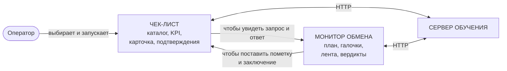
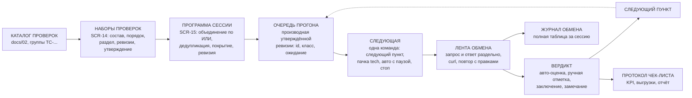
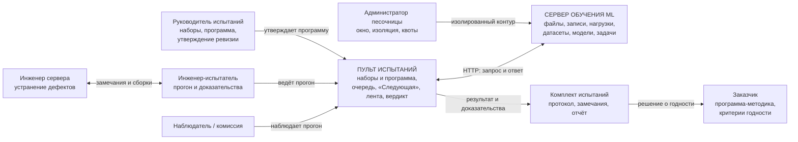
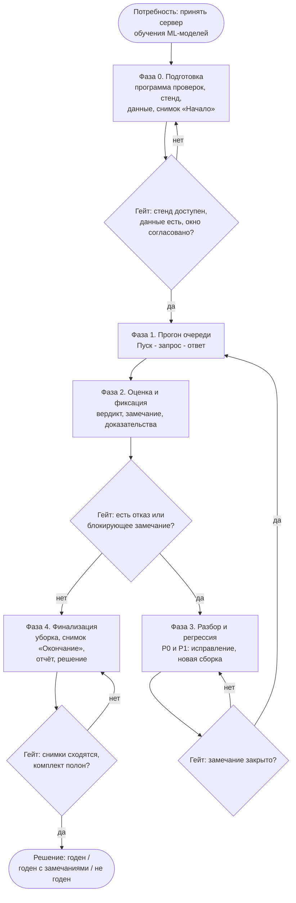
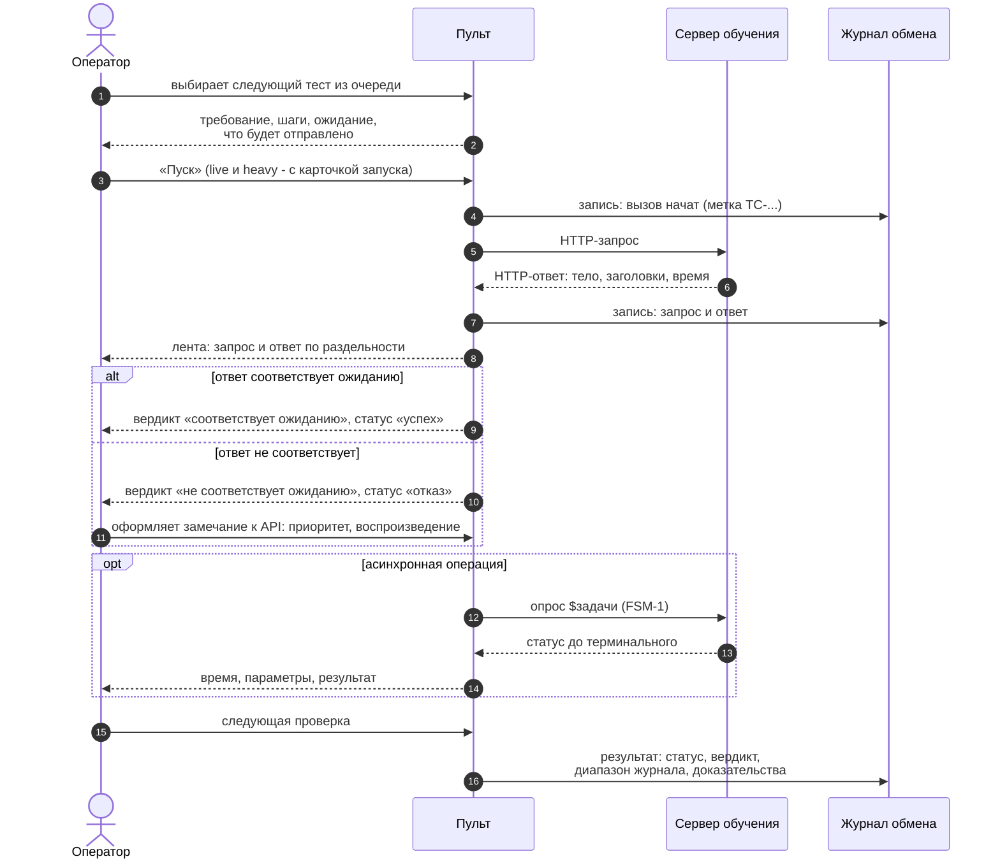
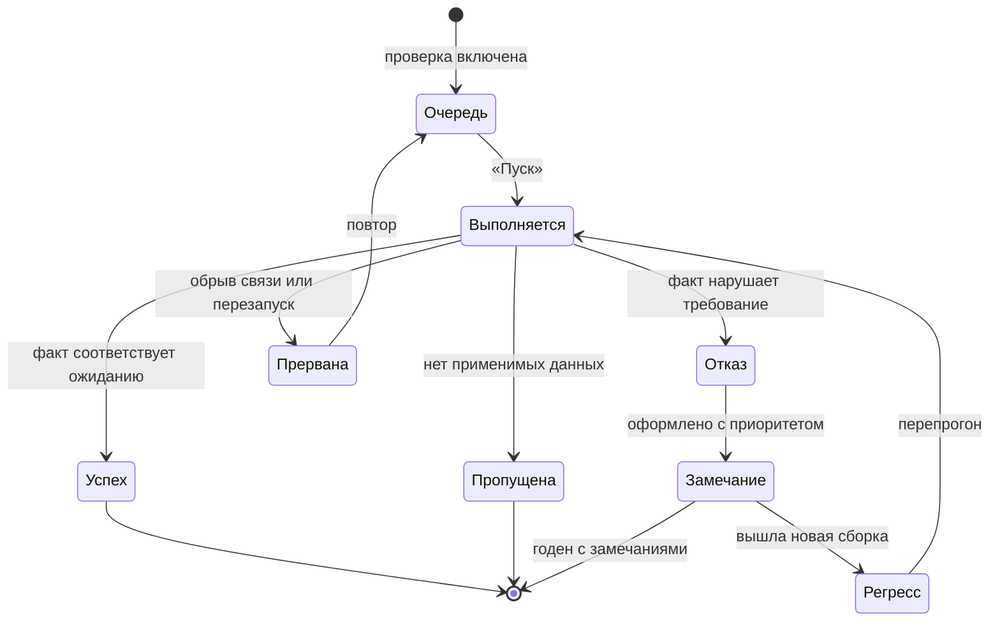
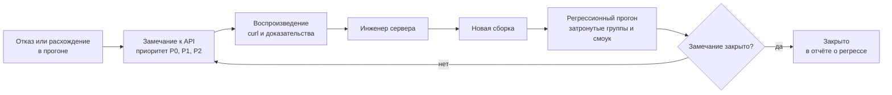
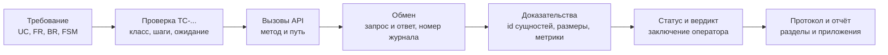

# Концепт пульта: целевой бизнес-процесс испытаний сервера обучения ML-моделей

> **Дата:** 21.09.2026. **Основание:** замечания заказчика (21.09.2026, пп. 1–4): принцип
> проведения испытаний, порядок разделов меню, «хаос» интерфейса, описание
> бизнес-процесса в идеальном варианте. **Статус:** концепт — описывает **целевое**
> состояние и не является описанием текущего кода; расхождения с текущим ПО указаны явно
> и имеют адрес в репозитории. **Источники:** `docs/01` (ТЗ), `docs/02` (программа
> проверок), `docs/12` (§3.4 маршрут, §13 чек-лист, §27 монитор обмена), `docs/13`
> (отчёт этапа M1), код `acceptance/**`.
> **Связанные изменения этого этапа:** порядок навигации вынесен в `acceptance/ui/nav.py`
> (проверяется `tests/unit/test_nav.py`), документ зарегистрирован в `docs/README.md`.

## 1. Принцип проведения испытаний

### 1.1. Пять слоёв, которые нельзя смешивать

Испытания сервера обучения — это не «набор кнопок», а пять различающихся сущностей
(термины согласованы с `acceptance/glossary.py` и §1.4 руководства `docs/12`):

| Слой | Что это | Владелец | Где живёт в пульте | Смена слоя означает |
|---|---|---|---|---|
| **Программа-методика** | документ заказчика: что считаем годным | заказчик | реквизиты `SessionInfo.program_doc` | изменение критериев приёмки |
| **Программа проверок** | каталог `TC-*`: 69 проверок с трассировкой на `UC/FR/BR/FSM`, классами, шагами, ожидаемым результатом | испытания (артефакт приёмки) | `docs/02`, `acceptance/checks/catalog.py` | смена объёма испытаний |
| **Программа испытаний** (план вызовов) | очередь: что и в каком порядке реально уходит на стенд | оператор | `acceptance/plan.py`, план сессии | смена порядка и объёма прогона |
| **Обмен** | пара «запрос → ответ» с меткой `TC-…`, номерами журнала, длительностью | пульт | `acceptance/http_log.py`, JSONL сессии | факт, который нельзя переписать |
| **Результат** | статус + вердикт + доказательства + заключение оператора | оператор | `session.checks` | оценка факта и решение по нему |

Ключевое следствие: **проверка (что проверяем) и вызов (что отправляем) — разные
сущности**. Одна проверка может отправить несколько вызовов (включая негативные пробы),
а один вызов может быть частью разных проверок. Путаница этих слоёв и порождает
«дублирующие» экраны (см. §2).

### 1.2. Цикл прогона (то, что делает оператор)

1. **Очередь.** Оператор видит, какой тест следующий: id, класс (`tech`/`live`/`heavy`/
   `manual`), требование, ожидаемый результат и — обязательно — **что именно уйдёт**
   (тела и имена `__TEST__`-сущностей формирует код пульта, а не оператор).
2. **Пуск.** Одна кнопка на проверку. Безопасные (`tech`) допускают пачку и авто-режим с
   паузой; `live`/`heavy` требуют карточки запуска и подтверждения расхода ресурсов.
3. **Наблюдение.** В ленте видно **по раздельности** отправленный запрос и полученный
   ответ (метод, путь с query, заголовки, тело, статус, время, размеры), с возможностью
   скопировать `curl` и повторить вызов с правками.
4. **Автоматический вердикт.** Пульт сам сравнивает факт с ожиданием проверки
   («соответствует / не соответствует ожиданию») и при асинхронной операции доводит
   `$Задачу` по FSM-1 до терминального состояния.
5. **Решение оператора.** Успех принимается, расхождение превращается в замечание к API
   (приоритет `P0/P1/P2`, факт, ожидание, воспроизведение), ручная проверка
   подтверждается заключением.
6. **След.** Результат проверки сохраняется вместе с доказательствами: `id` созданных
   сущностей, размеры, метрики, **диапазон номеров записей журнала** — по нему факт
   воспроизводим и проверяем комиссией.
7. **Следующий тест.** Цикл повторяется, пока очередь не пройдена; исключения
   (`пропущена`, `прервана`, снятая галочка) фиксируются с причиной, а не «молча».

### 1.3. Почему это работает (три инварианта)

| Инвариант | Формулировка | Чем подтверждается |
|---|---|---|
| **Прозрачность** | каждое действие оператора превращается в видимый HTTP-обмен, обмен привязан к проверке меткой `TC-…` | журнал обмена (таблица + JSONL сессии) |
| **Воспроизводимость** | любой результат можно воспроизвести вне пульта по `curl` и по номерам записей журнала | карточка проверки, лента обмена, отчёт (раздел доказательств) |
| **Безопасность общего стенда** | изменяются только `__TEST__`-сущности, с обязательной самоочисткой; изменяющие операции требуют подтверждения | правила выполнения (`docs/02` §3), карточка запуска, `available_actions` для `$Задач` |

## 2. Где маршрут оператора разрывается сегодня

### 2.1. Два экрана — два полушага одного цикла

| Элемент цикла (§1.2) | «✅ Чек-лист проверок» (`ui/pages/checks.py`) | «🔄 Монитор обмена» (`ui/pages/monitor.py`) |
|---|---|---|
| Список тестов | таблица каталога + фильтры + KPI | **дерево плана** (111 пунктов: 48 проверок + 63 вызова, галочки) |
| Пуск | «▶ Запустить проверку», групповой прогон `tech` | «▶ Выполнить следующую», «⏯ Авто с паузой», «⏸ Стоп», «↺ Сброс» |
| Наблюдение (запрос/ответ) | **нет** — только «диапазон журнала» (`#118–#123`) | **есть** — лента с независимой подробностью запроса и ответа, `curl`, повтор с правками |
| Карточка проверки, ручные отметки, замечание по проверке, предпросмотр `__TEST__` | **есть** | частично (ожидание пункта, предпросмотр payload, замечание из записи) |
| Состояние результата | `session.checks` | `session.plan.items` — **второй учёт того же факта** |

Практический эффект: начав с чек-листа (каталог, KPI, подтверждения), оператор уходит на
«Монитор обмена», чтобы увидеть, что ушло и что вернулось; начав с монитора — уходит в
чек-лист за ручной отметкой и заключением.

### 2.2. Что именно дублируется (шесть наблюдений)

| № | Наблюдение | Адрес в коде |
|---|---|---|
| 1 | Два списка одной и той же программы испытаний: таблица чек-листа и дерево плана | `ui/pages/checks.py` (таблица) и `ui/common/plan_panel.py` (дерево) |
| 2 | Две точки запуска одного сценария с разными правилами | `ui/common/check_run.run_check` и `plan_runner.execute_item` |
| 3 | Двойной учёт результата: `session.checks` и `session.plan.items` (статус, вердикт, диапазон журнала) | `acceptance/session.py` (схема v6) |
| 4 | Два блока KPI по одному и тому же прогону | `checks._render_kpi` и `plan_panel._render_summary` |
| 5 | Прозрачность доступна только на одном экране: лента обмена не встроена в карточку проверки | `ui/common/exchange_monitor.py` подключается только в `ui/pages/monitor.py` |
| 6 | Докстринг компонента обещает встраивание в «Чек-лист» и «Консоль», которого нет | `ui/common/exchange_monitor.py`, строки 13–14 |

**Диаграмма 1. Маршрут оператора сейчас (два экрана — два полушага)**

### 2.3. Ответ на вопрос «есть ли единая страница проверок»

Да, единое рабочее место — правильное решение, но «слияние в лоб» (одна страница вместо
двух) даёт перегруженный экран. Чек-лист — это ещё и **протокол испытаний**: KPI по
выборке, выгрузка CSV/MD в артефакты, раздел отчёта, приложение к комплекту
(`docs/12` §13.2, §13.6, §17.4).

Второй разрыв — **планирование и исполнение в одном экране**: состав программы (что и в каком
объёме испытываем) определяет руководитель испытаний, а прогон ведёт инженер-испытатель.
Галочки в очереди прогона заставляют инженера пересобирать программу, а руководителя —
смотреть прогон ради планирования.

Поэтому целевое решение — не «одна страница вместо двух», а **четыре ответственности** (§3):
планирование (наборы и программа сессии), прогон (единое рабочее место), протокол, архив.

## 3. Целевое разделение экранов

### 3.1. Четыре ответственности вместо двух половин

| Ответственность | Вопрос пользователя | Целевой экран | Что из текущего кода переходит |
|---|---|---|---|
| **Планирование** | «что и в каком объёме испытываем в этой сессии» | **раздел «Планирование испытаний»**: `SCR-14` «Наборы проверок» (двухколоночный редактор: каталог ↔ состав набора) + `SCR-15` «Программа сессии» (объединение наборов, покрытие разделов, утверждение ревизии) | каталог проверок и его группы; признак «ожидаемо блокировано» становится характеристикой объёма, а не режимом прогона |
| **Прогон** | «что запускаю дальше и что ушло/вернулось» | **единое рабочее место**: очередь (производная утверждённой программы) + команда «Следующая» + лента обмена активной проверки + блок вердикта | `plan_panel` (как очередь), `exchange_monitor` (как лента), `check_run`, `run_card`, предпросмотр `test_payloads` |
| **Протокол** | «что уже пройдено, с какими вердиктами и доказательствами» | **«Чек-лист (протокол)»**: таблица, KPI по выборке, ручные отметки, выгрузки CSV/MD, приложение к отчёту | таблица и KPI чек-листа, `checks_engine.checklist_rows`, выгрузки |
| **Архив** | «что было на самом деле, побайтно» | **«Журнал обмена»**: полная таблица обменов, выгрузка JSONL, разбор после прогона | экран «Журнал», `http_log.Journal` |

### 3.2. Пять принципов, на которых держится пульт

| Принцип | Что это значит | Как проверяется |
|---|---|---|
| **1. Планирование отделено от исполнения** | состав программы определяет руководитель испытаний (наборы и их объединение), прогон ведёт инженер-испытатель: в разделе «Планирование» нет команд запуска, а в «Испытаниях» нельзя править состав программы | в макете: `SCR-14`/`SCR-15` без запуска, `SCR-05` без правки состава (`IR-P-18`) |
| **2. Один источник программы** | программа сессии — **объединение выбранных наборов** (логическое ИЛИ) с дедупликацией; очередь прогона — производная утверждённой ревизии, а не второй список проверок | число пунктов очереди = числу проверок объединения; пересечения наборов учтены один раз (`FR-P-68`) |
| **3. Одна команда запуска** | одно место запуска и одна команда — **«Следующая»**: она запускает ровно следующий пункт программы и показывает его идентификатор. Пачка `tech`, авто-режим с паузой и ручная отметка — режимы одной механики, а не отдельные сценарии на разных экранах | в коде один исполнитель на проверку; подпись команды содержит идентификатор пункта (`FR-P-16`, `IR-P-4`) |
| **4. Один след** | результат проверки **один**: статус + вердикт + диапазон журнала + доказательства + заключение. Диапазон журнала раскрывается лентой прямо в карточке проверки, а не ссылкой на другой экран | в сессии одно поле результата; пункт очереди — производная от него |
| **5. Идеальный процесс не знает о дефектах API** | «блокировано API» — это результат, а не режим работы: пульт всегда доводит проверку до вердикта и оформляет замечание. В перспективе на стенде есть изоляция (песочница/namespace), поэтому «боевые» проверки безопасны | в идеале поле «ожидаемо блокировано» из программы проверок исчезает |

**Диаграмма 2. От каталога к прогону: планирование и единое рабочее место**

## 4. Порядок навигации (меню)

### 4.1. Как было и как стало

| Группа | Было | Стало | Почему |
|---|---|---|---|
| **Планирование испытаний** | такого раздела нет: состав и галочки живут в прогоне | **«Планирование испытаний»** (первым): `SCR-14` «Наборы проверок», `SCR-15` «Программа сессии» | планирование — ответственность руководителя испытаний, а не шаг прогона: раздел идёт первым, потому что объём проверок определяется до подготовки стенда |
| — / **Подготовка** | `stand`, `session` **без заголовка** | **«Подготовка»**: `stand`, `session` | после утверждённой программы маршрут идёт от проверки стенда и открытия сессии; группа без подписи выглядела «подвешенной» |
| **Испытания** | `records`, **`tasks`**, `datasets`, `checks`, `monitor`, `console` | **`checks`, `monitor`, `records`, `datasets`, `tasks`** | прогон и наблюдение — первыми; данные стенда — после них; `$Задачи` — **последними** (замечание п. 2): это монитор инфраструктуры, шагом приёмки он не является |
| — / **Инструменты** | (внутри «Испытаний») | **«Инструменты»**: `console` | консоль — свободные пробы и диагностика (FR-T3), а не шаг бизнес-процесса; впереди других разделов она сбивает с маршрута (§7.3 руководства) |
| **Результаты** | `notes`, `logs`, `report` | без изменений | замыкают маршрут: замечания → журнал → отчёт |

Место проектируемых экранов `TC-MOD`/`TC-TR`/`TC-INF` (этапы T6–T8) — сразу после
`$Датасетов`, перед `$Задачами`.

### 4.2. Чем порядок защищён

* Данные навигации вынесены в `acceptance/ui/nav.py` (`GROUPS`, `DEFAULT_SCREEN`) — без
  Streamlit, поэтому порядок проверяется unit-тестом `tests/unit/test_nav.py`:
  «`$Задачи` — последний в „Испытаниях“», «`checks`/`monitor` — первыми», «`console` — в
  инструментах», «каждый экран перечислен ровно один раз».
* `acceptance/app.py` при старте вызывает `nav.validate(SCREENS)`: новый экран, забытый в
  навигации, даёт понятную ошибку вместо «молча невидимой» страницы.
* Порядок групп не влияет на маршрутизацию (`st.session_state["pult_screen"]`) и на
  переходы «открыть в консоли/журнале» из других экранов.
* Целевой порядок (**пять групп**, первая — «Планирование испытаний») зафиксирован в ТЗ
  (§6.1, `IR-P-1`) и макете (`docs/16` §0); в коде он появится вместе с экранами `SCR-14`/
  `SCR-15` на этапе M2 — до этого менять `nav.py` нельзя: `nav.validate(SCREENS)` требует,
  чтобы каждый экран меню существовал.

## 5. Бизнес-процесс тестирования сервера обучения ML-моделей (идеальный вариант)

Описание ниже **не учитывает текущих ограничений созданного ПО**: предполагается, что у
стенда есть изолированный контур для испытаний, полный API (включая состав датасета и
`task_id` в ответах), а пульт реализован по §3 (одна очередь, один пуск, один след).

### 5.1. Участники

| Роль | Интерес и ответственность | Действия в пульте | Артефакт на выходе |
|---|---|---|---|
| **Руководитель испытаний** (заказчик) | годность сервера по программе-методике | собирает **наборы проверок** (`SCR-14`), объединяет их в **программу сессии** с покрытием разделов и утверждает ревизию (`SCR-15`); задаёт критерии годности; читает отчёт; подписывает решение | утверждённая программа испытаний (ревизия), подписанный отчёт, решение «годен / годен с замечаниями / не годен» |
| **Инженер-испытатель** (основной пользователь) | выполнить программу и доказать результат | ведёт сессию, готовит данные, нажимает «Следующая» в прогоне, читает запрос и ответ, фиксирует вердикт, снимает пункт с причиной, оформляет замечания, снимает снимки, убирает тестовые сущности | сессия, протокол чек-листа, реестр замечаний, отчёт с доказательствами |
| **Инженер-разработчик сервера** | закрыть замечания и выпустить сборку | получает замечание с фактом, ожиданием и `curl`; воспроизводит, исправляет | исправленная сборка, статус замечания |
| **Наблюдатель / приёмная комиссия** | убедиться, что результат не «на словах» | наблюдает прогон (лента, журнал), сверяет доказательства с требованиями | заключение наблюдателя, замечания к методике |
| **Администратор стенда (песочницы)** | сохранность живых данных и ресурсы | выделяет окно испытаний, изолированный контур, квоты на обучение и инференс | согласованное окно, изоляция, квоты |

### 5.2. Фазы процесса и гейты

| Фаза | Вход | Ключевые действия | Выход | Гейт (условие перехода) |
|---|---|---|---|---|
| **0. Подготовка** | программа-методика, доступ к стенду | **спланировать испытания**: собрать наборы проверок по разделам (`SCR-14`) и утвердить программу сессии с покрытием разделов (`SCR-15`); согласовать критерии годности; зафиксировать сборку; подготовить эталонные данные (`$Файлы` RAW+markup, `$Датасет`, `$Модель`, сэмплы для инференса); согласовать изоляцию и окно; снять снимок «Начало» | утверждённая программа испытаний (ревизия), сессия, снимок «Начало», подготовленный набор данных | программа утверждена; стенд отвечает, данные есть, окно и изоляция согласованы |
| **1. Прогон** | очередь проверок (производная утверждённой программы) | «Следующая» — по одной команде; наблюдение «запрос → ответ»; ожидание терминальных состояний FSM-1 у асинхронных операций; авто-режим с паузой для безопасных проверок | результаты по каждой проверке, обмены с метками `TC-…` | все включённые проверки завершены, либо осознанно сняты с причиной |
| **2. Оценка и фиксация** | результаты прогона | авто-вердикт «соответствует ожиданию»; ручные отметки `manual`; оформление замечаний с приоритетом и воспроизведением; сбор доказательств (`id` сущностей, размеры, метрики, диапазон журнала) | протокол чек-листа, реестр замечаний | каждое расхождение = замечание; каждое «пропущено/прервано» объяснено |
| **3. Разбор и регрессия** | замечания | передача замечаний разработчику; воспроизведение по `curl`; выпуск новой сборки; **перепрогон** затронутых групп и смоук-набора | закрытые замечания, отчёт о регрессе | нет открытых `P0/P1`, либо принято решение «годен с замечаниями» |
| **4. Финализация и передача** | протокол, замечания | уборка `__TEST__`-сущностей; снимок «Окончание» и сверка реестров; сборка комплекта отчётности; решение и подписи; сравнение с предыдущей сессией и сборкой | комплект испытаний (`md` + `json` + приложения), решение | снимки сходятся (расхождение объяснено), комплект полон |

**Диаграмма 3. Контекст процесса**

### 5.3. Классы проверок и режим запуска

| Класс | Что проверяет | Условие запуска | Что обязательно видно оператору |
|---|---|---|---|
| `tech` | контракт, валидация, доступность, формат ошибок, чтение реестров | без подтверждений; допускаются пачка и авто-прогон | запрос и ответ, вердикт, допущения о расхождениях |
| `live` | реальные данные стенда (`$Файл`, `$Нагрузка`, `$Датасет`) | подтверждение, цель проверки, используемые данные | **что будет отправлено** до запуска, след `__TEST__`, самоочистка |
| `heavy` | `train`, `check`, асинхронный `inference`, `fill` больших объёмов | карточка запуска: цель, данные, параметры, ответственный, оценка ресурсов, судьба артефактов, подтверждение расхода | `task_id`, FSM-1 до терминального состояния, метрики, окно ожидания |
| `manual` | визуальные и организационные проверки | отметка оператора с обязательным заключением | шаги проверки, ожидание, доказательство |

### 5.4. Трассируемость (сквозная связь требования и доказательства)

| Связь | Источник | Где хранится | Куда попадает |
|---|---|---|---|
| требование → проверка | `UC/FR/BR/FSM` в описании проверки | каталог проверок (`docs/02`) | протокол, отчёт (раздел «Программа и объём») |
| проверка → вызовы | эндпоинты и негативные пробы проверки | план/очередь | лента обмена, приложение `plan.csv` |
| вызов → обмен | метка `TC-…` и номера записей журнала | журнал обмена (JSONL сессии) | доказательства проверки, выдержки в отчёт |
| проверка → результат | статус, вердикт, доказательства, заключение | сессия испытаний | протокол чек-листа, отчёт |
| результат → замечание | правило «расхождение = замечание» (`P0/P1/P2`) | реестр замечаний | отчёт, передача разработчику |

### 5.5. Жизненный цикл проверки в идеальном процессе

| Статус | Смысл | Что делает пульт | Что делает оператор |
|---|---|---|---|
| `не выполнена` | стоит в очереди прогона (производная утверждённой программы) | показывает требование, ожидание и что уйдёт; помечает пункт как «следующая» | нажимает «Следующая»; обойти пункт нельзя — только «снять с причиной» или новая ревизия программы |
| `выполняется` | запросы ушли, асинхронная часть идёт | ждёт терминальный статус `$Задачи` (FSM-1), пишет обмены | наблюдает, при необходимости ставит паузу/прерывает |
| `успех` | факт совпал с ожиданием | фиксирует доказательства и диапазон журнала | переходит к следующему тесту |
| `отказ` | факт нарушает требование | помечает расхождение, готовит черновик замечания | оформляет замечание, участвует в разборе |
| `блокировано` | проверка неприменима/непроверяема (в идеале — редкость) | формирует замечание автоматически | подтверждает обходной путь или перспективное требование |
| `пропущена` | нет применимых данных или конфигурации | требует причину | вводит причину и допустимость пропуска |
| `прервана` | обрыв связи, таймаут, перезапуск пульта или сервера | сохраняет наблюдение и историю, ждёт возобновления (BR-R5/BR-R6) | повторяет прогон после восстановления |
| `требует регресса` | проверка была в `отказ`, вышла новая сборка | помечает проверку в очереди новой сессии | перепрогоняет затронутые группы и смоук |

### 5.6. Артефакты процесса

| Артефакт | Кто создаёт | Где лежит | Кому нужен |
|---|---|---|---|
| Программа проверок (`TC-*`) | испытания, по программе-методике | `docs/02`, каталог проверок | оператору, комиссии |
| Набор проверок (`SCR-14`) | руководитель испытаний | библиотека пульта, сессия | программе сессии, отчёту (раздел «Программа и объём») |
| Программа испытаний (ревизия, `SCR-15`) | руководитель испытаний (утверждение) | сессия | очереди прогона, протоколу, отчёту |
| Сессия испытаний | пульт | `acceptance_data/sessions/<id>.json` | оператору (продолжение), отчёту |
| Журнал обмена (JSONL) | пульт (каждый запрос) | `acceptance_data/logs/session_<id>.jsonl` | комиссии, разработчику (воспроизведение) |
| Протокол чек-листа (CSV + MD) | оператор (выгрузка) | артефакты сессии | приложению к отчёту |
| Реестр замечаний к API | пульт (авто) и оператор | сессия, выгрузки MD/JSON/CSV | разработчику, отчёту |
| Снимки стенда «Начало/Окончание» | оператор | сессия | отчёту (учёт ресурсов) |
| Комплект испытаний (`report.md`, `report.json`, приложения) | пульт по данным сессии | `acceptance_data/reports/` | заказчику, архиву |

### 5.7. Целевые экраны: вопрос → экран

| Вопрос оператора | Экран целевого пульта | Что не должен делать этот экран |
|---|---|---|
| «Стенд жив? Какая сборка? Что в реестрах?» | Подготовка → Стенд | не запускать проверки |
| «В какой сессии я работаю и что в неё попало?» | Подготовка → Сессия испытаний | не заменять прогон |
| «Что запускаю дальше?» | Прогон (очередь) | не показывать отчётность |
| «Что ушло и что вернулось?» | Прогон (лента обмена активной проверки) | не хранить второй статус проверки |
| «Пройдена ли программа и с какими вердиктами?» | Чек-лист (протокол) | не быть единственной точкой запуска |
| «Что было с этим `$Файлом` / `$Датасетом` / `$Задачей`?» | `$Задачи`, `$Датасеты`, Записи | не подменять прогон проверок |
| «Почему это ушло с ошибкой?» | Журнал обмена, Замечания к API | не быть повседневным рабочим экраном |
| «Что я передаю заказчику?» | Отчёт испытаний | не опрашивать сервер при формировании |

**Диаграмма 4. Макропроцесс с петлёй регрессии**

**Диаграмма 5. Один шаг прогона: «Пуск» проверки**

**Диаграмма 6. Жизненный цикл проверки (идеал)**

**Диаграмма 7. Контур замечаний и регрессии**

**Диаграмма 8. Трассируемость результата**

## 6. План перехода (что делать после принятия концепта)

| Этап | Содержание | Затрагивает | Риск |
|---|---|---|---|
| **M1+ (сделано)** | этот документ; порядок навигации в `acceptance/ui/nav.py` + тест `test_nav.py`; регистрация документа | `docs/14`, `acceptance/app.py`, `acceptance/ui/nav.py`, `tests/unit/test_nav.py`, `docs/README.md`, `README.md`, `docs/12` | низкий: экраны и данные не меняются |
| **M2** | **планирование испытаний** (раздел «Планирование»: `SCR-14` наборы проверок, `SCR-15` программа сессии с объединением по ИЛИ, покрытием разделов, ревизиями и утверждением) + единое рабочее место «Прогон»: лента обмена встраивается в карточку активной проверки, очередь — производная утверждённой программы, **одна команда запуска «Следующая»**; чек-лист остаётся протоколом; один исполнитель на проверку | `ui/pages/{sets,programme,checks,monitor,run}.py`, `ui/common/{exchange_monitor,plan_panel}.py`, `plan.py` (ревизии), `nav.py` (пять групп), `check_run`, `plan_runner` | средний: смоук-тесты экранов, правила подтверждений, схема сессии под ревизии программы |
| **M3** | снятие двойного учёта: пункт очереди — производная от результата проверки (схема сессии v7); переработка раздела 12 отчёта и `plan.csv`; разделение групп «Данные стенда» / «Инструменты» в ИА | `session.py`, `report.py`, `plan.py`, `ui/pages/**`, документация | высокий: схема сессии и отчёт — делается отдельным этапом с живым прогоном |

Что **не меняется** ни в одном из этапов: программа проверок `TC-*` и её трассировка,
правила `__TEST__`-сущностей и самоочистки, структура комплекта отчёта, контракт с
испытуемым API (пульт по-прежнему не требует доработок сервера).

## 7. Как решение удерживается

| Инвариант концепта | Чем проверяется |
|---|---|
| порядок навигации (планирование → подготовка → результаты; `$Задачи` последними; консоль — инструмент) | `tests/unit/test_nav.py` |
| перечень экранов, групп и требований ТЗ ↔ макет ↔ прототип (включая «в планировании нет запуска») | `tests/unit/test_target_docs.py` |
| целостность навигации: все экраны ровно один раз | `nav.validate(SCREENS)` при старте + тесты навигации |
| терминология `$`-сущностей стенда | `tests/unit/test_glossary.py` |
| числа каталога проверок в руководстве | `tests/unit/test_user_guide_doc.py` |
| экраны открываются без исключений | `tests/smoke/test_app_smoke.py` |

## 8. История документа

| Версия | Дата | Изменение |
|---|---|---|
| 1.0 | 21.09.2026 | Первая версия: принцип проведения испытаний (пять слоёв, цикл прогона, три инварианта), разбор дублирования «Чек-лист» ↔ «Монитор обмена», целевое разделение экранов (прогон / протокол / архив, четыре принципа), порядок навигации, бизнес-процесс в идеальном варианте (участники, фазы и гейты, классы, трассируемость, жизненный цикл, артефакты, экраны) — 8 диаграмм mermaid; план перехода M2/M3 |
| 1.1 | 21.09.2026 | Планирование выделено в отдельный раздел «Планирование испытаний» (первым): четыре ответственности, `SCR-14` «Наборы проверок» и `SCR-15` «Программа сессии»; принципы переформулированы («планирование отделено от исполнения», «один источник программы» — объединение наборов по ИЛИ, «одна команда запуска „Следующая“»); роли — «Руководитель испытаний» и «Инженер-испытатель»; диаграммы 2 и 3 обновлены; фаза 0 включает планирование и утверждение программы; артефакты «набор» и «программа испытаний»; план M2 расширен |
