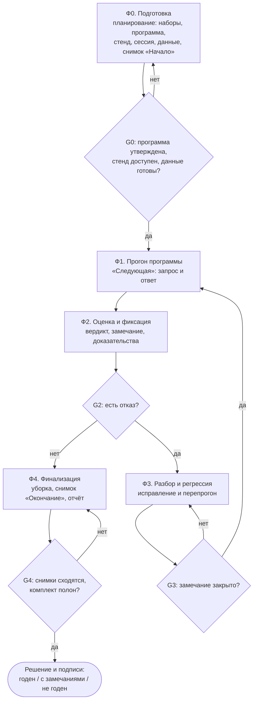
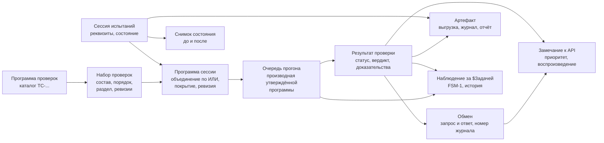

# Техническое задание на Пульт испытаний сервера обучения ML-моделей (целевое)

> **Дата:** 21.09.2026 (версия 1.2 — 22.09.2026). **Статус:** проект целевого ТЗ (версия 1.2) —
> описывает **целевую**
> систему по концепции `docs/14` и не является описанием текущей реализации.
> **Основание:** концепт `docs/14. Концепт пульта — целевой бизнес-процесс испытаний.md`
> (замечания заказчика 21.09.2026, пп. 1–4), пожелания к функционалу 21.09.2026
> (`llm_tasks/16`), опыт эксплуатации этапов T0–T5 и M1 (документы `docs/03…docs/13`).
> **Сопутствующие документы:** `docs/16. Макет интерфейса ПУЛЬТА (целевые экраны).md`
> (экраны `SCR-101…SCR-501`), прототип `mockup/` (кликабельный HTML-макет),
> `docs/02. Чек-лист испытаний.md` (программа проверок), `docs/01` (ТЗ временного UI —
> исторический документ, не нормативный для целевой системы).
> **Правило работы с документом:** любое спорное решение по пульту решается ссылкой на
> пункт настоящего ТЗ; изменения вносятся через §12 «История документа» с указанием
> затронутых ID требований.

## 1. Общие сведения

### 1.1. Наименование и назначение

| Параметр | Значение |
|---|---|
| Наименование | Пульт испытаний сервера обучения ML-моделей (далее — Пульт) |
| Назначение | автоматизация приёмочных испытаний сервера обучения: подготовка, прогон программы проверок, фиксация результатов и доказательств, оформление комплекта испытаний |
| Объект испытаний | сервер обучения ML-моделей (модули: система, импорт файлов, записи RAW+markup, нагрузки, датасеты, модели, обучение/проверка/ONNX, инференс, AutoML, служба задач) |
| Пользователи | инженер-испытатель (основной), руководитель испытаний, наблюдатель/комиссия, инженер-разработчик сервера |
| Способ работы | веб-приложение, разворачиваемое на машине испытателя; доступ к объекту испытаний — по HTTP API |

### 1.2. Область применения

Пульт применяется при:
1. приёмочных испытаниях новой сборки сервера обучения (полный проход программы проверок);
2. регрессионных прогонах после исправления дефектов (подмножество проверок + смоук-набор);
3. предъявлении результатов приёмной комиссии (прозрачный прогон «по одной команде»);
4. разборе инцидентов: воспроизведение вызовов, анализ обменов, подготовка замечаний разработчику.

### 1.3. Роли

| Роль | Права в целевом варианте | Ограничения |
|---|---|---|
| **Руководитель испытаний** | **проектирование испытаний**: наборы проверок (`SCR-101`), программа сессии с покрытием разделов и объёмом (`SCR-102`), утверждение ревизий; критерии годности; чтение протокола и отчёта; подпись решения | **не запускает проверки** и не изменяет результаты прогона |
| **Инженер-испытатель** | подготовка (стенд, сессия, данные, снимок «Начало»), прогон утверждённой программы («Следующая», пачка, авто с паузой), вердикты, ручные отметки, снятие с причиной, замечания, доказательства, уборка `__TEST__`, комплект отчёта | не изменяет состав утверждённой программы (изменение — новая ревизия у руководителя) |
| **Наблюдатель / комиссия** | просмотр прогона в реальном времени, журнала обмена, доказательств | без права изменения статусов |
| **Инженер-разработчик сервера** | чтение замечаний, воспроизведение вызовов по `curl` в своём контуре | без доступа к стенду испытаний на запись |
| **Администратор стенда** | управление контуром испытаний: изоляция, квоты, окно прогона | не влияет на результаты проверок |

Разграничение прав — требование `AR-P-8`; в минимальной поставке роли могут совмещаться в одном
пользователе, но модель прав и подписей в протоколе сохраняется.

### 1.4. Термины и соглашения

Соглашение о терминологии — из концепта (`docs/14` §1.1) и глоссария пульта:

* сущности **объекта испытаний** пишутся с префиксом `$`: `$Файл`, `$Запись`, `$Нагрузка`,
  `$Датасет`, `$Модель`, `$Задача`;
* внутренние сущности **ПУЛЬТА** — без префикса: проверка, карточка проверки, карточка
  запуска, пункт очереди, обмен, замечание, артефакт, сессия;
* «программа проверок» — каталог `TC-*` (что проверяем); **«набор проверок»** — именованный
  список проверок с порядком, разделом и ревизиями (`SCR-101`); **«программа сессии»** —
  объединение выбранных наборов (логическое ИЛИ), которое и исполняется (`SCR-102`);
  «очередь прогона» — производная утверждённой ревизии программы; «программа-методика» —
  документ заказчика;
* «обмен» — пара «запрос → ответ» с номером в журнале; «вердикт» — суждение о соответствии
  факта ожиданию; «доказательство» — данные, по которым результат воспроизводим.

Полный словарь с определениями — приложение Д (§12.5).

### 1.5. Порядок изменения документа

1. Требование имеет неизменяемый ID (`FR-P-…`, `DR-P-…`, `IR-P-…`, `AR-P-…`, `NFR-P-…`,
   `AC-P-…`); удаление ID запрещено — требование помечается «снято» с указанием причины.
2. Новое требование добавляется в конец своей группы (нумерация непрерывна — проверяется
   автоматически, `tests/unit/test_target_docs.py`).
3. Каждое требование ссылается на экран макета (`SCR-…`) и на приёмочную проверку (`AC-P-…`);
   разрыв трассировки не допускается (проверяется тестом).
4. Идентификатор экрана — `SCR-<раздел><порядок>`: раздел кодируется сотнями в порядке
   навигации (1xx — планирование, 2xx — подготовка, 3xx — испытания, 4xx — результаты,
   5xx — инструменты; 6xx — задел под T6–T11), порядок в разделе — единицами. Перенумерация
   выполнена однократно (версия 1.2); дальше коды экранов стабильны: новый экран получает
   первый свободный номер своего раздела. Порядок номеров совпадает с порядком навигации
   (проверяется `tests/unit/test_target_docs.py`).

## 2. Назначение, цель и границы

### 2.1. Цель

Дать испытательной группе инструмент, который **ведёт бизнес-процесс приёмки** сервера
обучения: от подготовки стенда и данных до подписанного комплекта испытаний, обеспечивая три
свойства:

| Свойство | Что означает на практике |
|---|---|
| **Прозрачность** | каждое действие оператора превращается в видимый HTTP-обмен; по отдельности видны отправленный запрос и полученный ответ |
| **Воспроизводимость** | любой результат подтверждается номером обмена в журнале и командой `curl`; результат воспроизводится вне ПУЛЬТА |
| **Управляемость процесса** | известно, что сделано, что осталось, что требует решения; пропуск и снятие проверки фиксируются с причиной |

### 2.2. Ключевой принцип

> ПУЛЬТ не требует доработки объекта испытаний. Всё, что нельзя проверить из-за дефекта или
> пробела API, фиксируется как **результат испытаний**: проверка получает статус
> «заблокировано», а в реестр замечаний и отчёт автоматически попадает замечание с
> приоритетом и обходным путём.

Вторые принципы — **планирование отделено от исполнения, один источник программы, одна команда
запуска, один след**: объём проверок определяет руководитель испытаний (наборы и их
объединение — `SCR-101`, `SCR-102`), инженер-испытатель исполняет утверждённую ревизию одной
командой «Следующая», результат у проверки один (реализация принципов — концепт `docs/14` §3.2).

### 2.3. Что входит в объём

* подготовка испытаний: проверка стенда и сборки, реквизиты сессии, снимки состояния
  реестров, подготовка данных (`$Файлы` RAW+markup, `$Нагрузки`, `$Датасеты`, `$Модели`);
* планирование испытаний: каталог проверок → наборы по разделам (`SCR-101`) → программа сессии
  с объединением наборов по логическому ИЛИ, покрытием разделов и утверждением ревизии
  (`SCR-102`); шаблоны «полная программа», «смоук-минимум», «регресс»;
* прогон утверждённой программы: очередь, **одна команда запуска «Следующая»**, пачечный и
  авто-прогон с паузой, карточки запуска для изменяющих и ресурсоёмких проверок;
* прозрачность: лента обменов, копирование `curl`, повтор с правками, предпросмотр того, что
  уйдёт на стенд;
* оценка: автоматический вердикт по ожиданию проверки, ручные отметки с заключением,
  доказательства (идентификаторы `$сущностей`, размеры, метрики, диапазон журнала);
* разбор: реестр замечаний к API (приоритеты, воспроизведение), перспективные требования,
  регрессионный перепрогон, сравнение сессий и сборок;
* финализация: уборка `__TEST__`-сущностей, сверка снимков, комплект отчётности
  (`md`/`json`/`csv` + приложения), решение и подписи;
* служебное: журналирование (приложение, сессия, обмен), справка и словарь статусов,
  диагностика связи.

### 2.4. Что вне объёма

* доработка объекта испытаний (API, стенд, алгоритмы обучения);
* продуктивный UI основного продукта и его функциональные требования (FR-1…FR-8);
* управление жизненным циклом ML-моделей вне программы проверок (промышленная эксплуатация);
* интеграция с внешними системами заказчика (Фабрика Данных, ERP) — перспектива (§11);
* обучение рабочих моделей на боевых данных вне испытаний.

### 2.5. Идеальный контур (допущения к стенду)

Целевое ТЗ формулируется для «идеального» стенда; отклонения фиксируются замечаниями, а не
меняют требования ПУЛЬТА:

| № | Допущение | Влияние на требования |
|---|---|---|
| 1 | Стенд предоставляет **изолированный контур** испытаний (namespace/тенант) и квоты на обучение и инференс | `AR-P-1`, `NFR-P-5`: изменяющие проверки безопасны, `__TEST__`-гигиена остаётся обязательной |
| 2 | API отдаёт **состав датасета** и агрегаты (число записей/чанков) | `DR-P-9`: учёт состава ведётся сервером, локальный учёт — резервный |
| 3 | Асинхронные операции возвращают **`task_id`** во всех ответах `202` | `FR-P-18`: ожидание задачи не требует поиска по списку |
| 4 | Реестры имеют `checksum` и `updated_at` | `FR-P-9`: актуальная версия `$Файла` определяется по данным сервера |
| 5 | Скачивание поддерживает `Range`/`Content-Length` | `NFR-P-6`: крупные файлы читаются частями, выгрузки воспроизводимы |
| 6 | Стенд доступен по HTTPS с фиксированным адресом; тестовые данные разрешены к записи | `AR-P-3`, `NFR-P-5` |
| 7 | Есть окно испытаний, согласованное с владельцем стенда | §3 фаза 0, гейт G0 |

## 3. Автоматизируемый бизнес-процесс

### 3.1. Фазы и гейты

| Фаза | Содержание | Гейт (условие перехода) | Требования |
|---|---|---|---|
| **Ф0. Подготовка** | **планирование** (наборы проверок, программа сессии с покрытием разделов, утверждение ревизии), проверка стенда и сборки, создание сессии, подготовка данных, снимок «Начало» | G0: программа утверждена, стенд доступен, данные готовы, окно согласовано | `FR-P-1…FR-P-12`, `FR-P-65…FR-P-70` |
| **Ф1. Прогон** | исполнение **утверждённой программы** по одной команде «Следующая» (или авто с паузой), наблюдение обменов, ожидание `$Задач` | G1: все включённые проверки завершены либо сняты с причиной | `FR-P-13…FR-P-28` |
| **Ф2. Оценка и фиксация** | вердикты, ручные отметки, замечания, доказательства, протокол | G2: каждое расхождение оформлено замечанием; каждое исключение объяснено | `FR-P-29…FR-P-39` |
| **Ф3. Разбор и регрессия** | передача замечаний, воспроизведение, новая сборка, перепрогон, сравнение | G3: нет открытых `P0/P1` либо принято решение «годен с замечаниями» | `FR-P-40…FR-P-45` |
| **Ф4. Финализация** | уборка, снимок «Окончание», сверка, комплект отчёта, решение и подписи | G4: снимки сходятся, комплект полон, решение внесено | `FR-P-46…FR-P-56` |

Детализация процесса, диаграммы макропроцесса и шага запуска («Следующая») — концепт `docs/14` §5.

### 3.2. Артефакты процесса

| Артефакт | Создаёт | Назначение | Требование |
|---|---|---|---|
| Сессия испытаний | ПУЛЬТ (автоматически) + инженер-испытатель (реквизиты) | контекст прогона, основа отчёта | `DR-P-1` |
| Набор проверок | руководитель испытаний | состав программы по разделу, ревизии | `FR-P-65`, `DR-P-13` |
| Программа сессии (ревизия) | руководитель испытаний (утверждение) | что и в каком объёме исполняется | `FR-P-68`, `DR-P-14` |
| Очередь прогона | ПУЛЬТ (из утверждённой программы) | что и в каком порядке отправляется; состав не редактируется | `FR-P-13` |
| Журнал обмена (JSONL) | ПУЛЬТ | машинный след, воспроизводимость | `NFR-P-8` |
| Протокол проверок | оператор (выгрузка) | KPI, вердикты, приложение к отчёту | `FR-P-34` |
| Реестр замечаний | ПУЛЬТ (авто) + оператор | передача разработчику, отчёт | `FR-P-31` |
| Снимки состояния | оператор | учёт ресурсов «до/после» | `FR-P-6` |
| Комплект отчёта | ПУЛЬТ | передача заказчику | `FR-P-49` |

### 3.3. Процесс в диаграмме

## 4. Функциональные требования (`FR-P`)

Формат требований: ID — формулировка — экран макета — источник — приёмочная проверка —
приоритет (**О** обязательное, **В** важное, **П** перспективное).

### 4.1. Фаза Ф0. Подготовка

| ID | Требование | Экран | Источник | Проверка | Пр. |
|---|---|---|---|---|---|
| `FR-P-1` | ПУЛЬТ проверяет доступность объекта испытаний (health и версия) по действию оператора и показывает все фактически полученные поля сборки | `SCR-202` | концепт §1.3 | `AC-P-1` | О |
| `FR-P-2` | ПУЛЬТ фиксирует сборку сервера в сессии и предупреждает, если фактическая сборка отличается от указанной в реквизитах | `SCR-203` | опыт T0–M1 | `AC-P-1` | О |
| `FR-P-3` | Оператор создаёт сессию с обязательными реквизитами (наименование, объект испытаний, программа-методика) и дополнительными (заказчик, организация, комиссия, цель, объём, условия, ограничения, критерии) | `SCR-203` | `docs/01` FR-T5 | `AC-P-2` | О |
| `FR-P-4` | Сессия ведёт историю событий (время, действие, автор, детали) и переживает перезапуск ПУЛЬТА | `SCR-203` | опыт T0–M1 | `AC-P-2` | О |
| `FR-P-5` | Жизненный цикл сессии: черновик → идёт → завершена; переоткрытие фиксируется с причиной | `SCR-203` | `docs/01` FR-T5 | `AC-P-2` | О |
| `FR-P-6` | Оператор снимает снимок состояния реестров «Начало»; ошибка отдельного запроса не прерывает снимок, а помечается в нём | `SCR-202` | `docs/01` FR-T1 | `AC-P-3` | О |
| `FR-P-7` | Экран данных стенда показывает реестры `$Файлов`, записей RAW+markup, `$Нагрузок`, `$Датасетов`, `$Моделей` с фильтрами, счётчиками и выгрузкой | `SCR-204` | концепт §1.2 | `AC-P-4` | О |
| `FR-P-8` | ПУЛЬТ объединяет `$Файлы` RAW и markup в записи по явному правилу, показывает правило и уверенность, ведёт дубли и несопоставленные файлы | `SCR-204` | замечание №1 к макету | `AC-P-4` | О |
| `FR-P-9` | Актуальная версия записи определяется по данным сервера (контрольная сумма, время обновления); при их отсутствии — по времени импорта с подписью источника и возможностью ручного решения оператора | `SCR-204` | замечание №1, концепт §2.5 | `AC-P-5` | О |
| `FR-P-10` | Подготовка данных к прогону документируется: состав `$Датасета`, используемые `$Модели`, эталонные сэмплы для инференса | `SCR-204` | концепт §5.2 | `AC-P-4` | В |
| `FR-P-11` | ПУЛЬТ оценивает готовность к прогону (гейт G0): программа утверждена, стенд доступен, данные готовы, сессия создана | `SCR-201`, `SCR-102` | концепт §5.2 | `AC-P-6`, `AC-P-26` | О |
| `FR-P-12` | Оценка готовности не блокирует работу: ПУЛЬТ объясняет, чего не хватает, и ведёт к нужному экрану | `SCR-201` | концепт §3.2 | `AC-P-6` | В |

### 4.2. Фаза Ф1. Прогон

| ID | Требование | Экран | Источник | Проверка | Пр. |
|---|---|---|---|---|---|
| `FR-P-13` | Очередь прогона — **производная утверждённой ревизии программы сессии**: она повторяет порядок пунктов программы; второго списка проверок в ПУЛЬТЕ нет, состав очереди в прогоне не редактируется | `SCR-301` | концепт §3.2 (принципы 1–2) | `AC-P-7` | О |
| `FR-P-14` | Пункт очереди показывает: идентификатор, название, класс, проверяемое требование, ожидаемый результат, зависимость от `$сущностей` и «что будет отправлено» | `SCR-301`,`SCR-302` | концепт §1.2(1) | `AC-P-7` | О |
| `FR-P-15` | Инженер-испытатель снимает пункт с очереди с обязательной причиной (по одному и по выборке) и возвращает его; снятие — **результат прогона**: оно не меняет программу и отражается в протоколе и отчёте отдельно от признака «вне программы» (планирование — `SCR-101`/`SCR-102`) | `SCR-301`, `SCR-401` | пожелание 21.09.2026 п. 3 | `AC-P-8` | О |
| `FR-P-16` | Следующий пункт программы всегда один и виден инженеру-испытателю; **единственная команда запуска — «Следующая»**: она отправляет ровно один пункт и показывает его идентификатор; обойти пункт нельзя — только снять с причиной или выпустить новую ревизию программы | `SCR-301` | концепт §1.2(2), §3.2 (принцип 3) | `AC-P-7` | О |
| `FR-P-17` | ПУЛЬТ выполняет пачечный прогон безопасных проверок (без изменений данных) одной командой, с отчётом о числе выполненных пунктов | `SCR-301` | опыт T3–T5 | `AC-P-8` | О |
| `FR-P-18` | Авто-прогон с паузой: интервал задаёт оператор; прогон останавливается при пункте, требующем подтверждения, при отказе и по команде «Стоп»; после устранения причины продолжается с того же пункта | `SCR-301` | пожелание 21.09.2026 п. 2 | `AC-P-8` | О |
| `FR-P-19` | Карточка запуска обязательна для изменяющих и ресурсоёмких проверок: цель, используемые данные, параметры, ответственный, ожидаемая длительность и ресурсы, судьба созданных артефактов, подтверждение расхода ресурсов | `SCR-301` | `docs/01` FR-T10 | `AC-P-9` | О |
| `FR-P-20` | До запуска ПУЛЬТ показывает, что именно уйдёт на стенд: тела запросов, имена и содержимое `__TEST__`-сущностей; оператор их не набирает вручную | `SCR-302` | пожелание 21.09.2026 п. 5 | `AC-P-9` | О |
| `FR-P-21` | Лента обменов: на каждый вызов — отдельная запись с отправленным запросом и полученным ответом; степень подробности запроса и ответа выбирается **независимо** | `SCR-301` | пожелание 21.09.2026 п. 1 | `AC-P-10` | О |
| `FR-P-22` | Каждая запись ленты содержит номер записи журнала, метку пункта/проверки, статус ответа, длительность и вердикт | `SCR-301`,`SCR-402` | концепт §1.3 | `AC-P-10` | О |
| `FR-P-23` | Из записи ленты доступны: копирование вызова как `curl`, повтор с правками (путь, параметры, тело), создание замечания к API, переход к полному журналу | `SCR-301` | пожелание 21.09.2026 п. 1–2 | `AC-P-10` | О |
| `FR-P-24` | Асинхронные операции: ПУЛЬТ отслеживает `$Задачу` по состояниям FSM-1 до терминального состояния в пределах заданного окна ожидания и показывает прогресс и результат | `SCR-303`,`SCR-301` | `docs/01` FR-T11 | `AC-P-11` | О |
| `FR-P-25` | Управление `$Задачей` — только командами, которые сервер перечислил как доступные для текущего состояния; обрыв связи и таймаут не разрушают сессию | `SCR-303` | BR-R5, BR-R6 | `AC-P-11` | О |
| `FR-P-26` | После перезапуска ПУЛЬТА или обрыва связи наблюдение и очередь восстанавливаются, история переходов FSM-1 сохраняется; проверка с прерванным исполнением получает статус «прервана» и может быть повторена | `SCR-303` | `docs/01` NFR-T3 | `AC-P-11` | О |
| `FR-P-27` | ПУЛЬТ поддерживает два режима исполнения: сценарием проверки целиком (по умолчанию) и по отдельным вызовам (пошаговый контроль); выбранный режим виден оператору | `SCR-301` | опыт M1 | `AC-P-7` | В |
| `FR-P-28` | Все обмены прогона помечаются меткой пункта, поэтому выборка по метке даёт полный след проверки в журнале | `SCR-402` | `docs/02` §3 | `AC-P-12` | О |

### 4.3. Фаза Ф2. Оценка и фиксация

| ID | Требование | Экран | Источник | Проверка | Пр. |
|---|---|---|---|---|---|
| `FR-P-29` | ПУЛЬТ автоматически сравнивает факт с ожидаемым результатом проверки и показывает вердикт «соответствует / не соответствует ожиданию» с объяснением правила | `SCR-301` | концепт §1.2(4) | `AC-P-13` | О |
| `FR-P-30` | Статусы проверки: не выполнена, выполняется, успех, отказ, блокировано, пропущена, прервана; статус и вердикт хранятся как единый результат проверки | `SCR-401` | `docs/02` §2 | `AC-P-13` | О |
| `FR-P-31` | Расхождение порождает замечание: отказ и блокировка автоматически создают замечание с приоритетом, модулем, фактом, ожиданием, воспроизведением и доказательствами | `SCR-403` | концепт §1.2(5) | `AC-P-14` | О |
| `FR-P-32` | Ручная отметка (проверки класса «ручная» и особые случаи) требует заключения оператора и не принимается без него | `SCR-401` | `docs/02` §1 | `AC-P-15` | О |
| `FR-P-33` | Доказательства проверки: идентификаторы созданных `$сущностей`, размеры и метрики, диапазон номеров журнала, ссылки на артефакты | `SCR-302` | концепт §1.2(6) | `AC-P-13` | О |
| `FR-P-34` | Протокол: таблица всех проверок с фильтрами и KPI по выборке (выполнено, успех, отказ, блокировано, не выполнено), выгрузка в CSV и сохранение в артефакты | `SCR-401` | опыт T3 | `AC-P-16` | О |
| `FR-P-35` | Скрытых исключений нет: снятые галочкой, пропущенные и прерванные проверки видны в протоколе с указанием причины | `SCR-401` | концепт §1.2(7) | `AC-P-15` | О |
| `FR-P-36` | Повтор проверки в открытой сессии перезаписывает результат, сохраняя предыдущий как историю (основа регресса) | `SCR-401` | концепт §5.5 | `AC-P-16` | В |
| `FR-P-37` | Замечание к API содержит: приоритет `P0/P1/P2`, модуль, эндпоинт, факт, ожидание, воспроизведение (`curl`), доказательства, статус | `SCR-403` | `docs/01` FR-T7 | `AC-P-14` | О |
| `FR-P-38` | Замечание создаётся из записи ленты, из проверки и вручную; связи «замечание ↔ проверка ↔ обмены» сохраняются и попадают в отчёт | `SCR-403` | концепт §5.4 | `AC-P-14` | О |
| `FR-P-39` | Перспективные требования к API ведутся отдельным реестром и не влияют на статусы проверок | `SCR-403` | `docs/01` FR-T7 | `AC-P-14` | В |

### 4.4. Фаза Ф3. Разбор и регрессия

| ID | Требование | Экран | Источник | Проверка | Пр. |
|---|---|---|---|---|---|
| `FR-P-40` | ПУЛЬТ формирует комплект для разработчика: перечень замечаний (md/json/csv) с воспроизведением по каждому пункту и ссылками на обмены | `SCR-403` | концепт §5.2 (Ф3) | `AC-P-17` | О |
| `FR-P-41` | Регрессионный прогон: ПУЛЬТ собирает **набор «регресс» в программе сессии** (затронутые группы + смоук-набор) из результатов предыдущей сессии, помечает новую сборку сервера, выпускает ревизию программы и ведёт его отдельным проходом | `SCR-102`,`SCR-405` | концепт §5.2 (Ф3) | `AC-P-18` | О |
| `FR-P-42` | Сравнение сессий: дельта статусов проверок, замечаний и снимков состояния между двумя сессиями | `SCR-405` | концепт §5.6 | `AC-P-18` | В |
| `FR-P-43` | Сравнение сборок: какие проверки изменили результат при переходе на новую сборку | `SCR-405` | концепт §5.2 (Ф3) | `AC-P-18` | В |
| `FR-P-44` | Статус замечания изменяется вручную (открыто / в работе / закрыто) с комментарием; для перевода в «закрыто» ПУЛЬТ требует подтверждения воспроизведением | `SCR-403` | концепт §5.2 (Ф3) | `AC-P-17` | В |
| `FR-P-45` | Итог регресса фиксируется в протоколе и в отчёте отдельным разделом («повторные прогоны») | `SCR-404` | концепт §5.6 | `AC-P-19` | В |

### 4.5. Фаза Ф4. Финализация и отчёт

| ID | Требование | Экран | Источник | Проверка | Пр. |
|---|---|---|---|---|---|
| `FR-P-46` | ПУЛЬТ ведёт перечень созданных `__TEST__`-сущностей и подтверждает их удаление; «хвосты» видны до формирования отчёта | `SCR-404` | `docs/02` §3 | `AC-P-19` | О |
| `FR-P-47` | Оператор снимает снимок «Окончание», ПУЛЬТ сверяет его с «Началом», а расхождения объясняет созданным и удалённым | `SCR-202` | `docs/01` FR-T1 | `AC-P-3` | О |
| `FR-P-48` | Готовность отчёта: ПУЛЬТ показывает, чего не хватает для подписания (незавершённые проверки, замечания без воспроизведения, отсутствующие снимки, незаполненные реквизиты, открытые `P0/P1`) | `SCR-404` | опыт T3 | `AC-P-19` | О |
| `FR-P-49` | Комплект отчёта: `report.md`, `report.json` и приложения (протокол, замечания, журнал обмена, перечень `__TEST__`, снимки, выгрузки данных); формируется **по данным сессии и журнала, без обращений к стенду** | `SCR-404` | `docs/01` FR-T8 | `AC-P-20` | О |
| `FR-P-50` | Разделы отчёта: сессия и реквизиты; программа и объём; снимки и сравнение; сводка KPI; детализация проверок с доказательствами; `$Задачи` и история FSM-1; данные и состав; артефакты и `__TEST__`; замечания по приоритетам; перспективные требования; повторные прогоны; итог и подписи; приложения | `SCR-404` | `docs/01` FR-T8 | `AC-P-20` | О |
| `FR-P-51` | Решение по итогам испытаний: годен / годен с замечаниями / не годен / не определён — с обоснованием и подписями ответственных | `SCR-404` | `docs/02` §15 | `AC-P-19` | О |
| `FR-P-52` | Выгрузка и загрузка сессии вместе с комплектом для передачи между машинами ПУЛЬТА | `SCR-203`,`SCR-404` | `docs/01` FR-T5 | `AC-P-21` | В |
| `FR-P-53` | Шапка отчёта содержит адрес стенда, сборку сервера, версию ПУЛЬТА, период испытаний, уровень журналирования | `SCR-404` | `docs/01` NFR-T7 | `AC-P-20` | О |
| `FR-P-54` | Экспорт отчёта в `docx`/`pdf` — опция, включаемая по решению заказчика (базовый формат — `md`/`json`/`csv`) | `SCR-404` | §11 (открытые вопросы) | `AC-P-20` | П |
| `FR-P-55` | Завершение сессии фиксирует время окончания и блокирует прогон до переоткрытия | `SCR-203` | `docs/01` FR-T5 | `AC-P-2` | О |
| `FR-P-56` | Артефакты сессии не удаляются автоматически; их судьба — решение оператора, зафиксированное в сессии | `SCR-404` | `docs/01` FR-T5 | `AC-P-21` | В |

### 4.6. Сервисные функции

| ID | Требование | Экран | Источник | Проверка | Пр. |
|---|---|---|---|---|---|
| `FR-P-57` | Журнал обмена: таблица всех обменов с фильтрами (ошибки, метка, подстрока), детали запроса и ответа, выгрузка JSONL сессии | `SCR-402` | `docs/01` FR-T6 | `AC-P-12` | О |
| `FR-P-58` | Журнал приложения: отдельный файл на каждый запуск ПУЛЬТА, выбор и скачивание журналов прошлых запусков | `SCR-501` | пожелание 21.09.2026 п. 3 | `AC-P-22` | О |
| `FR-P-59` | Консоль запросов: свободный вызов любой операции контракта с классами безопасности и подтверждениями, результат — в общий журнал | `SCR-501` | `docs/01` FR-T3 | `AC-P-22` | В |
| `FR-P-60` | Справка: словарь терминов и статусов, правила `__TEST__`, краткая карта процесса и правила работы на общем стенде | `SCR-501` | `llm_tasks/16` п. 3 | `AC-P-22` | В |
| `FR-P-61` | Настройки: адрес стенда, таймауты, порог крупных файлов, уровень журналирования, интервал опроса `$Задач`, квоты ресурсов | `SCR-501` | `docs/01` FR-T1 | `AC-P-22` | О |
| `FR-P-62` | Диагностика: проверка связи, доступности операций, прав на запись и состояния очереди `$Задач` — одной командой, с понятным отчётом | `SCR-501` | опыт T0–M1 | `AC-P-22` | В |
| `FR-P-63` | Горячие клавиши: «Следующая» (запуск следующего пункта), «Пауза/продолжить авто-прогон», «К следующему экрану», «Изменить программу» — без конфликтов с полями ввода | `SCR-501` | концепт §3.2 | `AC-P-23` | П |
| `FR-P-64` | Экспорт очереди и протокола в CSV для внешней обработки (таблицы заказчика) | `SCR-401` | `docs/01` FR-T8 | `AC-P-16` | В |

### 4.7. Планирование испытаний (раздел «Планирование»)

Требования фазы Ф0, реализуемые экранами `SCR-101` «Наборы проверок» и `SCR-102` «Программа сессии»
(пожелания заказчика 21.09.2026: планирование — ответственность руководителя испытаний).

| ID | Требование | Экран | Источник | Проверка | Пр. |
|---|---|---|---|---|---|
| `FR-P-65` | ПУЛЬТ ведёт **библиотеку наборов проверок**: создание из каталога, копирование, переименование, удаление черновика, назначение раздела испытаний и целевого объёма (`смоук` / `стандарт` / `полный`); набор хранит состав **с порядком** пунктов | `SCR-101` | пожелание 21.09.2026 п. 1 | `AC-P-25` | О |
| `FR-P-66` | Набор **версионируется**: изменение утверждённого набора создаёт ревизию N+1; ревизии неизменяемы, содержат автора и время, предыдущие доступны для чтения и восстановления | `SCR-101` | пожелание п. 1–2 | `AC-P-25` | О |
| `FR-P-67` | Набор **утверждает руководитель испытаний** (статус, автор, время); утверждённый набор не редактируется без новой ревизии; состав набора доступен только для чтения в разделе «Испытания» | `SCR-101` | §1.3 (роли) | `AC-P-25` | О |
| `FR-P-68` | **Программа сессии** собирается как объединение выбранных наборов по логическому **ИЛИ** с дедупликацией: проверка входит в программу один раз, сохраняется происхождение (наборы-источники); порядок наследуется по приоритету наборов, при пересечении — из первого набора, с возможностью ручной правки; программа версионируется и утверждается так же, как набор | `SCR-102` | пожелание п. 2 | `AC-P-26` | О |
| `FR-P-69` | ПУЛЬТ показывает **покрытие программы по разделам** испытаний (раздел × «в программе / всего» против целевого объёма) и предупреждает о непокрытых разделах, пустых наборах и пересечениях; утверждение программы с сокращением требует обоснования, которое попадает в протокол и отчёт | `SCR-102`, `SCR-201` | пожелание п. 2, концепт §5.2 | `AC-P-26` | О |
| `FR-P-70` | **Шаблоны и перенос**: «Полная программа» (все разделы), «Смоук-минимум» (обязательный — не исключается из программы и идёт первым), «Регресс после исправления» (из результатов предыдущей сессии: отказы/блокировки + смоук их разделов); экспорт и импорт наборов и программы (`json`/`csv`) для переноса между сессиями и машинами | `SCR-102`, `SCR-405` | пожелание п. 2, `FR-P-41` | `AC-P-27` | В |

## 5. Требования к данным (`DR-P`)

### 5.1. Сущности

| ID | Требование | Пр. |
|---|---|---|
| `DR-P-1` | **Сессия** — центральная сущность: реквизиты, состояние, история событий, результаты проверок, очередь, замечания, артефакты, снимки, учёт `__TEST__`-сущностей. Сохраняется в файле сессии и восстанавливается после перезапуска ПУЛЬТА | О |
| `DR-P-2` | **Программа проверок** — каталог описаний проверок: идентификатор `TC-…`, название, модуль, трассировка на требования, класс, шаги, ожидаемый результат, используемые операции, признак автоматизации. Версионируется: сессия хранит версию использованного каталога | О |
| `DR-P-3` | **Очередь** — упорядоченный список пунктов с состоянием (включён/снят с причиной, статус, вердикт, параметры запуска, диапазон номеров журнала) и режимом исполнения | О |
| `DR-P-4` | **Обмен** — запись журнала: номер, время, метод, путь и параметры, заголовки, тело (в пределах лимита), статус ответа, длительность, размеры, признак ошибки, метка пункта/проверки | О |
| `DR-P-5` | **Результат проверки** — единственный источник статуса: статус, вердикт, доказательства, заключение оператора, автор, время начала/окончания, диапазон номеров журнала, история прежних результатов | О |
| `DR-P-6` | **Замечание** — приоритет (`P0/P1/P2`), модуль, операция, факт, ожидание, воспроизведение, доказательства, статус, связи с проверками и обменами, автор и время | О |
| `DR-P-7` | **Артефакт** — именованный файл испытаний: тип, имя, путь, размер, время, автор, примечание; перечисляется в отчёте как доказательство | О |
| `DR-P-8` | **Снимок состояния** — счётчики и объёмы реестров на момент времени («Начало», «Окончание», произвольный) с отдельным списком ошибок снимка | О |
| `DR-P-9` | **Состав данных стенда** — учёт состава `$Датасета`, пар RAW+markup, используемых `$Моделей`. У каждого факта состава указан источник: данные сервера / факт наполнения (пульт) / гипотеза по реестру / решение оператора | О |
| `DR-P-10` | **Наблюдение за `$Задачей`**: идентификатор, тип, текущее состояние FSM-1, история переходов, прогоны, промежуточный результат; наблюдение переживает перезапуск ПУЛЬТА | О |
| `DR-P-11` | **Идентификаторы.** Сущности объекта испытаний адресуются их серверными идентификаторами; внутренние сущности ПУЛЬТА — своими (`session_id`, `check_id`, `SCR-…`). Идентификаторы стабильны, не переиспользуются, попадают в отчёт | О |
| `DR-P-12` | **Хранение.** Данные испытаний — в выделенном каталоге данных (сессии, журналы, отчёты, артефакты); формат совместим вперёд (отсутствующие поля читаются со значениями по умолчанию); перенос между машинами — выгрузкой сессии и комплекта | О |
| `DR-P-13` | **Набор проверок** — именованный список проверок каталога с порядком, разделом испытаний, целевым объёмом (`смоук`/`стандарт`/`полный`), статусом (черновик/утверждён), автором и **неизменяемыми ревизиями** (состав + автор + время каждой ревизии). Библиотека наборов живёт в данных ПУЛЬТА и переносится вместе с сессией | О |
| `DR-P-14` | **Программа сессии** — утверждённая ревизия объединения выбранных наборов: список пунктов с **происхождением** (наборы-источники), порядком, матрицей покрытия разделов и обоснованием сокращений. Очередь прогона и результаты проверок ссылаются на ревизию программы; выпуск новой ревизии не изменяет ранее полученные результаты | О |

### 5.2. Модель данных

### 5.3. Правила целостности данных

1. Результат проверки существует в одном экземпляре; пункт очереди **ссылается** на него, а не
   хранит второй статус (`DR-P-5`).
2. Каждый обмен принадлежит ровно одному пункту очереди по метке (`DR-P-4`, `FR-P-28`).
3. Замечание без воспроизведения не считается готовым к передаче разработчику (`FR-P-48`).
4. Артефакт, упомянутый в отчёте, существует на диске; отсутствие артефакта блокирует
   готовность отчёта (`FR-P-48`, `DR-P-7`).
5. Учёт `__TEST__`-сущностей закрывается до формирования отчёта: каждая созданная сущность
   имеет запись об удалении либо решение «оставить как доказательство» (`FR-P-46`).
6. Утверждённая ревизия набора и программы **неизменяема**: изменение выполняется выпуском
   новой ревизии (N+1), при этом ранее полученные результаты сохраняются и ссылаются на ту
   ревизию, по которой были получены (`DR-P-13`, `DR-P-14`, `FR-P-66`).
7. При объединении наборов проверка попадает в программу **один раз** (дедупликация), а её
   происхождение перечисляет все наборы, где она выбрана (`FR-P-68`).

## 6. Требования к интерфейсу (`IR-P`)

### 6.1. Карта экранов

Состав экранов фиксирован: **15 экранов в пяти группах** навигации. Идентификаторы идут по
порядку навигации: `SCR-<раздел><порядок>`, где раздел — сотни (1xx — планирование,
2xx — подготовка, 3xx — испытания, 4xx — результаты, 5xx — инструменты), порядок — единицы
(§1.5). Описание каждого экрана (wireframe, блоки, поля, состояния) —
`docs/16. Макет интерфейса ПУЛЬТА (целевые экраны).md`.

| ID | Экран | Группа | Фаза процесса | Закрываемые требования |
|---|---|---|---|---|
| `SCR-101` | Наборы проверок | Планирование испытаний | Ф0 | `FR-P-65`, `FR-P-66`, `FR-P-67` |
| `SCR-102` | Программа сессии | Планирование испытаний | Ф0, Ф3 | `FR-P-68`, `FR-P-69`, `FR-P-70`, `FR-P-41` |
| `SCR-201` | Обзор испытаний | Подготовка | Ф0–Ф4 | `FR-P-11`, `FR-P-12`, `FR-P-48` |
| `SCR-202` | Стенд (сервер, сборка, снимки) | Подготовка | Ф0, Ф4 | `FR-P-1`, `FR-P-6`, `FR-P-47` |
| `SCR-203` | Сессия испытаний | Подготовка | Ф0, Ф4 | `FR-P-2`, `FR-P-3`, `FR-P-4`, `FR-P-5`, `FR-P-52`, `FR-P-55` |
| `SCR-204` | Данные стенда (`$Файлы`, записи, `$Нагрузки`, `$Датасеты`, `$Модели`) | Подготовка | Ф0 | `FR-P-7`, `FR-P-8`, `FR-P-9`, `FR-P-10` |
| `SCR-301` | Прогон (единое рабочее место) | Испытания | Ф1–Ф2 | `FR-P-13`…`FR-P-23`, `FR-P-27`, `FR-P-29`, `FR-P-41` |
| `SCR-302` | Карточка проверки | Испытания | Ф1–Ф2 | `FR-P-14`, `FR-P-20`, `FR-P-33` |
| `SCR-303` | `$Задачи` (монитор инфраструктуры) | Испытания | Ф1–Ф2 | `FR-P-24`, `FR-P-25`, `FR-P-26` |
| `SCR-401` | Протокол проверок | Результаты | Ф2 | `FR-P-30`, `FR-P-32`, `FR-P-34`, `FR-P-35`, `FR-P-36`, `FR-P-64` |
| `SCR-402` | Журнал обмена | Результаты | Ф1–Ф4 | `FR-P-28`, `FR-P-57` |
| `SCR-403` | Замечания к API и перспективные требования | Результаты | Ф2–Ф3 | `FR-P-31`, `FR-P-37`, `FR-P-38`, `FR-P-39`, `FR-P-40`, `FR-P-44` |
| `SCR-404` | Отчёт испытаний | Результаты | Ф4 | `FR-P-45`…`FR-P-56` |
| `SCR-405` | Сравнение сессий и сборок | Результаты | Ф3–Ф4 | `FR-P-42`, `FR-P-43` |
| `SCR-501` | Инструменты: консоль, диагностика, настройки, справка | Инструменты | вне процесса | `FR-P-58`…`FR-P-63` |

### 6.2. Правила интерфейса

| ID | Требование | Пр. |
|---|---|---|
| `IR-P-1` | Навигация — **пять групп** в порядке процесса: «Планирование испытаний» → «Подготовка» → «Испытания» → «Результаты» → «Инструменты»; группы не смешиваются, планирование отделено от исполнения, «Инструменты» отделены от маршрута приёмки | О |
| `IR-P-2` | В группе «Испытания» экран `$Задачи` стоит последним: это монитор инфраструктуры, он обслуживает прогон, а не является его шагом | О |
| `IR-P-3` | Экран `SCR-301` «Прогон» — единое рабочее место: очередь, команда «Следующая», лента обменов и вердикт доступны одновременно, без переходов между экранами | О |
| `IR-P-4` | В ПУЛЬТЕ **одна команда запуска** — «Следующая» (`SCR-301`): её подпись содержит идентификатор запускаемого пункта; команд запуска нет ни в разделе «Планирование», ни на `SCR-401` «Протокол» | О |
| `IR-P-5` | Диапазон номеров журнала раскрывается лентой внутри карточки проверки (`SCR-302`), а не уводит на другой экран (правило «один след») | О |
| `IR-P-6` | Статусы и вердикты отображаются единообразно на всех экранах (пиктограмма, цвет, текст) и сопровождаются легендой | О |
| `IR-P-7` | У каждого вычисленного значения подписан источник: данные сервера / вычисление ПУЛЬТА / решение оператора | О |
| `IR-P-8` | Состояния экрана: пусто, загрузка, ошибка, нет сессии, нет данных, частичные данные. В каждом состоянии — объяснение и действие («что сделать, чтобы пошло») | О |
| `IR-P-9` | Сообщение об ошибке содержит: что произошло, что предпринять, где след (номер записи журнала или ссылка на проверку) | О |
| `IR-P-10` | Длительные операции не блокируют интерфейс: видны прогресс и возможность прерывания (там, где сервер это позволяет) | В |
| `IR-P-11` | Перед любой изменяющей операцией показывается предпросмотр отправляемого (тела, имена `__TEST__`-сущностей) и требуется подтверждение | О |
| `IR-P-12` | Удаляющие операции требуют явного подтверждения с указанием идентификатора сущности | О |
| `IR-P-13` | Лента обмена имеет два независимых селектора подробности (запрос и ответ) с уровнями: кратко, сводка, заголовки, тело, полностью | О |
| `IR-P-14` | Таблицы поддерживают сортировку, фильтры, пагинацию и выгрузку; выбранные фильтры сохраняются в сессии | В |
| `IR-P-15` | Основные действия доступны с клавиатуры («Следующая», пауза, переход между экранами, поиск по очереди); интерфейс читаем при масштабировании 125 % | В |
| `IR-P-16` | Язык интерфейса и отчётов — русский; терминология `$`-сущностей обязательна во всех экранах, справка содержит словарь терминов и статусов | О |
| `IR-P-17` | `SCR-101` «Наборы проверок» — **двухколоночный редактор**: слева каталог проверок с фильтрами (раздел, класс, «в наборе / не в наборе», статус в текущей сессии, поиск), справа состав набора с порядком; массовые действия «выбрать все отфильтрованные (N)», «снять выделение»; у каждой строки справа виден статус проверки в текущей сессии | О |
| `IR-P-18` | Разделение ответственности видно в интерфейсе: в разделе «Планирование» **нет команд запуска** и нет статусов «успех/отказ» (только чтение статусов сессии), а в «Испытаниях» нельзя изменить состав утверждённой программы | О |
| `IR-P-19` | `SCR-102` «Программа сессии» показывает: выбранные наборы, объединение по ИЛИ с дедупликацией, **происхождение** каждой проверки (наборы-источники), матрицу покрытия разделов против целевого объёма, предупреждения (непокрытый раздел, пустой набор, пересечение) и дельту с предыдущей ревизией | О |
| `IR-P-20` | Команда запуска и очередь показывают объект запуска явно: подпись «Следующая: `TC-…`», а в очереди различимы маркеры «следующая», «выполняется», «последняя» | О |
| `IR-P-21` | Опасные для программы действия требуют подтверждения с обоснованием: удаление набора, сокращение покрытия при утверждении, выпуск новой ревизии при незавершённом прогоне | В |

## 7. Требования к интеграции (`AR-P`)

| ID | Требование | Пр. |
|---|---|---|
| `AR-P-1` | Объект испытаний предоставляет изолированный контур испытаний (namespace/тенант) с квотами на обучение и инференс; ПУЛЬТ адресует только этот контур | О |
| `AR-P-2` | ПУЛЬТ использует только документированные операции контракта; реестр операций ведётся автоматически из спецификации, ручные правки реестра исключены | О |
| `AR-P-3` | Подключение: адрес, TLS, таймауты и число повторов для операций чтения задаются конфигурацией; учётные данные не хранятся в репозитории | О |
| `AR-P-4` | Каждой операции присвоен класс безопасности (чтение / изменение / удаление / ресурсоёмкая), определяющий подтверждения и предпросмотр перед отправкой | О |
| `AR-P-5` | Асинхронные операции возвращают идентификатор `$Задачи`; ПУЛЬТ опрашивает состояние с настраиваемым интервалом и выполняет только команды, разрешённые сервером для текущего состояния | О |
| `AR-P-6` | Любой ответ приводится к единому результату (успех, ошибка клиента, ошибка сервера, сетевая ошибка, таймаут) и не приводит к исключению в интерфейсе | О |
| `AR-P-7` | Имена файлов с не-ASCII символами обрабатываются на всех операциях загрузки и скачивания; невозможность — дефект стенда, фиксируемый замечанием и не блокирующий прочие проверки | О |
| `AR-P-8` | Разделение прав по ролям (§1.3): оператор, руководитель испытаний, наблюдатель, разработчик, администратор; модель прав сохраняется даже при единственном пользователе | В |
| `AR-P-9` | Форматы выгрузок стабильны и пригодны для машинной обработки: комплект отчёта (`md`/`json`), журнал обмена (`jsonl`), таблицы (`csv`) | О |
| `AR-P-10` | Диагностика интеграции: одна команда проверяет связь, доступность операций, права на запись и состояние очереди `$Задач`, выдавая отчёт по каждому пункту | В |

## 8. Нефункциональные требования (`NFR-P`)

| ID | Требование | Пр. |
|---|---|---|
| `NFR-P-1` | Отзывчивость интерфейса: локальные операции — до 2 с; фильтрация и сортировка выборок до 1 000 строк — без заметных задержек | О |
| `NFR-P-2` | Масштаб данных: реестры до 1 000 `$Файлов`, до 500 `$Задач`, до 100 проверок в протоколе, до 10 000 обменов за сессию — без деградации интерфейса | О |
| `NFR-P-3` | Авто-прогон: настраиваемый интервал 0.5–120 с, тик не блокирует интерфейс, остановка мгновенная | О |
| `NFR-P-4` | Лимиты журналирования: тела обменов сохраняются с настраиваемым лимитом; при усечении запись сохраняется с пометкой об усечении | О |
| `NFR-P-5` | Безопасность общего стенда: изменяются только `__TEST__`-сущности; удаление сущностей без этого признака — только с двойным подтверждением; ресурсоёмкие операции — с подтверждением расхода | О |
| `NFR-P-6` | Крупные файлы: порог размера требует подтверждения; скачивание — потоковое, без удержания содержимого в памяти | О |
| `NFR-P-7` | Надёжность: состояние прогона и наблюдений восстанавливается после перезапуска ПУЛЬТА; аварийное завершение не теряет журнал | О |
| `NFR-P-8` | Журналирование и воспроизводимость: три уровня (приложение, сессия, обмен), машиночитаемые поля событий; по диапазону номеров восстанавливается любой результат | О |
| `NFR-P-9` | Совместимость окружения: Windows 10+ и Linux, Python 3.12+, браузеры Chrome/Edge/Firefox актуальных версий; запуск одной командой; работа ПУЛЬТА не требует доступа в интернет, кроме связи со стендом | О |
| `NFR-P-10` | Тестируемость: автотесты ядра (данные, вердикты, отчёт), смоук-тест открытия всех экранов, стоп-тесты согласованности «ТЗ ↔ макет ↔ прототип» | О |
| `NFR-P-11` | Сопровождаемость: модульная структура, единственный источник состояния (результат проверки — `DR-P-5`), документированные точки расширения (программа проверок, разделы отчёта, шаблоны замечаний) | В |
| `NFR-P-12` | Эргономика: главный экран содержит не более трёх основных зон, второстепенные сведения — в панелях и раскрытиях; инструмент не требует обучения дольше одного часа для оператора, знакомого с процессом | В |

## 9. Критерии приёмки (`AC-P`)

Каждый критерий проверяется на живом стенде (или на эталонной заглушке) и фиксируется в
протоколе приёмки как «выполнен / не выполнен» с доказательством.

| ID | Критерий приёмки (что должно наблюдаться) | Требования |
|---|---|---|
| `AC-P-1` | Стенд и сборка получены и зафиксированы в сессии; расхождение сборки с реквизитами даёт предупреждение | `FR-P-1`, `FR-P-2` |
| `AC-P-2` | Сессия создана, реквизиты сохранены, жизненный цикл (черновик → идёт → завершена → переоткрыта) работает, состояние переживает перезапуск | `FR-P-3`…`FR-P-5`, `FR-P-55` |
| `AC-P-3` | Снимки «Начало» и «Окончание» сняты, сравнение показывает дельту, расхождения объяснены созданным и удалённым | `FR-P-6`, `FR-P-47` |
| `AC-P-4` | Реестры данных доступны, записи RAW+markup сформированы с показом правила и уверенности, дубли и несопоставленные видны | `FR-P-7`, `FR-P-8`, `FR-P-10` |
| `AC-P-5` | Актуальная версия записи определена по данным сервера либо по времени импорта с подписью источника; ручное решение оператора сохранено | `FR-P-9` |
| `AC-P-6` | Готовность к прогону (G0: программа утверждена, стенд доступен, данные готовы, сессия создана) отображается; при неготовности ПУЛЬТ объясняет причину и ведёт к нужному экрану | `FR-P-11`, `FR-P-12` |
| `AC-P-7` | Очередь видна целиком, «следующий» пункт один, команда «Следующая: `TC-…`» отправляет ровно один пункт; состав очереди соответствует утверждённой программе; обойти пункт нельзя | `FR-P-13`, `FR-P-14`, `FR-P-16`, `FR-P-27` |
| `AC-P-8` | Снятие пункта с причиной и его возврат работают по одному и по выборке, состав программы при этом не меняется; пачечный прогон и авто-прогон с паузой останавливаются по правилам | `FR-P-15`, `FR-P-17`, `FR-P-18` |
| `AC-P-9` | Карточка запуска обязательна для изменяющих и ресурсоёмких проверок; предпросмотр «что будет отправлено» совпадает с фактически отправленным | `FR-P-19`, `FR-P-20` |
| `AC-P-10` | Лента показывает запрос и ответ по раздельности с независимой подробностью; `curl`, повтор с правками и создание замечания работают | `FR-P-21`…`FR-P-23` |
| `AC-P-11` | Асинхронная операция отслежена до терминального состояния; команды ограничены разрешёнными; после перезапуска наблюдение и история восстановлены | `FR-P-24`…`FR-P-26` |
| `AC-P-12` | Журнал обмена фильтруется по метке и ошибкам; выборка по метке даёт полный след проверки; выгрузка JSONL воспроизводит результат | `FR-P-28`, `FR-P-57` |
| `AC-P-13` | Вердикт считается автоматически и объясняется; доказательства (идентификаторы, размеры, метрики, диапазон журнала) присутствуют | `FR-P-29`, `FR-P-30`, `FR-P-33` |
| `AC-P-14` | Отказ и блокировка дают замечание с приоритетом и воспроизведением; связи с проверками и обменами сохранены; перспективные требования отделены | `FR-P-31`, `FR-P-37`…`FR-P-39` |
| `AC-P-15` | Ручная отметка без заключения не принимается; снятые, пропущенные и прерванные проверки видны с причинами | `FR-P-32`, `FR-P-35` |
| `AC-P-16` | Протокол с фильтрами и KPI формируется, выгружается в CSV и сохраняется в артефакты; повтор проверки сохраняет предыдущий результат | `FR-P-34`, `FR-P-36`, `FR-P-64` |
| `AC-P-17` | Комплект замечаний для разработчика сформирован и воспроизводим; статус замечания изменяется с комментарием и подтверждением | `FR-P-40`, `FR-P-44` |
| `AC-P-18` | Регрессионный прогон собрал нужное подмножество; сравнение сессий и сборок показывает дельту | `FR-P-41`…`FR-P-43` |
| `AC-P-19` | Уборка закрыта (нет `__TEST__`-хвостов), готовность отчёта рассчитана, решение внесено и обосновано | `FR-P-45`, `FR-P-46`, `FR-P-48`, `FR-P-51` |
| `AC-P-20` | Комплект отчёта полон (`md` + `json` + приложения), собран без обращений к стенду, шапка содержит сборку, адрес и период | `FR-P-49`, `FR-P-50`, `FR-P-53`, `FR-P-54` |
| `AC-P-21` | Сессия и комплект перенесены на другую машину ПУЛЬТА и открыты; артефакты на месте либо отчёт сообщает об их отсутствии | `FR-P-52`, `FR-P-56` |
| `AC-P-22` | Журналы по запускам доступны, консоль выполняет произвольные операции, справка и настройки работают, диагностика выдаёт отчёт по пунктам | `FR-P-58`…`FR-P-62` |
| `AC-P-23` | Основные действия выполняются с клавиатуры, конфликтов с полями ввода нет | `FR-P-63` |
| `AC-P-24` | Эргономика: главный экран не перегружен (не более трёх основных зон), оператор, знакомый с процессом, выполняет первый прогон без дополнительного обучения | `NFR-P-12` |
| `AC-P-25` | Набор собран из каталога (фильтрами и вручную), сохранён и утверждён; изменение утверждённого набора даёт новую ревизию, предыдущая остаётся читаемой и восстанавливаемой | `FR-P-65`…`FR-P-67` |
| `AC-P-26` | Программа из двух наборов **с пересечением** не даёт дублей в очереди, показывает происхождение каждой проверки и покрытие разделов; непокрытый раздел виден и требует обоснования при утверждении; выпуск новой ревизии не теряет ранее полученные результаты | `FR-P-68`, `FR-P-69` |
| `AC-P-27` | Шаблоны «Полная программа», «Смоук-минимум» и «Регресс после исправления» собираются корректно; «Смоук-минимум» не исключается из программы; экспорт и импорт набора воспроизводят состав и порядок | `FR-P-70` |

## 10. Этапы разработки

| Этап | Содержание | Критерий готовности |
|---|---|---|
| **M0. Каркас** | архитектура, модель данных (`DR-P`), журналирование (`NFR-P-8`), клиент стенда, реестр операций, хранилище сессий | сессия создаётся и переживает перезапуск; журнал трёхуровневый |
| **M1. Планирование и подготовка** | `SCR-101` «Наборы проверок» и `SCR-102` «Программа сессии» (объединение по ИЛИ, покрытие разделов, ревизии, утверждение), затем `SCR-201`…`SCR-204`: обзор, стенд, сессия, данные стенда | `AC-P-1`…`AC-P-6`, `AC-P-25`…`AC-P-27` |
| **M2. Прогон** | `SCR-301`…`SCR-303`: очередь, пуск, лента обменов, карточка запуска, карточка проверки, наблюдение FSM-1 | `AC-P-7`…`AC-P-12` |
| **M3. Оценка и замечания** | вердикты, доказательства, ручные отметки, протокол, `SCR-403`: замечания и перспективные требования | `AC-P-13`…`AC-P-17` |
| **M4. Отчёт и финализация** | `SCR-402`, `SCR-404`: журнал, уборка, готовность, комплект отчёта, решение и подписи | `AC-P-19`…`AC-P-21` |
| **M5. Регресс и сравнение** | `SCR-405`: подмножества прогона, сравнение сессий и сборок | `AC-P-18` |
| **M6. Инструменты** | `SCR-501`: консоль, диагностика, настройки, справка, журналы запусков | `AC-P-22`, `AC-P-23` |
| **M7. Полная программа проверок** | группы проверок моделей, обучения/ONNX, инференса, уборки, AutoML; расширение каталога без переделки ядра | полный проход программы проверок на живом стенде |
| **M8. Передача** | комплект документации (ТЗ, макет, руководство), обучение оператора, приёмочный прогон по `AC-P` | подписанный комплект испытаний |

## 11. Риски, допущения и открытые вопросы

### 11.1. Риски и меры

| Риск | Мера в требованиях |
|---|---|
| Дефекты и пробелы API стенда | правило «дефект = результат испытаний» (`§2.2`), автоматическое замечание (`FR-P-31`), обходной путь в замечании (`FR-P-37`) |
| Общий стенд без изоляции | изоляция как допущение (`AR-P-1`), `__TEST__`-гигиена и подтверждения (`NFR-P-5`), перечень созданного/удалённого (`FR-P-46`) |
| Ресурсоёмкие прогоны (обучение, инференс) | карточка запуска, ответственный, окно и квоты (`FR-P-19`, `AR-P-1`) |
| Крупные файлы без `Range` | порог и подтверждение, потоковая выгрузка (`NFR-P-6`) |
| Дубли и неактуальные версии данных | подпись источника и ручное решение (`FR-P-9`, `DR-P-9`) |
| Перегрузка интерфейса | правило трёх зон (`NFR-P-12`), приёмочный критерий `AC-P-24`, запрет второго списка проверок и второй команды запуска (`FR-P-13`, `IR-P-4`, `IR-P-18`) |
| Расхождение программы и прогона (состав «поправили» на ходу) | ревизии и утверждение набора и программы (`FR-P-66`, `FR-P-67`, `DR-P-14`), запрет правки состава из «Испытаний» (`IR-P-18`), снятие только с причиной (`FR-P-15`) |
| Программа не покрывает раздел, а прогон уже идёт | матрица покрытия и предупреждения (`FR-P-69`), обоснование сокращения при утверждении, раздел «Повторные прогоны» в отчёте (`FR-P-45`) |
| Долгие асинхронные операции | окно ожидания, пауза/прерывание по разрешённым командам, восстановление наблюдения (`FR-P-24`…`FR-P-26`) |
| Смена контракта API | реестр операций из спецификации, стоп-тест актуальности (`AR-P-2`, `NFR-P-10`) |
| Потеря данных испытаний | журналы и сессия на диске, выгрузки, отсутствие автоудаления (`NFR-P-7`, `FR-P-56`) |

### 11.2. Открытые вопросы (решение заказчика)

| № | Вопрос | Решение по умолчанию в версии 1.0 | Статус |
|---|---|---|---|
| 1 | Изоляция стенда и квоты | предполагается изолированный контур (`AR-P-1`) | открыт |
| 2 | РБАК и подписи | модель ролей описана (`§1.3`, `AR-P-8`), реализация — конфигурацией; подписи текстовые (ФИО, должность, дата) | открыт |
| 3 | Автопрогон по расписанию | вне объёма версии 1.0 (перспектива) | открыт |
| 4 | Формат отчёта | базовый `md`/`json`/`csv`; `docx`/`pdf` — опция (`FR-P-54`) | открыт |
| 5 | Мультисессионность | одна активная сессия на экземпляр ПУЛЬТА | открыт |
| 6 | Конструктор программы проверок | каталог фиксирован и версионируется (`DR-P-2`), редактирование — перспектива | открыт |
| 7 | Интеграция с Фабрикой Данных | вне объёма (`§2.4`), перспектива | открыт |
| 8 | Срок хранения данных испытаний | бессрочно, пока оператор не примет решение (`FR-P-56`) | открыт |
| 9 | Целевой объём по разделу испытаний | «стандарт», если не задан явно (`FR-P-65`); уровни — `смоук` / `стандарт` / `полный` | открыт |
| 10 | Непокрытый раздел при утверждении программы | предупреждение + обязательное обоснование сокращения (`FR-P-69`); блокировка — перспектива | открыт |
| 11 | Обязательный набор «Смоук-минимум» | не исключается из программы и идёт первым (`FR-P-70`) | открыт |
| 12 | Прогон по неутверждённой программе (черновику) | разрешён, но помечен в протоколе и отчёте как черновик (`DR-P-14`) | открыт |
| 13 | Пересечения наборов | разрешены (объединение по ИЛИ, дедупликация), видны предупреждением (`FR-P-68`) | открыт |
| 14 | Подпись ревизии набора/программы | в минимальной поставке — автор и время; электронная подпись — перспектива (`AR-P-8`) | открыт |

## 12. Приложения

### 12.1. Приложение А. Трассировка «экран → требования → приёмочные проверки»

| Экран | Требования | Приёмочные проверки |
|---|---|---|
| `SCR-101` Наборы проверок | `FR-P-65`…`FR-P-67`, `DR-P-13`, `IR-P-17`, `IR-P-18`, `IR-P-21` | `AC-P-25` |
| `SCR-102` Программа сессии | `FR-P-68`…`FR-P-70`, `FR-P-41`, `DR-P-14`, `IR-P-19`, `IR-P-21` | `AC-P-26`, `AC-P-27` |
| `SCR-201` Обзор испытаний | `FR-P-11`, `FR-P-12`, `FR-P-48`, `IR-P-8` | `AC-P-6`, `AC-P-19` |
| `SCR-202` Стенд | `FR-P-1`, `FR-P-6`, `FR-P-47`, `DR-P-8` | `AC-P-1`, `AC-P-3` |
| `SCR-203` Сессия испытаний | `FR-P-2`…`FR-P-5`, `FR-P-52`, `FR-P-55`, `DR-P-1` | `AC-P-1`, `AC-P-2`, `AC-P-21` |
| `SCR-204` Данные стенда | `FR-P-7`…`FR-P-10`, `DR-P-9` | `AC-P-4`, `AC-P-5` |
| `SCR-301` Прогон | `FR-P-13`…`FR-P-23`, `FR-P-27`, `FR-P-29`, `FR-P-41`, `IR-P-3`, `IR-P-4`, `IR-P-20` | `AC-P-7`…`AC-P-10`, `AC-P-13`, `AC-P-18` |
| `SCR-302` Карточка проверки | `FR-P-14`, `FR-P-20`, `FR-P-33`, `IR-P-5` | `AC-P-9`, `AC-P-13` |
| `SCR-303` `$Задачи` | `FR-P-24`…`FR-P-26`, `DR-P-10`, `IR-P-2` | `AC-P-11` |
| `SCR-401` Протокол проверок | `FR-P-30`, `FR-P-32`, `FR-P-34`, `FR-P-35`, `FR-P-36`, `FR-P-64`, `DR-P-5` | `AC-P-13`, `AC-P-15`, `AC-P-16` |
| `SCR-402` Журнал обмена | `FR-P-28`, `FR-P-57`, `DR-P-4` | `AC-P-12` |
| `SCR-403` Замечания к API | `FR-P-31`, `FR-P-37`…`FR-P-40`, `FR-P-44`, `DR-P-6` | `AC-P-14`, `AC-P-17` |
| `SCR-404` Отчёт испытаний | `FR-P-45`…`FR-P-56`, `DR-P-7` | `AC-P-19`…`AC-P-21` |
| `SCR-405` Сравнение сессий и сборок | `FR-P-42`, `FR-P-43` | `AC-P-18` |
| `SCR-501` Инструменты | `FR-P-58`…`FR-P-63`, `IR-P-16` | `AC-P-22`, `AC-P-23` |

### 12.2. Приложение Б. Карточка запуска (`FR-P-19`)

| Поле | Обязательность | Правило |
|---|---|---|
| Цель проверки | обязательно | что проверяем и какой вывод должен быть сделан |
| Используемые данные | обязательно | идентификаторы `$Датасета`, `$Файлов`/записей, `$Модели` с именами |
| Параметры запуска | по операции | эпохи, батч, порог, длительность и т.п. |
| Ответственный | обязательно | ФИО и должность запускающего |
| Ожидаемое время и ресурсы | желательно | оценка по опыту или расчёту |
| Судьба созданных артефактов | обязательно | удалить / оставить как доказательство / решение испытателя |
| Подтверждение расхода ресурсов | обязательно | отметка оператора |
| Комментарий | нет | условия и ограничения запуска |

Карточка сохраняется в сессии и попадает в отчёт (`FR-P-50`, `DR-P-1`).

### 12.3. Приложение В. Каталог событий журнала (`NFR-P-8`)

| Событие | Когда возникает | Ключевые поля |
|---|---|---|
| `session_created` / `session_updated` / `session_finished` | изменение жизненного цикла сессии | `session_id`, автор, реквизиты |
| `set_created` / `set_revised` / `set_approved` | работа с наборами проверок (`SCR-101`) | `set_id`, ревизия, автор, состав (число пунктов) |
| `programme_selected` / `programme_approved` / `programme_revised` | сборка и утверждение программы сессии (`SCR-102`) | `set_ids`, ревизия, покрытие, обоснование сокращения |
| `queue_built` / `queue_changed` | построение очереди из программы, снятие/возврат пункта с причиной | `item_id`, причина, ревизия программы |
| `check_started` / `check_finished` | запуск и завершение пункта очереди | `check_id`, `journal_from`, `journal_to`, длительность |
| `http_request` / `http_response` | каждый обмен со стендом | метод, путь, статус, длительность, размеры, метка |
| `task_observed` / `task_status_changed` | наблюдение `$Задачи`, переход FSM-1 | `task_id`, было → стало |
| `note_created` / `note_status_changed` | замечание создано/изменён статус | приоритет, модуль, автор |
| `snapshot_taken` | снимок состояния | момент, счётчики, ошибки снимка |
| `artifact_saved` | сохранение артефакта | тип, имя, размер, путь |
| `report_built` | формирование комплекта отчёта | состав файлов, версия шаблона |

### 12.4. Приложение Г. Словарь статусов и вердиктов

| Сущность | Значения |
|---|---|
| Проверка (пункт очереди) | `не выполнена`, `выполняется`, `успех`, `отказ`, `блокировано`, `пропущена`, `прервана` |
| Вердикт | `соответствует ожиданию`, `не соответствует ожиданию`, `вызов не выполнен` |
| Замечание | `открыто`, `в работе`, `закрыто` (с подтверждением воспроизведением) |
| `$Задача` (FSM-1) | `new`, `running`, `pausing`, `paused`, `completed`, `failed`, `interrupted`, `not_found` |
| Сессия | `черновик`, `идёт`, `завершена` (+ `переоткрыта`) |
| Набор проверок / программа сессии | `черновик`, `утверждён` (+ номер ревизии) |
| Целевой объём раздела | `смоук`, `стандарт`, `полный` |
| Покрытие раздела в программе | `не покрыт`, `частично`, `покрыт` (с числом `в программе / всего`) |
| Утверждение с сокращением | `без сокращений`, `сокращено` (+ обоснование) |
| Итоговое решение | `годен`, `годен с замечаниями`, `не годен`, `не определён` |
| Приоритет замечания | `P0` (блокирующий), `P1` (существенный), `P2` (косметический/уточнение) |

### 12.5. Приложение Д. Термины и определения

| Термин | Определение |
|---|---|
| ПУЛЬТ | программный комплекс испытаний (описан этим ТЗ) |
| Объект испытаний | сервер обучения ML-моделей и его API |
| Программа проверок | каталог проверок `TC-…`: что и по каким требованиям проверяется |
| Раздел испытаний | группа проверок каталога (модуль API): `TC-SYS`, `TC-FILE`, `TC-REC`, `TC-LOAD`, `TC-TASK`, `TC-DS`, `TC-MOD`, `TC-TR`, `TC-INF`, `TC-CLEAN` |
| Набор проверок | именованный список проверок с порядком, разделом и ревизиями (`SCR-101`); единица планирования |
| Программа сессии | утверждённая ревизия объединения выбранных наборов (логическое ИЛИ, дедупликация) — что и в каком объёме исполняется (`SCR-102`) |
| Покрытие раздела | доля проверок раздела, включённых в программу, против целевого объёма (`смоук` / `стандарт` / `полный`) |
| Очередь прогона | производная утверждённой программы: упорядоченный список пунктов со статусами сессии |
| Ревизия | неизменяемая версия набора или программы; изменение выпускает новую ревизию |
| Пункт очереди | проверка либо отдельный вызов в очереди прогона |
| Обмен | пара «запрос → ответ» с номером в журнале и меткой пункта |
| Вердикт | суждение о соответствии факта ожидаемому результату |
| Доказательство | данные, по которым результат проверки воспроизводим (идентификаторы, размеры, метрики, диапазон журнала, артефакты) |
| Сессия испытаний | контекст одного прогона: реквизиты, результаты, замечания, артефакты |
| Протокол | таблица результатов проверок с KPI, приложение к отчёту |
| Комплект отчёта | `report.md` + `report.json` + приложения |
| Гейт | условие перехода между фазами процесса (G0–G4) |
| `__TEST__`-сущность | сущность стенда, созданная ПУЛЬТОМ в ходе испытаний и удаляемая им |
| Идеальный контур | предполагаемые свойства стенда (§2.5), отклонения фиксируются замечаниями |

### 12.6. История документа

| Версия | Дата | Изменение |
|---|---|---|
| 1.0 | 21.09.2026 | Первая версия целевого ТЗ по концепции `docs/14`: разделы 1–12, требования `FR-P-1…64`, `DR-P-1…12`, `IR-P-1…16`, `AR-P-1…10`, `NFR-P-1…12`, критерии приёмки `AC-P-1…24`, этапы M0–M8, приложения А–Д. Экраны `SCR-01…SCR-13` — макет `docs/16`, прототип `mockup/` |
| 1.1 | 21.09.2026 | Планирование выделено в раздел «Планирование испытаний» (первый в навигации): новые `FR-P-65`…`FR-P-70` (§4.7), `DR-P-13`/`DR-P-14` (набор и программа сессии), `IR-P-17`…`IR-P-21` (двухколоночный редактор набора, запрет запуска в планировании, покрытие и происхождение, подпись команды), `AC-P-25`…`AC-P-27`; переформулированы `FR-P-11`, `FR-P-13`, `FR-P-15`, `FR-P-16`, `FR-P-41`, `FR-P-63`, `IR-P-1` (пять групп), `IR-P-4` (одна команда запуска «Следующая»), `AC-P-6`…`AC-P-8`; роли — «Руководитель испытаний» и «Инженер-испытатель»; фаза Ф0 включает планирование, гейт G0 — утверждение программы; экраны `SCR-14`, `SCR-15`; приложения А, В, Г, Д обновлены; этап M1 расширен |
| 1.2 | 22.09.2026 | Перенумерация экранов (решение заказчика 22.09.2026): `SCR-<раздел><порядок>`, разделы идут в порядке навигации — `SCR-101`…`SCR-501`. §1.5 дополнен правилом нумерации экранов, §6.1 и приложения приведены к новой схеме. Требования `FR-P`/`DR-P`/`IR-P`/`AR-P`/`NFR-P`/`AC-P` и их ID не менялись |

