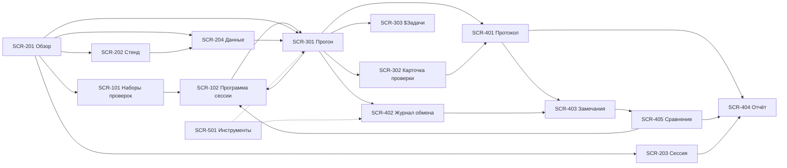

# Макет интерфейса ПУЛЬТА (целевые экраны)

> **Дата:** 21.09.2026 (версия 1.2 — 22.09.2026). **Основание:** концепт `docs/14` и целевое ТЗ
> `docs/15. ТЗ на Пульт испытаний (целевое, по концепции).md`.
> **Статус:** макет целевого состояния (версия 1.2). Настоящий документ описывает
> **что и как показано** на экранах; требования к системе — в `docs/15`, кликабельное
> представление — в прототипе `mockup/` (открывается `mockup/index.html`).
> **Правило:** перечень экранов, их идентификаторы (`SCR-101…SCR-501`) и группы навигации
> совпадают в трёх местах — ТЗ (§6.1), настоящем макете и прототипе; совпадение проверяется
> тестом `tests/unit/test_target_docs.py`.
> **Порядок описания и нумерация.** Экраны описаны в порядке навигации, и он же — порядок
> номеров: `SCR-<раздел><порядок>`, где раздел кодируется сотнями (1xx — планирование,
> 2xx — подготовка, 3xx — испытания, 4xx — результаты, 5xx — инструменты).

## 0. Общие правила макета

| Правило | Как показано на экранах |
|---|---|
| Три зоны | Слева — навигация (5 групп), в центре — рабочая область, справа — панель контекста (выбранный объект, действия, свежие обмены) |
| Планирование отделено от исполнения | Раздел «Планирование испытаний» (`SCR-101`, `SCR-102`) не содержит команд запуска и статусов «успех/отказ»; в «Испытаниях» (`SCR-301`) нельзя изменить состав программы (`IR-P-18`) |
| Одна команда запуска | Единственная команда запуска — «Следующая: `TC-…`» на `SCR-301`; её подпись содержит идентификатор пункта, который будет запущен; на прочих экранах — переходы «открыть в прогоне» |
| Маркеры очереди | В очереди различимы: «следующая» (что запустится по команде), «выполняется» (идёт сейчас), «последняя» (что только что прогнали — для чтения ленты) |
| Программа и покрытие | `SCR-102` показывает объединение наборов по логическому ИЛИ (дедупликация с происхождением) и покрытие каждого раздела против целевого объёма (`IR-P-19`) |
| Один след | Диапазон журнала раскрывается лентой внутри карточки проверки (`SCR-302`) |
| Словарь интерфейса | `$` — сущности объекта испытаний; без префикса — сущности ПУЛЬТА (`docs/14` §1.4) |
| Цвет и пиктограммы | Статусы: ⚪ не выполнена, ▶ выполняется, ✅ успех, ❌ отказ, 🚫 блокировано, ⏭ пропущена, ⛔ прервана |
| Источник значения | Подпись рядом: «сервер», «пульт», «оператор» (`IR-P-7`) |
| Состояния | На каждом экране описаны: пусто, загрузка, ошибка, нет сессии, частичные данные (`IR-P-8`) |

Навигация (общая для всех экранов):

```text
┌───────────────────────────────┐
│ 🧪 ПУЛЬТ испытаний            │
│ Стенд: ai-center.online       │
│ Сессия: 20260921-2f6a · идёт  │
│ Сборка: dev@83319ae           │
│ Программа: ревизия 2 · утв.   │
│ Уровень журнала: [INFO   ▾]   │
├───────────────────────────────┤
│ ПЛАНИРОВАНИЕ ИСПЫТАНИЙ        │
│  [ 🧭 Наборы проверок ]       │
│  [ 🎯 Программа сессии ]      │
│ ПОДГОТОВКА                    │
│  [ 📊 Обзор испытаний ]       │
│  [ 🖥️ Стенд ]                 │
│  [ 🧪 Сессия испытаний ]      │
│  [ 🗃️ Данные стенда ]         │
│ ИСПЫТАНИЯ                     │
│  [ ▶ Прогон (рабочее место) ] │
│  [ 🔎 Карточка проверки ]     │
│  [ ⏱️ $Задачи ]               │
│ РЕЗУЛЬТАТЫ                    │
│  [ 📋 Протокол ]              │
│  [ 🧾 Журнал обмена ]         │
│  [ ✍️ Замечания к API ]       │
│  [ 📄 Отчёт испытаний ]       │
│  [ 🔁 Сравнение сессий ]      │
│ ИНСТРУМЕНТЫ                   │
│  [ 🛠️ Консоль и настройки ]   │
└───────────────────────────────┘
```

## SCR-101. Наборы проверок

**Группа:** Планирование испытаний (первый раздел навигации). **Фаза:** Ф0. **Требования:**
`FR-P-65`…`FR-P-67`, `DR-P-13`, `IR-P-17`, `IR-P-18`, `IR-P-21`.

**Назначение.** Собрать и утвердить **наборы проверок** по разделам испытаний: слева — полный
каталог с фильтрами и статусами текущей сессии, справа — состав набора с порядком. Экран
отвечает на вопрос руководителя испытаний «что и в каком объёме мы испытываем», не отвлекаясь
на прогон.

**Не делает (anti-goals).** Ни одной команды запуска (`IR-P-18`); не показывает статусы
«успех/отказ» как результат (только чтение статусов текущей сессии у строк каталога); не
редактирует каталог проверок — источник состава `docs/02`; не исполняет и не меняет результаты.

**Wireframe.**

```text
┌── Каталог проверок (69) ────────────────────┬── Набор Н-02 «Файлы и записи» ────────────────┐
│ Раздел [TC-FILE ▾] Класс [все ▾]            │ Раздел: TC-FILE   Объём: [стандарт ▾]         │
│ (•) все ( ) в наборе ( ) не в наборе        │ Автор: Петров П.П. · ревизия 3 · черновик     │
│ Поиск [фильтр                 ]             │ ┌ Состав (14) ── ↑ ↓ [в начало] [← убрать] ┐  │
│ [ Выбрать все отфильтрованные (6) ]         │ │ 1 ☑ TC-FILE-01 Реестр        tech  ✅ сессия│  │
├─────────────────────────────────────────────┤ │ 2 ☑ TC-FILE-03 Фильтр типа   tech  ⚪       │  │
│ ☐ TC-FILE-01 Реестр файлов      tech ✅сессия│ │ 3 ☑ TC-FILE-08 Скачивание    tech  ✅ сессия│  │
│ ☑ TC-FILE-02 Создание файла     live ⚪     │ │ 4 ☑ TC-FILE-13 Round-trip    live  ⚪       │  │
│ ☑ TC-FILE-03 Фильтр типа        tech ⚪     │ │ … всего 14 пунктов                        │  │
│ ☑ TC-FILE-08 Скачивание         tech ⚪     │ └───────────────────────────────────────────┘  │
│ ☑ TC-FILE-10 не-ASCII имя       tech 🚫     │ KPI: 14 · tech 9 · live 3 · heavy 1 · manual 1 │
│ 🚫 в наборе, но блокирована API             │ Обязательный смоук: 2 пункта (идут первыми)    │
│ ☐ TC-REC-01 Объединение записей tech ⚪     │ ⚠️ Пересечение с Н-01: 3 проверки (в программе  │
│ … 63 пункта каталога                        │    учитываются один раз)                       │
│ Источник факта: сервер / пульт / оператор   │ [ 💾 Сохранить ревизию ] [ ✅ Утвердить ]      │
│                                             │ [ ⧉ Копировать ] [ 🗑 Удалить черновик ]       │
│                                             │ [ ⬇ json ] [ ⧇ Импорт ] [ 📄 История ревизий ] │
└─────────────────────────────────────────────┴────────────────────────────────────────────────┘
```

**Блоки.**

| Блок | Назначение | Данные | Действия |
|---|---|---|---|
| Каталог проверок (слева) | что можно включить в набор | `DR-P-2` (каталог), статусы сессии | фильтры (раздел, класс, «в наборе»), поиск, отметить/снять |
| Массовый выбор | быстрая сборка набора | текущий фильтр | «выбрать все отфильтрованные (N)», «снять выделение» (`IR-P-17`) |
| Состав набора (справа) | что вошло и в каком порядке | `DR-P-13` | добавить, убрать, порядок (↑↓, «в начало»), обозначить обязательное |
| KPI набора | объём и риски | состав | оценка карточек запуска для `live`/`heavy` |
| Ревизии и статус | управляемость планирования | `FR-P-66`, `FR-P-67` | «сохранить ревизию», «утвердить», история ревизий |
| Перенос | переиспользование набора | `FR-P-70` | экспорт/импорт `json`/`csv`, копирование |
| Предупреждения | пересечения и обязательные пункты | `FR-P-68` | переход к `SCR-102` для сборки программы |

**Состояния.** *Пусто* — «Наборов нет: создайте набор из каталога или возьмите шаблон „Смоук“».
*Нет сессии* — набор проектируется, статусы сессии не показываются, привязка к сессии
недоступна. *Утверждён* — правки запрещены, доступна кнопка «новая ревизия». *Ошибка
каталога* — «Не удалось прочитать каталог проверок: <причина>. Повторить» с номером обмена.

**Переходы и клавиши.** `Alt+N`; `Ctrl+A` (в фокусе каталога) — выделить отфильтрованное;
`Ctrl+S` — сохранить ревизию; кнопка «к программе →» ведёт на `SCR-102`.

**Приёмочная проверка (`AC-P-25`).** Набор собирается из каталога фильтрами и вручную,
сохраняется и утверждается; изменение утверждённого набора даёт новую ревизию, предыдущая
остаётся читаемой и восстанавливаемой; команд запуска на экране нет.

## SCR-102. Программа сессии

**Группа:** Планирование испытаний. **Фаза:** Ф0, Ф3 (регресс). **Требования:** `FR-P-41`,
`FR-P-68`…`FR-P-70`, `DR-P-14`, `IR-P-19`, `IR-P-21`.

**Назначение.** Собрать **программу испытаний сессии**: выбрать наборы, получить их объединение
(логическое ИЛИ, дедупликация), увидеть покрытие каждого раздела против целевого объёма и
утвердить ревизию, которую исполнит прогон.

**Не делает (anti-goals).** Ни одной команды запуска (`IR-P-18`); не меняет результаты уже
выполненных проверок при выпуске новой ревизии (`DR-P-14`); не редактирует состав наборов —
это `SCR-101`.

**Wireframe.**

```text
┌── Наборы (5) ───────────┬── Программа сессии · ревизия 2 · черновик ──────────────────────┐
│ ☑ Н-01 Система (смоук)  │ [ ✅ Утвердить программу ] [ ➕ Новая ревизия ] [ ⬇ json ]       │
│ ☑ Н-02 Файлы и записи   │ Включено по ИЛИ: 41 пункт (Н-01 6 · Н-02 14 · Н-04 21)           │
│ ☐ Н-03 Датасеты         │ Пересечений: 3 — в программе учтены один раз                     │
│ ☐ Н-04 Задачи и FSM-1   │ ┌ Покрытие разделов ───────────────────────────────────────────┐ │
│ ☐ Н-05 Обучение (полн.) │ │ TC-SYS 5/5 полный ✅ · TC-FILE 14/14 стандарт ✅              │ │
│                         │ │ TC-REC 0/6 ⛔ не покрыт · TC-LOAD 2/12 смоук                  │ │
│ Шаблон: [полная ▾]      │ │ TC-TASK 4/8 частично · TC-DS 4/7 стандарт · TC-MOD 1/3 смоук  │ │
│ [ Собрать программу ]   │ └───────────────────────────────────────────────────────────────┘ │
│                         │ ⚠️ TC-REC не покрыт — при утверждении нужно обоснование сокращения│
│                         │ ┌ Программа (41) ──────────────────────────────────────────────┐ │
│                         │ │ 1 ✅ TC-SYS-01 (Н-01) · 2 ☑ TC-FILE-01 (Н-02) · …             │ │
│                         │ │ 41 ☑ TC-CLEAN-01 (Н-01)                                       │ │
│                         │ └───────────────────────────────────────────────────────────────┘ │
│                         │ Дельта с ревизией 1: +4 (TC-DS-03…06) · −1 (TC-REC-02)            │
└─────────────────────────┴──────────────────────────────────────────────────────────────────┘
```

**Блоки.**

| Блок | Назначение | Данные | Действия |
|---|---|---|---|
| Наборы (слева) | что объединяем в программу | `DR-P-13` | выбрать/снять, «собрать программу», шаблоны |
| Объединение по ИЛИ | итоговый состав без дублей | `FR-P-68` | ручная правка порядка, исключение пункта (кроме обязательных) |
| Покрытие разделов | полнота программы против объёма | `FR-P-69` | задать целевой объём по разделу, переход к разделам с недобором |
| Предупреждения | пересечения, пустые наборы, непокрытые разделы | `FR-P-68`, `FR-P-69` | обоснование сокращения при утверждении (`IR-P-21`) |
| Ревизии | управляемое изменение программы | `DR-P-14` | «новая ревизия», дельта с предыдущей, история |
| Программа | что именно исполнит прогон | `DR-P-14` | «к прогону →» (`SCR-301`), экспорт |
| Регресс | подмножество после исправления | `FR-P-41`, `FR-P-70` | «собрать набор „регресс“» из результатов сессии |

**Состояния.** *Пусто* — «Наборы не выбраны: программа пуста» + ссылка на `SCR-101`.
*Черновик* — прогон возможен, но помечается как «по черновику» (§11.2 ТЗ). *Утверждена* —
правка только через новую ревизию; в шапке пульта — «Программа: ревизия N · утв.».
*Сокращение* — перечень непокрытых разделов и поле обоснования. *Частичные данные* —
недоступные статусы сессии помечены «нет данных от стенда».

**Переходы и клавиши.** `Alt+P` — программа, `Alt+N` — наборы, `Alt+5` — прогон;
`Ctrl+Enter` — «Утвердить программу».

**Приёмочная проверка (`AC-P-26`, `AC-P-27`).** Программа из двух наборов с пересечением не
даёт дублей, показывает происхождение и покрытие; непокрытый раздел виден и требует
обоснования; шаблоны «полная», «смоук», «регресс» собираются корректно, «Смоук-минимум» не
исключается; новая ревизия не теряет ранее полученные результаты.

## SCR-201. Обзор испытаний

**Группа:** Подготовка. **Фаза:** Ф0–Ф4 (положение в процессе). **Требования:**
`FR-P-11`, `FR-P-12`, `FR-P-48`, `IR-P-8`.

**Назначение.** Одна панель, отвечающая на вопрос «где я и что требует внимания»: фаза
процесса, прогресс очереди, открытые замечания, готовность отчёта, состояние стенда.

**Не делает (anti-goals).** Не запускает проверки, не меняет данные, не дублирует протокол
и журнал — только положение в процессе и переходы к нужному экрану.

**Wireframe.**

```text
┌── Обзор испытаний ───────────────────────────────┬── Внимание ─────────────┐
│ Фаза: [Ф0] Ф1 ● Ф2 ○ Ф3 ○ Ф4 ○                    │ Открытые P0: 1          │
│ Сессия: 20260921-2f6a «Приёмка dev@83319ae»       │  → TC-FILE-10 (latin-1) │
│ Программа: ревизия 2 · утверждена                 │ Открытые P1: 2          │
│ Покрытие разделов: 8 из 10 (TC-REC, TC-MOD —      │ Не воспроизведено: 1    │
│ сокращено, обоснование в отчёте)                  │ Снимок «Окончание»: нет │
│ ┌ Прогресс очереди ───────────────────────────┐   │ Реквизиты сессии: 90 %  │
│ │ выполнено 34 из 41  ●●●●●●●●●●●●●●●●●○○○  83% │   │                         │
│ │ успех 30 · отказ 2 · блокировано 1 · проп. 1 │   │ [ К прогону → ]         │
│ └─────────────────────────────────────────────┘   │ [ К программе → ]       │
│ Готовность отчёта: 78 % — не хватает: снимок      │ [ К протоколу → ]       │
│ «Окончание», 1 замечание без воспроизведения      │ [ К отчёту → ]          │
│ Стенд: ✅ ai-center.online · dev@83319ae          │                         │
│ Обменов за сессию: 214 (ошибок 6, 128 КБ)         │                         │
└───────────────────────────────────────────────────┴─────────────────────────┘
```

**Блоки.**

| Блок | Назначение | Данные | Действия |
|---|---|---|---|
| Полоса фаз Ф0–Ф4 | положение в бизнес-процессе | признаки готовности гейтов | переход к экрану фазы |
| Программа и покрытие | чем испытываем и где сокращено | `DR-P-14`, `IR-P-19` | открыть `SCR-102` |
| Прогресс очереди | сколько пройдено и с каким результатом | очередь, результаты | открыть `SCR-401` |
| Готовность отчёта | чего не хватает для подписания | проверки, замечания, снимки, реквизиты | открыть `SCR-404` |
| Состояние стенда | доступность и сборка | сервер | открыть `SCR-202` |
| Сводка обменов | объём работы за сессию | журнал | открыть `SCR-402` |
| Панель «Внимание» | открытые замечания и пробелы | замечания, учёт `__TEST__` | переход к `SCR-403`, `SCR-404` |

**Состояния.** *Пусто* — «Сессия не выбрана: создайте сессию, чтобы пульт начал вести
протокол» + кнопка. *Загрузка* — скелетон блоков, счётчики «…». *Ошибка* — «Не удалось
прочитать очередь: <причина>. Повторить». *Частичные данные* — недоступные блоки помечены
«нет данных от стенда» с номером обмена.

**Переходы и клавиши.** `Alt+1` — на экран; `Ctrl+Enter` — «К прогону».

**Приёмочная проверка (`AC-P-6`, `AC-P-19`).** При неготовности стенда или данных обзор
показывает причину и ведёт на `SCR-202`/`SCR-204`; при неготовности отчёта — перечень
недостающего.

## SCR-202. Стенд (сервер, сборка, снимки)

**Группа:** Подготовка. **Фаза:** Ф0, Ф4. **Требования:** `FR-P-1`, `FR-P-6`, `FR-P-47`,
`DR-P-8`.

**Назначение.** Подтвердить, что испытывается нужная сборка, и зафиксировать состояние
реестров «до» и «после» сессии.

**Не делает (anti-goals).** Это не панель настроек подключения (настройки — `SCR-501`) и не
монитор обменов: здесь только состояние стенда и снимки.

**Wireframe.**

```text
┌── Стенд ──────────────────────────────────────────┬── Снимки ──────────────┐
│ Адрес: https://ai-center.online    [ 🔄 Проверить ]│ Начало: 21.09 10:12    │
│ Сборка: dev@83319ae · branch dev · 20.09 18:40    │ Окончание: —           │
│ Сообщение: «test stand ready»                     │ [ 📸 Снять снимок ]    │
│ Журналы: logs/applog/applog_20260921-101005.log   │ Ошибки снимка: —       │
├── Реестры (снимок «Начало») ──────────────────────┼────────────────────────┤
│ $Файлы: 265 (47.3 ГБ) · RAW 240 · markup 18 · ONNX 7│ Разница «до/после»    │
│ Записи: 129 (дубли 128, без разметки 3)           │ появится после снимка  │
│ $Нагрузки: 12 · $Датасеты: 9 · $Модели: 6         │                        │
│ $Задачи: 215 (активных 4, архив 211)              │ [ Экспорт сравнения ]  │
└───────────────────────────────────────────────────┴────────────────────────┘
```

**Блоки.**

| Блок | Назначение | Данные | Действия |
|---|---|---|---|
| Сервер и сборка | подтверждение объекта испытаний | health, версия | «Проверить» (осознанное действие) |
| Журналы | пути журналов запуска и сессии | файлы | скачать журнал, открыть `SCR-501` |
| Реестры | счётчики и объёмы | реестры стенда | открыть `SCR-204` |
| Снимок | фиксация «Начало»/«Окончание» | `DR-P-8` | снять снимок, сравнить |
| Разница снимков | учёт ресурсов за сессию | два снимка | экспорт сравнения в артефакты |

**Состояния.** *Ошибка связи* — «Стенд недоступен: <причина>. Проверьте адрес в `SCR-501`;
повтор». *Частичный снимок* — блок счётчиков помечен «ошибка запроса
`GET /api/datasets/`: 500»; снимок не прерывается.

**Переходы и клавиши.** `Alt+2`; `Ctrl+Shift+S` — снять снимок.

**Приёмочная проверка (`AC-P-1`, `AC-P-3`).** Сборка зафиксирована в сессии; расхождение
сборки с реквизитами даёт предупреждение; сравнение снимков объясняет дельту.

## SCR-203. Сессия испытаний

**Группа:** Подготовка. **Фаза:** Ф0, Ф4. **Требования:** `FR-P-2`…`FR-P-5`, `FR-P-52`,
`FR-P-55`, `DR-P-1`.

**Назначение.** Открыть и вести сессию: реквизиты, которые попадут в шапку отчёта, ход
работы (история), передача и завершение.

**Не делает (anti-goals).** Не управляет прогоном и не хранит результаты — это контекст.

**Wireframe.**

```text
┌── Сессия испытаний ───────────────────────────────┬── Состояние ────────────┐
│ Наименование * [Приёмка сервера обучения, сб…]    │ Статус: идёт            │
│ Объект *       [dev@83319ae                     ] │ Начало: 21.09 10:11     │
│ Методика *     [Методика ПМИ-2026-09, ред. 3    ] │ Обменов: 214            │
│ Заказчик       [Энергомера                      ] │ Проверок: 34/69         │
│ Организация    [Испытательная лаборатория       ] │ Снимков: 1              │
│ Комиссия       [Иванов И.И. (председатель), …   ] │ [ ⏹ Завершить ]         │
│ Критерии       [годен при отсутствии P0/P1      ] │ [ ↗ Переоткрыть ]       │
├── История событий ────────────────────────────────┼─────────────────────────┤
│ 10:11 создана · 10:12 снимок «Начало» · 10:20 …   │ [ ⬇ Выгрузить сессию ]  │
│ 11:05 замечание P1 создано (TC-DS-03)             │ [ ⬆ Загрузить сессию ]  │
└───────────────────────────────────────────────────┴─────────────────────────┘
```

**Блоки.**

| Блок | Назначение | Данные | Действия |
|---|---|---|---|
| Реквизиты | шапка отчёта | `DR-P-1` | сохранение, дозаполнение по ходу |
| Сборка и предупреждение | контроль объекта испытаний | стенд + реквизиты | переход к `SCR-202` |
| Состояние | ход работы | результаты, очередь, снимки | завершение/переоткрытие с причиной |
| История событий | кто и что делал | журнал сессии | фильтр, выгрузка |
| Передача | перенос между машинами | файл сессии + артефакты | выгрузить/загрузить (`FR-P-52`) |

**Состояния.** *Черновик* — реквизиты неполные, прогон предупреждает, но не блокируется.
*Завершена* — «Сессия завершена 21.09 18:40. Прогон заблокирован до переоткрытия».
*Переоткрыта* — пометка с причиной и автором.

**Переходы и клавиши.** `Alt+3`; `Ctrl+S` — сохранить реквизиты.

**Приёмочная проверка (`AC-P-1`, `AC-P-2`, `AC-P-21`).** Жизненный цикл работает;
перезапуск ПУЛЬТА сохраняет сессию; выгрузка/загрузка переносит сессию на другую машину.

## SCR-204. Данные стенда

**Группа:** Подготовка. **Фаза:** Ф0. **Требования:** `FR-P-7`…`FR-P-10`, `DR-P-9`.

**Назначение.** Убедиться, что данные для проверок готовы и понятны: `$Файлы`, записи
RAW+markup, `$Нагрузки`, `$Датасеты`, `$Модели` — с источником каждого факта.

**Не делает (anti-goals).** Не запускает проверки и не подменяет прогон: это подготовка.

**Wireframe.**

```text
┌── Данные стенда ──────────────────────────────────┬── Выбранная запись ─────┐
│ [Записи 129][$Файлы 265][$Нагрузки 12][$Датасеты 9][$Модели 6]              │
│ Фильтр: [Antminer        ] Тип [RAW ▾] Дубли [все ▾]   [ ⬇ CSV ]            │
├───────────────────────────────────────────────────┼─────────────────────────┤
│ ✅ Antminer_S19   RAW+markup 2.1 ГБ / 12 МБ  видимо│ RAW: id 7f3a, 21.08    │
│ ⚠️ 3Dпринтер      RAW+markup 24 МБ / 1.2 МБ  дубль │ markup: id 91b2         │
│ ⚠️ Печь_№4        RAW без разметки 88 МБ           │ Версия: сервер (нет     │
│ 🚫 Принтер-2      markup без RAW 3 МБ               │ checksum → по импорту) │
└───────────────────────────────────────────────────┴─────────────────────────┘
```

**Блоки.**

| Блок | Назначение | Данные | Действия |
|---|---|---|---|
| Вкладки реестров | доступ к данным по типам | реестры стенда | фильтры, поиск, выгрузка CSV |
| Таблица записей | пары RAW+markup, дубли, несопоставленные | `FR-P-8` | ручные решения: привязать/исключить/актуальная версия |
| Карточка записи | части записи и их идентификаторы | файлы записи | скачать RAW/markup, «в прогон» |
| Подпись источника | откуда взят факт (сервер / пульт / оператор) | `DR-P-9` | — |
| Состав `$Датасета` | что войдёт в проверки | `FR-P-10` | выгрузить карточку состава |

**Состояния.** *Пусто* — «В реестре нет записей: импортируйте `$Файлы` или перейдите к
`SCR-501`». *Частичные данные* — «markup недоступен из-за дефекта имён (P0): 108 записей не
разбираются» с переходом в `SCR-403`.

**Переходы и клавиши.** `Alt+4`; `Ctrl+F` — поиск по реестру.

**Приёмочная проверка (`AC-P-4`, `AC-P-5`).** Записи сформированы по явному правилу с
показом уверенности; дубли и несопоставленные видны; актуальная версия подписана источником,
ручное решение оператора сохранено.

## SCR-301. Прогон (единое рабочее место)

**Группа:** Испытания. **Фаза:** Ф1–Ф2. **Требования:** `FR-P-13`…`FR-P-23`, `FR-P-27`,
`FR-P-29`, `FR-P-41`, `IR-P-3`, `IR-P-4`, `IR-P-13`, `IR-P-20`.

**Назначение.** Главный экран исполнения: очередь из утверждённой программы (что дальше),
одна команда «Следующая», лента обменов (что ушло и что вернулось) и вердикт — одновременно,
без переходов.

**Не делает (anti-goals).** Не показывает KPI протокола и отчётность; не хранит второй
статус проверки; **не редактирует состав программы** — изменение делает руководитель на
`SCR-102` новой ревизией (`IR-P-18`); не даёт «отправить всё залпом» без контроля.

**Wireframe.**

```text
┌── Очередь программы (41) ─────┬── Управление ───────────────────────────────┐
│ фильтр: [раздел ▾][⚪ невып. ▾]│ [ ▶ Следующая: TC-FILE-13 ]                 │
│ Программа: ревизия 2 · утв.   │ Следующая: TC-FILE-13 (live) «Round-trip»,   │
│ (состав правится на SCR-102)   │ класс live — потребуется карточка запуска    │
│ ✅ TC-SYS-01 Система     │     │ Режим: (•) сценарием ( ) по вызовам         │
│ ✅ TC-FILE-01 Реестр      │    │ Пауза авто: [3.0 с]  [⏯ Авто] [⏸ Стоп]      │
│ ❌ TC-SYS-03 405 вместо 404│   │ [ ▶▶ Пачка tech (12) ]                      │
│ 🚫 TC-FILE-10 не-ASCII    │    │ ┌ Карточка запуска (обязательно для live) ┐ │
│ ▶ сейчас: TC-FILE-13 ─────│    │ │ Цель * [проверка полного цикла файла ] │ │
│ ⚪ следующая: TC-TASK-01 ──│    │ │ Данные * [__TEST__…csv, сессия 2f6a  ] │ │
│ ⚪ последняя: TC-DS-05 ────│    │ │ Ответственный * [Петров П.П., инженер] │ │
│ ⚪ TC-MOD-01 каталог…      │    │ │ Артефакты [удалить после проверки ▾]   │ │
│ … осталось 36 пунктов      │    │ │ [x] Подтверждаю расход ресурсов        │ │
│ [ снять с причиной ]       │    │ └────────────────────────────────────────┘ │
│ [ изменить программу → ]   │    │                                             │
├───────────────────────────────┴─────────────────────────────────────────────┤
│ Лента обмена  запрос: [сводка ▾]  ответ: [тело ▾]  [ только ошибки ] [25 ▾] │
│ ┌ #214 TC-FILE-13 ─ POST /api/data/file ────────── 201 · 412 мс · ✅ ожид. ┐ │
│ │ ЗАПРОС  multipart: file=__TEST__TC-FILE-13_2f6a.csv (1024 Б), тип RAW   │ │
│ │ ОТВЕТ   {"id":"b41c…","file_name":"__TEST__TC-FILE-13_2f6a.csv", …}     │ │
│ │ [копировать curl] [повторить с правками] [замечание] [в журнал]         │ │
│ └──────────────────────────────────────────────────────────────────────────┘ │
│ ┌ #215 TC-FILE-13 ─ GET /api/data/file/{id}/download ─ 200 · 88 мс · ✅    ┐ │
│ │ ЗАПРОС  GET …/download                                                   │ │
│ │ ОТВЕТ   octet-stream, 1024 Б, Content-Disposition: …                     │ │
│ └──────────────────────────────────────────────────────────────────────────┘ │
│ Вердикт: соответствует ожиданию · Статус: ✅ успех · Журнал #214–#217       │
└──────────────────────────────────────────────────────────────────────────────┘
```

**Блоки.**

| Блок | Назначение | Данные | Действия |
|---|---|---|---|
| Очередь | состав утверждённой программы (только чтение) и «следующий» | `DR-P-3`, `DR-P-14`, каталог | фильтры, выбор пункта для просмотра (`SCR-302`), «снять с причиной» (`FR-P-15`) |
| Управление | одна команда запуска, режимы | очередь | «Следующая», «Пачка tech», «Авто», «Стоп» |
| Карточка запуска | подтверждение изменяющих и ресурсоёмких | `FR-P-19` | заполнение и подтверждение |
| Предпросмотр payload | что именно уйдёт | `FR-P-20` | раскрыть перед первым изменяющим вызовом |
| Лента обмена | запрос и ответ по раздельности | `DR-P-4` | подробность запроса/ответа, `curl`, повтор, замечание |
| Вердикт и след | оценка и диапазон журнала | `FR-P-29`, `FR-P-33` | открыть `SCR-302`, `SCR-402` |

**Состояния.** *Нет сессии* — «Выберите сессию (`SCR-203`), иначе результаты не попадут в
протокол». *Программа не утверждена* — «Прогон идёт по черновику программы (ревизия 2): он
помечен в протоколе» + переход на `SCR-102`. *Нет стенда* — «Стенд недоступен: <причина>».
*Ожидание подтверждения* — прогон остановлен, подсвечена карточка запуска и причина остановки.
*Ошибка вызова* — в ленте красная запись с текстом и ссылкой на разбор (`SCR-402`).

**Переходы и клавиши.** `Alt+5`; `Ctrl+Enter` — «Следующая» (следующий пункт программы);
`Ctrl+Space` — пауза авто-прогона; `Ctrl+Shift+R` — «повторить последний обмен с правками»;
`Ctrl+P` — «изменить программу» (`SCR-102`).

**Приёмочная проверка (`AC-P-7`…`AC-P-10`, `AC-P-13`).** Команда «Следующая: `TC-…`» отправляет
ровно один пункт и называет его; состав очереди совпадает с утверждённой программой и не
редактируется здесь; лента показывает запрос и ответ раздельно; вердикт считается
автоматически; для изменяющих проверок без карточки запуска запуск невозможен.

## SCR-302. Карточка проверки

**Группа:** Испытания. **Фаза:** Ф1–Ф2. **Требования:** `FR-P-14`, `FR-P-20`, `FR-P-33`,
`IR-P-5`.

**Назначение.** Раскрыть один пункт очереди целиком: требование, шаги, ожидание, что уйдёт,
след обменов и доказательства — на одном экране.

**Не делает (anti-goals).** Не заменяет `SCR-401` (протокол) и не вводит собственную команду
запуска: единственная команда запуска — «Следующая» на `SCR-301` (`IR-P-4`).

**Wireframe.**

```text
┌── TC-FILE-13. Round-trip upload → list → download → delete ──────────────────┐
│ Класс: live · Модуль: File Import · Требования: UC-02…UC-05 · Подтверждение:  │
│ обязательно · Ожидание: файл создан, найден, скачан, удалён                  │
│ В программе: Н-02 «Файлы и записи» (ревизия 3) · позиция 4 из 41              │
├── Шаги ────────────────────────────┬── Что будет отправлено ────────────────┤
│ 1. POST /api/data/file             │ file: __TEST__TC-FILE-13_2f6a.csv       │
│ 2. GET  /api/data/files?file_name= │ содержимое: 3 колонки, 5 строк          │
│ 3. GET  …/download                 │ имена: __TEST__ (пульт), уборка: да     │
│ 4. DELETE /api/{file_id}           │ [ проверить перед запуском ]            │
├── След прогона ────────────────────┼── Доказательства ──────────────────────┤
│ #214–#217 (лента) [▶ показать]     │ file_id b41c…, 1024 Б, удалён 21.09 12:03│
│ длительность 1.8 с · 4 обмена      │ artifact: checklist.csv (см. сессию)    │
└────────────────────────────────────┴────────────────────────────────────────┘
```

**Блоки.**

| Блок | Назначение | Данные | Действия |
|---|---|---|---|
| Заголовок | что проверяем, на каком основании и в каком наборе | каталог `TC-…`, `DR-P-14` | переход к соседним пунктам, к программе (`SCR-102`) |
| Шаги и ожидание | сценарий проверки | `DR-P-2` | раскрыть подробности шага |
| Что будет отправлено | предпросмотр payload | `FR-P-20` | проверить перед запуском |
| След прогона | лента обменов **внутри** экрана | `DR-P-4` | раскрыть ленту (`IR-P-5`), `curl`, повтор |
| Доказательства | воспроизводимость результата | `FR-P-33` | выгрузить в артефакты |
| Отметка оператора | ручное решение с заключением | `FR-P-32` | ручная/пропущена/прервана — с причиной |

**Состояния.** *Не выполнялась* — «Проверка ещё не запускалась: запуск — командой «Следующая» на `SCR-301`».
*Выполняется* — прогресс и текущий обмен. *Блокировано* — причина (дефект API), ссылка на
замечание и обходной путь.

**Переходы и клавиши.** `Alt+6`; `→`/`←` — следующий/предыдущий пункт очереди.

**Приёмочная проверка (`AC-P-9`, `AC-P-13`).** Предпросмотр совпадает с фактически
отправленным; след обменов раскрывается внутри экрана; доказательства полны.

## SCR-303. `$Задачи` (монитор инфраструктуры)

**Группа:** Испытания (последний экран группы). **Фаза:** Ф1–Ф2. **Требования:**
`FR-P-24`…`FR-P-26`, `DR-P-10`, `IR-P-2`.

**Назначение.** Наблюдение за асинхронными операциями стенда: состояние очереди, прогресс
`$Задач` по FSM-1, разрешённые команды, история переходов, восстановление после обрыва.

**Не делает (anti-goals).** Не заменяет прогон: задачи здесь наблюдаются, а не запускаются
(кроме диагностической задачи `celery-test`).

**Wireframe.**

```text
┌── $Задачи ────────────────────────────────────────┬── Команды ──────────────┐
│ [Наблюдение 4][Список 215][Архив 211][Диагностика]│ task 5f1d · training    │
│ Фильтр: [все типы ▾][активные ▾] период [⇄]       │ Статус: ▶ running       │
├───────────────────────────────────────────────────┤ Доступно: pause,        │
│ ▶ 5f1d training      dataset ds-12  12:02 · 03:41 │ interrupt               │
│ ⏸ 7a2e dataset-fill  ds-12          11:58 · 00:12 │ [ ⏸ пауза ] [ ⛔ прервать]│
│ ✅ 91bc celery-test   —             11:40 · 00:02 │ История FSM-1:          │
│ ❓ c4d0 model-testing —            11:20 · 00:05 │  new→running 11:41 #198 │
│ [ ⟳ опросить все ]  интервал [2.0 с]              │  running→pausing 12:04  │
└───────────────────────────────────────────────────┴─────────────────────────┘
```

**Блоки.**

| Блок | Назначение | Данные | Действия |
|---|---|---|---|
| Наблюдение | активные `$Задачи` с прогрессом | `DR-P-10` | опрос, пауза наблюдения, снятие |
| Список и архив | состояние очереди стенда | реестр задач | фильтры, «в наблюдение», переход к карточке |
| Команды | только разрешённые сервером | `FR-P-25` | `pause`/`resume`/`interrupt` по списку |
| История FSM-1 | переходы с номерами журнала | `DR-P-10` | отчёт (раздел «`$Задачи`») |
| Диагностика | дешёвая задача очереди | `FR-P-62` | запуск `celery-test` с подтверждением |

**Состояния.** *Обрыв связи* — «Наблюдение приостановлено: <причина>; история сохранена,
опрос возобновится автоматически» (`FR-P-26`). *Терминальное состояние* — задача
переносится в архив (> суток), результат привязывается к пункту очереди.

**Переходы и клавиши.** `Alt+7`; `Ctrl+R` — опросить сейчас.

**Приёмочная проверка (`AC-P-11`).** Асинхронная проверка доходит до терминального
состояния; команды ограничены разрешёнными; перезапуск ПУЛЬТА восстанавливает наблюдение.

## SCR-401. Протокол проверок

**Группа:** Результаты. **Фаза:** Ф2. **Требования:** `FR-P-30`, `FR-P-32`, `FR-P-34`,
`FR-P-35`, `FR-P-36`, `FR-P-64`, `DR-P-5`, `IR-P-4`.

**Назначение.** Протокол испытаний: что пройдено, с какими вердиктами и доказательствами;
ручные отметки; выгрузки.

**Не делает (anti-goals).** Не запускает проверки (команд запуска здесь нет — `IR-P-4`), не
дублирует журнал обмена и не меняет состав программы: сокращение программы — решение
руководителя на `SCR-102`.

**Wireframe.**

```text
┌── Протокол ───────────────────────────────────────┬── KPI выборки ──────────┐
│ Группа [все ▾] Статус [все ▾] Класс [live ▾]      │ В выборке: 23           │
│ Поиск [TC-FILE            ] [⚪ только невыполн.]  │ Выполнено: 21           │
│ [ ⬇ CSV ] [ 💾 В артефакты ] [ ↻ Обновить ]        │ Успех 18 · Отказ 2      │
├───────────────────────────────────────────────────┤ Блокировано 1 · Проп. 1  │
│ ID          Класс Статус Вердикт       Журнал  Прог│ Готовность: 91 %        │
│ TC-FILE-01  tech  ✅     соответствует #12–#13 Н-02│                         │
│ TC-SYS-03   tech  ❌     не соответств. #44    Н-01│ [ Снять с причиной ]    │
│ TC-FILE-10  tech  🚫     блокировано   #88     Н-02│ [ Ручная отметка ]      │
│ TC-FILE-13  live  ✅     соответствует #214–#217   │ [ Экспорт выборки ]     │
│ TC-REC-03   manual 🖐️    выполнена вручную —    Н-02│                        │
│ TC-MOD-01   tech  ⏭     не в программе (снято) —   │ [ Программа: ревизия 2 ]│
└───────────────────────────────────────────────────┴─────────────────────────┘
```

**Блоки.**

| Блок | Назначение | Данные | Действия |
|---|---|---|---|
| Фильтры и поиск | выборка протокола | результаты | фильтр по группе/статусу/классу, по признаку «вне программы» |
| Таблица | статус, вердикт, диапазон журнала, набор-источник | `DR-P-5`, `DR-P-14` | открыть карточку (`SCR-302`) |
| KPI | сводка по выборке | результаты | — |
| Ручные отметки | заключение оператора | `FR-P-32` | ручная/пропущена/прервана с причиной |
| Снятие с причиной | осознанный отказ от выполнения пункта программы | `FR-P-35` | ввод причины, отражение в отчёте |
| Вне программы | проверки, не вошедшие в утверждённую программу | `FR-P-13`, `FR-P-69` | просмотр обоснования сокращения, переход к `SCR-102` |
| Выгрузки | CSV и артефакты | сессия | сохранить в артефакты |

**Состояния.** *Пусто* — «Проверки ещё не выполнялись: начните прогон на `SCR-301`».
*Незаполненные заключения* — строка помечена «нужно заключение» (ручная отметка без
заключения не принимается).

**Переходы и клавиши.** `Alt+8`; `Ctrl+E` — экспорт выборки.

**Приёмочная проверка (`AC-P-13`, `AC-P-15`, `AC-P-16`).** Протокол с фильтрами и KPI
формируется, выгружается и сохраняется; снятые с причиной, пропущенные, прерванные и **вне
программы** проверки видны раздельно и с причинами; повтор проверки сохраняет предыдущий
результат.

## SCR-402. Журнал обмена

**Группа:** Результаты. **Фаза:** Ф1–Ф4. **Требования:** `FR-P-28`, `FR-P-57`, `DR-P-4`.

**Назначение.** Полный машинный след испытаний: все обмены со стендом, разбор после прогона,
выгрузка JSONL для внешнего анализа и воспроизведения.

**Не делает (anti-goals).** Не является повседневным рабочим экраном (для прогона — `SCR-301`)
и не хранит второй статус проверки.

**Wireframe.**

```text
┌── Журнал обмена ──────────────────────────────────┬── Выбранный обмен ──────┐
│ [только ошибки][метка ▾ TC-FILE-13][поиск ……]     │ #214 · 12:02:14.221     │
│ Обменов 214 · ошибок 6 · макс 1 240 мс · 128 КБ   │ POST /api/data/file     │
├───────────────────────────────────────────────────┤ multipart/form-data     │
│ #214 ✅ 201 POST /api/data/file       TC-FILE-13  │ Заголовки запроса (7)   │
│ #215 ✅ 200 GET  /api/data/file/{id}/download …    │ Тело запроса (усечено)  │
│ #216 ⚠️ 404 GET  /api/data/file/несущ./download   │ Заголовки ответа (5)    │
│ #217 ✅ 204 DELETE /api/{file_id}                 │ Тело ответа (JSON)      │
│ #218 ❌ —   GET  /api/loads/list (таймаут 15 с)   │ [копировать curl]       │
│ [ ⬇ JSONL сессии ] [ 💾 Сохранить выборку ]        │ [повторить] [замечание] │
└───────────────────────────────────────────────────┴─────────────────────────┘
```

**Блоки.**

| Блок | Назначение | Данные | Действия |
|---|---|---|---|
| Фильтры | быстрый разбор | `DR-P-4` | «только ошибки», по метке, подстрока |
| Таблица обменов | хронология | журнал | сортировка, выбор строки |
| Детали обмена | запрос и ответ по отдельности | `DR-P-4` | заголовки/тела, раскрытие |
| Действия | воспроизведение и разбор | — | `curl`, повтор, замечание, переход к проверке |
| Выгрузка | машинный след | JSONL/CSV | скачать, сохранить в артефакты |

**Состояния.** *Пусто* — «Обменов ещё не было: пульт обращается к стенду только по вашим
действиям». *Переполнение лимита* — «Тело усечено до 4 096 символов (лимит настройки)»
(`NFR-P-4`).

**Переходы и клавиши.** `Alt+9`; `Ctrl+L` — «только ошибки»; `↑`/`↓` — навигация по строкам.

**Приёмочная проверка (`AC-P-12`).** Выборка по метке даёт полный след проверки; выгрузка
JSONL воспроизводит результат; тела усечены с пометкой, а не потеряны.

## SCR-403. Замечания к API и перспективные требования

**Группа:** Результаты. **Фаза:** Ф2–Ф3. **Требования:** `FR-P-31`, `FR-P-37`…`FR-P-40`,
`FR-P-44`, `DR-P-6`.

**Назначение.** Ведение дефектов и требований: что нашли, как воспроизвести, что передать
разработчику; закрытие после проверки новой сборкой.

**Не делает (anti-goals).** Не меняет статусы проверок (расхождение проверки и замечание
связаны, но живут отдельно) и не подменяет отчёт.

**Wireframe.**

```text
┌── Замечания к API ────────────────────────────────┬── Карточка ─────────────┐
│ [Замечания 14][Перспективные требования 5]         │ Заголовок: 404 на        │
│ Приоритет [все ▾] Модуль [File Import ▾] поиск …   │ не-ASCII имени файла     │
│ [ ⬇ MD ] [ ⬇ JSON ] [ ⬇ CSV ] [ 📤 Комплект ]      │ Приоритет: P0 · статус:  │
├───────────────────────────────────────────────────┤ в работе                 │
│ P0 TC-FILE-10 нет-ASCII: 404 latin-1     в работе  │ Эндпоинт: GET /api/data/ │
│ P1 TC-DS-03 нет состава датасета          открыто  │ file/{id}/download       │
│ P1 TC-DS-05 fill без task_id              открыто  │ Факт: 404 при имени …    │
│ P2 TC-SYS-05 расхождение формата ошибок   открыто  │ Воспроизведение: curl …  │
│ — TC-TASK-02 нет статуса в списке         открыто  │ Доказательства: #88,#92  │
│ [ 🔁 Проверить исправление (перепрогон) ]           │ [ ⟳ Перепрогон ] [ ✅ ]   │
└───────────────────────────────────────────────────┴─────────────────────────┘
```

**Блоки.**

| Блок | Назначение | Данные | Действия |
|---|---|---|---|
| Реестр замечаний | открытые дефекты и пробелы API | `DR-P-6` | фильтры P0/P1/P2, модуль, статус |
| Карточка замечания | факт, ожидание, воспроизведение, связи | `DR-P-6` | изменение статуса с комментарием |
| Перспективные требования | бэклог API | реестр | отдельный список (`FR-P-39`) |
| Комплект разработчику | передача | md/json/csv | выгрузка (`FR-P-40`) |
| Перепрогон | проверка исправления | замечание + проверка | «перепрогон затронутого» (`FR-P-41`) |

**Состояния.** *Пусто* — «Замечаний нет: расхождения фиксируются автоматически при
выполнении проверок». *Замечание без воспроизведения* — помечено, блокирует готовность
отчёта (`FR-P-48`).

**Переходы и клавиши.** `Alt+0`; `Ctrl+Shift+N` — создать замечание вручную.

**Приёмочная проверка (`AC-P-14`, `AC-P-17`).** Отказ и блокировка дают замечание с
приоритетом и воспроизведением; связи с проверками и обменами сохранены; статус меняется с
комментарием, закрытие требует подтверждения воспроизведением.

## SCR-404. Отчёт испытаний

**Группа:** Результаты. **Фаза:** Ф4. **Требования:** `FR-P-45`…`FR-P-56`, `DR-P-7`.

**Назначение.** Собрать комплект испытаний: готовность, предпросмотр, файлы, решение и
подписи — «что я передаю заказчику».

**Не делает (anti-goals).** Не опрашивает стенд при формировании (только данные сессии и
журнала) и не подменяет протокол: протокол — приложение отчёта.

**Wireframe.**

```text
┌── Отчёт испытаний ────────────────────────────────┬── Готовность 78 % ──────┐
│ Сессия 20260921-2f6a · dev@83319ae · 21.09 10:11– │ ✅ реквизиты (90 %)     │
│ Период 10:11–18:40 · пульт 0.1.0 · журнал INFO    │ ✅ проверки (34/69)     │
├── Разделы ─────────────────────────────────────────┤ ⛔ снимок «Окончание»   │
│ 1 Сессия и реквизиты           8 Артефакты/$TEST__ │ ⛔ 1 замечание без      │
│ 2 Программа и объём            9 Замечания P0/P1/P2│    воспроизведения     │
│ 3 Снимки и сравнение          10 Перспективные     │ ⛔ открытые P0: 1       │
│ 4 Сводка KPI                  11 Повторные прогоны │                         │
│ 5 Детализация проверок        12 Итог и подписи    │ [ ⬇ Комплект (md+json) ]│
│ 6 $Задачи и FSM-1             13 Приложения        │ [ ⬇ Приложения CSV ]    │
│ 7 Данные и состав             14 Контроль __TEST__ │ [ 💾 В артефакты ]      │
├── Итоговое решение ────────────────────────────────┴─────────────────────────┤
│ (•) годен  ( ) годен с замечаниями  ( ) не годен  ( ) не определён          │
│ Обоснование [P0 закрыт, 1 P1 принят как ограничение …]                       │
│ Подписи: оператор [Петров П.П.] · руководитель [Иванов И.И.] · дата 21.09    │
└──────────────────────────────────────────────────────────────────────────────┘
```

**Блоки.**

| Блок | Назначение | Данные | Действия |
|---|---|---|---|
| Шапка | воспроизводимость (сборка, адрес, период, версия) | `FR-P-53` | — |
| Готовность | чего не хватает для подписания | `FR-P-48` | переход к проблемному месту |
| Разделы | состав комплекта | `FR-P-50` | предпросмотр раздела |
| Комплект | файлы `md` + `json` + приложения | `FR-P-49` | скачать, сохранить в артефакты |
| Контроль `__TEST__` | уборка закрыта | `FR-P-46` | удалить остатки, «оставить доказательством» |
| Решение и подписи | итог испытаний | `FR-P-51` | выбрать решение, внести обоснование и подписи |

**Состояния.** *Не готов* — перечень недостающего и переходы к исправлению. *Готов* —
кнопка комплекта активна, решение доступно. *Устаревшие данные* — «Результаты изменились
после формирования комплекта: сформируйте заново».

**Переходы и клавиши.** `Alt+F`; `Ctrl+B` — сформировать комплект.

**Приёмочная проверка (`AC-P-19`…`AC-P-21`).** Комплект полон и собран без обращений к
стенду; шапка содержит сборку, адрес и период; решение внесено и обосновано.

## SCR-405. Сравнение сессий и сборок

**Группа:** Результаты. **Фаза:** Ф3–Ф4. **Требования:** `FR-P-42`, `FR-P-43`.

**Назначение.** Показать, что изменилось после исправлений и смены сборки: дельта статусов,
закрытые и открытые замечания, изменения состояния реестров.

**Не делает (anti-goals).** Не заменяет протокол: сравнение — аналитический разрез, а не
источник статусов.

**Wireframe.**

```text
┌── Сравнение ──────────────────────────────────────┬── Дельта замечаний ─────┐
│ Базовая: 20260918-140006 (dev@58ac72f)            │ ✅ TC-SYS-03 405→404     │
│ Текущая: 20260921-2f6a   (dev@83319ae)            │ ✅ ТC-LOAD-02 закрыто    │
│ [ ⇄ Поменять ][ только изменившиеся ▾ ]           │ ⏳ TC-DS-03 открыто      │
├───────────────────────────────────────────────────┤ ➕ TC-MOD-05 новое (P2) │
│ Проверок сравнимо: 41 · изменили результат: 6     │                         │
│ ✅ стало успехом: 4   ❌ стало отказом: 1          │ Реестры:                │
│ 🚫 блокировано: 0     ⚪ не выполнялось: 1         │ $Файлы +6 · $Датасеты +2│
│ [ ⬇ Дельта CSV ] [ 💾 В артефакты ] [ 🔁 В регресс]│ $Модели +1              │
└───────────────────────────────────────────────────┴─────────────────────────┘
```

**Блоки.**

| Блок | Назначение | Данные | Действия |
|---|---|---|---|
| Выбор сессий | что с чем сравниваем | сессии | поменять местами, фильтр «изменившиеся» |
| Сводка проверок | сколько изменилось и как | результаты | открыть проверку в протоколе |
| Дельта замечаний | закрытые/открытые/новые | реестр замечаний | переход в карточку замечания |
| Дельта реестров | влияние прогона на стенд | снимки | экспорт дельты |
| Регресс | сборка подмножества для перепрогона | очередь + замечания | «в регресс» (`FR-P-41`) |

**Состояния.** *Одна сессия* — «Выберите вторую сессию для сравнения». *Сборки совпадают* —
«Сборки совпадают: сравнение показывает только изменение данных».

**Переходы и клавиши.** `Alt+С`; `Ctrl+D` — экспорт дельты.

**Приёмочная проверка (`AC-P-18`).** Сравнение показывает дельту по проверкам, замечаниям и
реестрам; регрессионный прогон собирает нужное подмножество для новой сборки.

## SCR-501. Инструменты: консоль, диагностика, настройки, справка

**Группа:** Инструменты (вне маршрута приёмки). **Фаза:** вне процесса. **Требования:**
`FR-P-58`…`FR-P-63`, `IR-P-16`.

**Назначение.** Служебные функции: произвольные вызовы API (диагностика), проверка готовности
связи и прав, настройки окружения, журналы запусков, справка и словарь терминов.

**Не делает (anti-goals).** Не является шагом испытаний: вызовы консоли помечаются как
«инструмент» и не меняют статусы проверок, если оператор явно не привяжет вызов к пункту.

**Wireframe.**

```text
┌── Инструменты ───────────────────────────────────────────────────────────────┐
│ [Консоль][Диагностика][Настройки][Журналы запусков][Справка][Словарь]        │
├──────────────────────────────────────────────────────────────────────────────┤
│ Консоль: модуль [File Import ▾] операция [POST /api/data/file ▾] класс write │
│ Параметры: file [выбрать…] file_type [RAW ▾]   [ ☑ Префикс __TEST__ имён ]   │
│ Тело: { … }                        [ ⚙ Предпросмотр ]  [ ↗ Отправить ]       │
│ Результат: 201 · 412 мс · #214 · [в артефакты] [к проверке] [замечание]      │
├──────────────────────────────────────────────────────────────────────────────┤
│ Диагностика: ✅ связь · ✅ /health · ✅ /version · ⛔ запись (403) · ✅ очередь │
│ Настройки: адрес [https://ai-center.online] таймаут [15] порог [200 МБ]       │
│            журнал [INFO ▾] опрос задач [2.0 с] квоты [train 2/сутки]         │
│ Журналы: applog_20260921-101005.log (1.2 МБ) · applog_20260920-… [⬇ скачать] │
└──────────────────────────────────────────────────────────────────────────────┘
```

**Блоки.**

| Блок | Назначение | Данные | Действия |
|---|---|---|---|
| Консоль | произвольный вызов операции | реестр операций контракта | выбор операции, предпросмотр, отправка |
| Классы безопасности | подтверждения и предпросмотр | `AR-P-4` | подтверждение, `__TEST__`-имена |
| Диагностика | проверка связи, прав, очереди | `AR-P-10` | запуск проверки, отчёт по пунктам |
| Настройки | конфигурация окружения | `FR-P-61` | сохранение, сброс к `.env` |
| Журналы запусков | разбор работы ПУЛЬТА | `FR-P-58` | выбор запуска, скачивание |
| Справка и словарь | обучение оператора | `FR-P-60` | поиск по терминам |

**Состояния.** *Изменяющая операция* — предпросмотр и подтверждение обязательны. *Удаляющая
операция* — ввод идентификатора сущности. *Ошибка соединения* — текст ошибки и номер попытки.

**Переходы и клавиши.** `Alt+I`; `Ctrl+P` — предпросмотр вызова.

**Приёмочная проверка (`AC-P-22`, `AC-P-23`).** Консоль выполняет произвольные операции с
подтверждениями; журналы запусков доступны; диагностика выдаёт отчёт по пунктам; справка
содержит словарь.

## Карта переходов между экранами



## Сводка экранов

| ID | Экран | Группа | Фаза | Ключевые блоки |
|---|---|---|---|---|
| `SCR-101` | Наборы проверок | Планирование испытаний | Ф0 | каталог ↔ состав набора, массовый выбор, порядок, ревизии, утверждение, перенос |
| `SCR-102` | Программа сессии | Планирование испытаний | Ф0, Ф3 | выбор наборов, объединение по ИЛИ, покрытие разделов, предупреждения, ревизии, регресс |
| `SCR-201` | Обзор испытаний | Подготовка | Ф0–Ф4 | полоса фаз, программа и покрытие, прогресс очереди, готовность отчёта, «Внимание» |
| `SCR-202` | Стенд | Подготовка | Ф0, Ф4 | сервер и сборка, реестры, снимки, сравнение |
| `SCR-203` | Сессия испытаний | Подготовка | Ф0, Ф4 | реквизиты, состояние, история, передача |
| `SCR-204` | Данные стенда | Подготовка | Ф0 | вкладки реестров, записи, состав, источник факта |
| `SCR-301` | Прогон | Испытания | Ф1–Ф2 | очередь, управление, карточка запуска, лента, вердикт |
| `SCR-302` | Карточка проверки | Испытания | Ф1–Ф2 | шаги, payload, след обменов, доказательства, отметка |
| `SCR-303` | `$Задачи` | Испытания | Ф1–Ф2 | наблюдение, список/архив, команды FSM-1, история |
| `SCR-401` | Протокол | Результаты | Ф2 | таблица, KPI, ручные отметки, выгрузки |
| `SCR-402` | Журнал обмена | Результаты | Ф1–Ф4 | фильтры, таблица, детали, выгрузка JSONL |
| `SCR-403` | Замечания к API | Результаты | Ф2–Ф3 | реестр, карточка, перспективные, комплект, перепрогон |
| `SCR-404` | Отчёт испытаний | Результаты | Ф4 | шапка, готовность, разделы, комплект, решение |
| `SCR-405` | Сравнение сессий | Результаты | Ф3–Ф4 | выбор сессий, дельта проверок, замечаний, реестров |
| `SCR-501` | Инструменты | Инструменты | вне процесса | консоль, диагностика, настройки, журналы, справка |

## Требования к прототипу `mockup/`

| Требование | Как выполнено |
|---|---|
| Работает офлайн, без сборки и зависимостей | один `index.html`, `styles.css`, `app.js`, `demo-data.js`; никаких внешних ссылок и `fetch` |
| Все 15 экранов доступны | боковая навигация по 5 группам (первая — «Планирование испытаний») + hash-адреса `#scr-301`, `#scr-101` |
| Ключевые взаимодействия проверяемы | **планирование**: сборка набора в двух колонках, «выбрать все отфильтрованные», порядок, сохранение и утверждение ревизии; **программа**: выбор наборов, объединение по ИЛИ без дублей, покрытие разделов, обоснование сокращения; **прогон**: «▶ Следующая: `TC-…`» (симуляция обменов), авто-прогон с паузой, карточка запуска как гейт, два независимых селектора подробности, повтор с правками, ручные отметки, снятие с причиной, фильтры, выгрузки (заглушки) |
| Разделение планирования и прогона видно | на `SCR-101`/`SCR-102` нет команд запуска; на `SCR-301` нет правки состава — только «изменить программу →» |
| Демонстрационные данные правдоподобны | 69 проверок каталога (сокращённый каталог из `docs/02`), 5 наборов и программа из 41 пункта с покрытием, 214 обменов, 4 `$Задачи` с историей FSM-1, записи с не-ASCII именами, замечания P0/P1/P2 |
| Соответствие макету | идентификаторы и названия экранов совпадают с настоящим документом и ТЗ (проверяется тестом) |

## История документа

| Версия | Дата | Изменение |
|---|---|---|
| 1.0 | 21.09.2026 | Первая версия: 13 экранов (`SCR-01…SCR-13`) с wireframe-схемами, блоками, состояниями, переходами и приёмочными проверками; карта переходов; требования к прототипу `mockup/` |
| 1.1 | 21.09.2026 | Раздел «Планирование испытаний» (первый в навигации, 5 групп): новые экраны `SCR-14` «Наборы проверок» (двухколоночный редактор, массовый выбор по фильтру, порядок, ревизии, утверждение, перенос) и `SCR-15` «Программа сессии» (объединение наборов по ИЛИ, происхождение, покрытие разделов, предупреждения, ревизии, регресс); правило «один пуск» заменено на «одна команда запуска „Следующая: `TC-…`“» с маркерами «следующая/выполняется/последняя»; обновлены `SCR-01` (программа и покрытие), `SCR-05` (очередь из программы, без правки состава), `SCR-06` (принадлежность к набору), `SCR-08` (признак «вне программы»); карта переходов, сводка экранов и требования к прототипу обновлены |
| 1.2 | 22.09.2026 | Перенумерация экранов по решению заказчика: `SCR-01`…`SCR-15` → `SCR-101`…`SCR-501` (`SCR-<раздел><порядок>`, раздел = сотни, порядок = единицы, номера идут в порядке навигации); заголовки разделов, ссылки внутри описаний, карта переходов, сводка экранов и требования к прототипу приведены к новой схеме; «Порядок описания» переписан |
